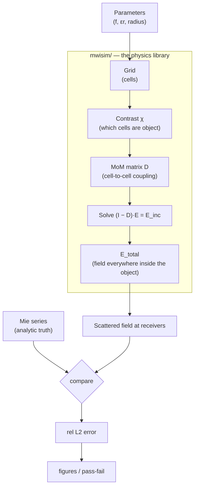

# Codebase & Algorithm Guide — from 0 to 1

> **Who this is for:** you, six months from now, opening this repo and thinking "what *is* all this?" It rebuilds the electromagnetic scattering algorithm from scratch, then walks every Python file in `mwisim/`, `scripts/`, and `tests/`, line-ideas explained, with **MATLAB analogies** throughout (you know MATLAB; NumPy is MATLAB with different punctuation). Read Part 1 to refresh the physics, Part 2 for the Python you need, then Part 3 is the file-by-file map.
## Contents

1. The 30-second mental model
2. The algorithm from zero (the physics)
3. NumPy for a MATLAB user (just what this repo uses)
4. File-by-file walkthrough (`mwisim/`)
5. The drivers (`scripts/`)
6. The tests as a specification (`tests/`)
7. One full run, traced end to end
8. Symbol & glossary table

---

## 1. The 30-second mental model

We simulate one experiment: **a plane microwave hits a dielectric cylinder; we compute the scattered field on a ring of receivers around it.** Then we check our answer against the textbook closed-form solution (the *Mie series*). If they agree, our numerical engine is trustworthy — and *that* engine is what later reconstructs unknown objects (breast / bone) from their scattered fields.



- **F1** built this whole chain *densely* (a real $N\times N$ matrix). See [[F1_milestone]].
- **F2** replaced the slow matrix step with an FFT so it scales to huge grids, without changing any physics. See [[F2_milestone]].

---

## 2. The algorithm from zero (the physics)

### 2.1 What field are we even solving for?

In 2D **TM polarization**, the electric field points purely along $z$, so the whole vector problem collapses to **one scalar function** $E_z(x,y)$. That is the single reason 2D-TM is the standard starting point — no vector bookkeeping, just one complex number per point. Everything in this repo is that one scalar field, sampled on a grid.

We use the engineering time convention $e^{+j\omega t}$ (same as radar). Consequence: outgoing waves look like $e^{-jk R}$, and the right special function is the **Hankel function of the second kind** $H^{(2)}$. (If you ever see $H^{(1)}$ and $+i$, that's the physics convention — don't mix them or the imaginary part flips sign.)
### 2.2 Incident, scattered, total

The field splits into two parts:
$$E_z = \underbrace{E_z^{\text{inc}}}_{\text{the wave you sent in}} + \underbrace{E_z^{\text{sc}}}_{\text{what the object re-radiates}}$$
The incident wave is a plane wave travelling along $+x$: $E_z^{\text{inc}}=E_0 e^{-jk_b x}$. The scattered part is what we want to predict (and later, measure and invert).

### 2.3 The contrast — "how different is each point from the background?"

Define the **contrast function**
$$\chi(\mathbf r)=\frac{\varepsilon_r(\mathbf r)}{\varepsilon_b}-1.$$
It is $0$ in empty background and nonzero only inside the object. $\chi$ is the *unknown* in the imaging problem; in the *forward* problem we know it and compute the field.

### 2.4 The master equation (Lippmann–Schwinger)

Every scattering simulation in this repo is one equation:
$$\boxed{\,E_z(\mathbf r)=E_z^{\text{inc}}(\mathbf r)+k_b^2\!\int_S G(\mathbf r,\mathbf r')\,\chi(\mathbf r')\,E_z(\mathbf r')\,dS'\,}$$
In words: **the field at a point = the wave you sent in + the sum of tiny re-radiations from every bit of object, each weighted by how strong it is ($\chi$), how strong the field there is ($E_z$), and how a wave travels from there to here (the Green's function $G$).**

The 2D free-space Green's function (our $e^{+j\omega t}$ convention) is
$$G(\mathbf r,\mathbf r')=\frac{1}{4j}H_0^{(2)}\!\bigl(k_b|\mathbf r-\mathbf r'|\bigr).$$

> **Why is this called nonlinear "in general" but linear here?** $E_z$ appears on *both* sides. In the forward problem $\chi$ is known, so it's a linear equation in the unknown $E_z$ — one solve and done. In the *inverse* problem $\chi$ and $E_z$ are *both* unknown and multiply each other → genuinely nonlinear → that's why inversion (I1–I4) needs iteration (Born, DBIM…).

### 2.5 Turning the integral into a matrix (Method of Moments, Richmond)

A computer can't handle a continuous integral, so we **discretize**:

1. Cover the object region with $N$ tiny **square cells** of side $d$. Assume $E_z$ and $\chi$ are constant inside each cell ("pulse basis").
2. Demand the equation hold exactly at each **cell center** ("point matching").
3. The integral becomes a finite sum. Collect it into matrix form:

$$(\mathbf I-\mathbf D)\,\mathbf E=\mathbf E^{\text{inc}},\qquad D_{mn}=k_b^2\,\chi_n \!\int_{\text{cell}_n}\! G(\mathbf r_m,\mathbf r')\,dS'.$$

$\mathbf E$ is the stacked field values, one per cell. $D_{mn}$ says **how much the field in cell $n$ contributes to the field in cell $m$.** Solve the linear system → you have the field everywhere inside the object. That is the entire forward solver.

### 2.6 The one hard integral: the self-cell

When $m=n$ (a cell's effect on itself), $\mathbf r_m=\mathbf r_n$ and $G$ blows up ($H_0^{(2)}$ is singular at zero distance). **Richmond's trick:** replace the square cell by an equal-area disk of radius $a=d/\sqrt{\pi}$ (so $\pi a^2 = d^2$). The disk integral has a closed form:

$$D_{mn}=\begin{cases}-\,\chi_n\,\dfrac{j\pi k_b a}{2}\,J_1(k_b a)\,H_0^{(2)}(k_b\rho_{mn}), & m\neq n,\\[2mm]-\,\chi_n\Bigl[\dfrac{j\pi k_b a}{2}\,H_1^{(2)}(k_b a)+1\Bigr], & m=n.\end{cases}$$

> ⚠️ **The famous "+1" (the F1 bug).** That extra $+1$ inside the self term came from the lower limit of the radial integral ($\lim_{u\to0}uH_1^{(2)}(u)=2j/\pi\neq0$). Dropping it matched Mie at *weak* contrast but diverged (~80% error) at strong contrast. It cost a day to find. In the code you'll see it as `... - 1` written *before* multiplying the column by $\chi_n$, so it becomes the $-\chi_n$ above. Never delete it.

### 2.7 Getting the scattered field at the receivers

Once we know $\mathbf E$ inside the object, the field at any *exterior* receiver $\mathbf r_r$ is a plain weighted sum (no singularity, receivers are far from cells):

$$E_z^{\text{sc}}(\mathbf r_r)=k_b^2\sum_n G(\mathbf r_r,\mathbf r_n)\,\chi_n\,E_n\,dS.$$

### 2.8 The ground truth: the Mie series

For a *circular* cylinder there is an exact analytic answer — an infinite series of angular modes:

$$E_z^{\text{sc}}(\rho,\phi)=\sum_{n=-\infty}^{\infty}(-j)^n a_n H_n^{(2)}(k_b\rho)\,e^{jn\phi},$$

with mode coefficients $a_n$ built from Bessel/Hankel functions and the boundary conditions. We truncate the sum (it converges fast) and treat it as **truth**. The entire validation philosophy of the project: *compare numerics to an exact answer, in simulation, no lab needed.*

### 2.9 The validation metric

Relative $L_2$ error between our field and Mie's:
$$\text{err}=\frac{\lVert E^{\text{MoM}}-E^{\text{Mie}}\rVert_2}{\lVert E^{\text{Mie}}\rVert_2}.$$

F1 passes when this is small **and** shrinks as the grid is refined (a *convergence curve*).

That's the whole algorithm. Everything below is this maths, written in Python.

---

## 3. NumPy for a MATLAB user (just what this repo uses)

You know MATLAB, so here is only the delta.

| Idea | MATLAB | NumPy (this repo) |
|---|---|---|
| import the library | (built in) | `import numpy as np` |
| make a vector | `linspace(0,1,5)` | `np.linspace(0,1,5)` |
| imaginary unit | `1i` or `1j` | `1j` (e.g. `4j` is one literal!) |
| matrix multiply | `A*B` | `A @ B` (the `@` operator) |
| **elementwise** multiply | `A.*B` | `A * B` |
| transpose / conj-transpose | `A.'` / `A'` | `A.T` / `A.conj().T` |
| solve $Ax=b$ | `A\b` | `np.linalg.solve(A, b)` |
| 2-norm | `norm(v)` | `np.linalg.norm(v)` |
| build a grid | `meshgrid` | `np.meshgrid(..., indexing="ij" or "xy")` |
| indexing base | **1-based**, `v(1)` | **0-based**, `v[0]` |
| index range | `v(2:5)` (incl.) | `v[1:5]` (**end-exclusive**) |
| last element | `v(end)` | `v[-1]` |
| reshape to column list | `reshape` | `arr.ravel()` / `arr.reshape(...)` |
| stack columns | `[a b]` | `np.column_stack([a, b])` |

Five gotchas that matter here:

- **`@` vs `*`.** `@` is real matrix multiply (linear algebra); `*` is elementwise (`.*`). Mixing them up is the #1 NumPy bug for MATLAB users.
- **Broadcasting.** `centers[:, None, :] - centers[None, :, :]` is how we build an all-pairs difference with no loop. `None` inserts a new axis (like making a "page" dimension), and NumPy auto-stretches singleton axes. This single line is what vectorizes the distance matrix.
- **`indexing="ij"` vs `"xy"`.** `"ij"` = matrix/row-column order (axis 0 is $y$ rows); `"xy"` = Cartesian (axis 0 is $x$). The repo deliberately uses each in the right place; the FFT operator depends on the ravel order matching.
- **Slicing is end-exclusive and 0-based.** `vp[:ny, :nx]` keeps rows `0..ny-1`. This is how F2 crops the FFT result.
- **`dtype=complex`.** Arrays must be told they're complex up front, or assigning a complex value silently drops the imaginary part.

A few Python-isms you'll see:

- `def f(x: float) -> np.ndarray:` — the `: float` / `-> np.ndarray` are **type hints**, documentation only; Python doesn't enforce them.
- `"""..."""` right under a `def` is the **docstring** (help text).
- `from __future__ import annotations` — a harmless compatibility line; ignore it.
- `a or b` — returns `a` if it's "truthy", else `b`. Used for defaults: `P["R_cyl"] or 0.5*lam0`.

---

## 4. File-by-file walkthrough (`mwisim/`)

> Mapping: §2.x physics → file. grid/contrast → §2.3, 2.5 · green → §2.4 · mom → §2.5–2.7 · mie → §2.8 · metrics → §2.9 · operators → F2 (§2.5 sped up).

### 4.1 `grid.py` — lay down the cells, mark the object

**`make_grid(domain_size, d)`** builds the $N$ cell centers covering a square $[-L/2,L/2]^2$ and returns them as an `(N, 2)` array of $(x,y)$ plus the cell area `dS = d**2`.

- `N_cells = math.ceil(domain_size / d)` — how many cells per side.
- The `if N_cells % 2 == 0` branch just centers the grid nicely on the origin whether the count is even or odd (`%` is modulo; `//` is integer division).
- `X, Y = np.meshgrid(x_, y_, indexing="xy")` then `centers = np.column_stack([X.ravel(), Y.ravel()])` — flatten the 2D grid into a flat list of points. *MATLAB:* `[X(:) Y(:)]`.

**`assign_contrast(centers, R_cyl, eps_r, eps_b=1.0)`** decides which cells are "object."

- `r = np.hypot(centers[:,0], centers[:,1])` — distance of each cell to the origin (`hypot` = $\sqrt{x^2+y^2}$, the whole vector at once).
- `chi = np.where(r <= R_cyl, eps_r/eps_b - 1, 0.0)` — *vectorized if/else*: where the cell is inside the radius use $\varepsilon_r/\varepsilon_b-1$, else $0$. This is §2.3.
- `.astype(complex)` — force complex storage so lossy $\varepsilon_r$ works.

### 4.2 `green.py` — how a wave travels from one point to another

**`green_2d(k_b, R)`** returns $G(R)=\frac{1}{4j}H_0^{(2)}(k_b R)$ — §2.4, exactly. `hankel2(0, k_b*R)` is SciPy's $H_0^{(2)}$. Note `1/4j` parses as `1/(4j)` (since `4j` is a single complex literal), which is correct. The self term $R=0$ is *not* handled here — it's done specially in `mom.py` (§2.6).

### 4.3 `mom.py` — the heart: build the matrix, solve, radiate

This file is the forward solver (§2.5–2.7). Four functions:

**`build_D(centers, chi, k_b, d)`** → the $N\times N$ coupling matrix (§2.5–2.6). The file keeps a commented-out *slow, readable* double loop on top (great for understanding) and a *fast vectorized* version below. The fast one:

```python
a = d / np.sqrt(np.pi)                       # equal-area disk radius (§2.6)
pref = -(1j * np.pi * k_b * a / 2)           # the shared prefactor in the boxed formula
diff = centers[:, None, :] - centers[None, :, :]   # all-pairs (r_m - r_n), shape (N,N,2)
rho  = np.sqrt((diff**2).sum(axis=-1))       # all-pairs distances rho_mn, shape (N,N)
D = pref * jv(1, k_b*a) * hankel2(0, k_b*rho)      # off-diagonal entries
np.fill_diagonal(D, pref * hankel2(1, k_b*a) - 1)  # SELF term incl. the famous "-1" (§2.6!)
D = D * chi[None, :]                          # multiply each COLUMN n by chi_n
return D
```

Why column multiply (`chi[None, :]`)? Because $\chi_n$ belongs to the *source* cell $n$, which is the **column** index. `chi[None, :]` is a `(1, N)` row that broadcasts down every row. After this, the diagonal `-1` has become $-\chi_n$ — that is the self-cell term.

**`incident_plane_wave(centers, k_b, E0=1.0)`** → $E_0 e^{-jk_b x}$ at each cell (§2.2). `centers[:,0]` is the $x$ column. One line, fully vectorized.

**`solve_total_field(D, E_inc)`** → solves $(\mathbf I-\mathbf D)\mathbf E=\mathbf E^{\text{inc}}$ with `np.linalg.solve(I - D, E_inc)` (*MATLAB:* `(I-D)\E_inc`). This is the dense direct solve that F2 later replaces. Returns the field inside the object.

**`scattered_field(rx_points, centers, chi, E_tot, k_b, dS)`** → the field at exterior receivers (§2.7): builds receiver-to-cell distances by broadcasting, forms $G$, then `E_sc = pref * (G @ (chi * E_tot))`. Here `G @ (...)` is a real matrix-vector product (the weighted sum), while `chi * E_tot` is elementwise. Receivers are outside the object so no singularity.

### 4.4 `mie.py` — the analytic ground truth (§2.8)

**`mie_an(n, k_b, k_1, R_cyl)`** computes one mode coefficient $a_n$ from the boundary-condition ratio of Bessel/Hankel terms. `jv, jvp` are $J_n$ and its derivative; `hankel2, h2vp` are $H_n^{(2)}$ and its derivative.

**`mie_scattered(rx_points, k_b, k_1, R_cyl, Nmax=None)`** sums the series over modes $-N_{\max}..N_{\max}$:

- `rho, phi = np.hypot(...), np.arctan2(...)` — convert receivers to polar.
- default `Nmax = ceil(|k_b| R_cyl) + 10` — enough modes for convergence (more modes for bigger/faster-varying objects).
- the `for n in range(-Nmax, Nmax+1)` loop adds each mode's contribution.
- *sanity check baked into the tests:* increase `Nmax` and the answer must stop changing (T5).

> **Get this file right FIRST.** If the "truth" is wrong, every comparison downstream lies. That's why Mie has its own self-convergence test before MoM is ever trusted.

### 4.5 `metrics.py` — score and convergence (§2.9)

**`rel_l2_error(approx, ref)`** = $\lVert \text{approx}-\text{ref}\rVert / \lVert \text{ref}\rVert$, complex-aware. A helper, used everywhere.

**`convergence_study(d_list, params)`** runs the *entire* pipeline for several cell sizes $d$ and records the error each time, returning `(cells_per_wavelength, errors)` for the log-log convergence plot. Note the line `m = chi != 0; centers, chi = centers[m], chi[m]` — **boolean-mask indexing** keeps only object cells to shrink the dense system (MATLAB logical indexing `centers(m,:)`). The derived wavenumbers use $k=2\pi f/c\cdot\sqrt{\varepsilon}$.

### 4.6 `operators.py` — the F2 fast engine (same physics, FFT speed)

This is the F2 deliverable; full theory in [[F2_Tutorial_CG-FFT-matrix-free-solver]] and [[F2_milestone]]. The key realisation: on a regular grid $D_{mn}=g(\mathbf r_m-\mathbf r_n)\chi_n$ depends only on the **displacement** $\mathbf r_m-\mathbf r_n$, so $\mathbf D$ is **block-Toeplitz with Toeplitz blocks (BTTB)**, and "multiply by a Toeplitz matrix" = "do a convolution" = "multiply in Fourier space." So we never store $\mathbf D$:

- **`infer_grid_shape(centers)`** — recover $(N_y,N_x)$ from the flat `centers` (the FFT needs the regular grid back in 2D).
- **`GreenFFT.__init__`** — compute the kernel $g$ over *all* displacements once, zero-pad it to `next_fast_len(2N-1)` (the **circulant embedding** that prevents FFT wrap-around), and cache `self.G_hat = fft2(g_pad)`. The self entry carries the same `- 1` as `build_D`.
- **`_conv(v_grid)`** — one convolution: pad `v` into a zeros canvas, `ifft2(G_hat * fft2(vp))`, then crop `[:ny, :nx]`. The wrap-around garbage lives entirely in the discarded part.
- **`apply_D(x)`** — reshape `x` to a grid, multiply by $\chi$ (source/column), convolve, ravel back. This *equals* `build_D @ x` but in $O(N\log N)$ (test T9 proves it).
- **`apply_IminusD(x)`** — `x - apply_D(x)`: the operator $(\mathbf I-\mathbf D)$.
- **`as_linear_operator()`** — wraps the above so SciPy's iterative solvers can call it with just matvecs (no matrix needed).
- **`solve_total_field(...)`** — BiCGStab or GMRES iterates to the answer; a callback counts iterations; it reports an honest residual $\lVert b-A\mathbf E\rVert/\lVert b\rVert$.

Also in this file: **`A_op` / `AH_op`** — the Born forward operator and its adjoint for the *inversion* stage (I1+). `A_op(v) = k_b^2 dS · G_tr @ (E_inc * v)` maps a contrast guess to predicted receiver fields; `AH_op` back-projects a residual onto the grid. These are the seeds of the imaging work to come.

### 4.7 `inverse/__init__.py` — placeholder for I1–I4

Empty package with a docstring roadmap (Born → BIM/DBIM → CGLS/LSQR → PnP-DBIM). Nothing to run yet; this is where I1 will land.

---

## 5. The drivers (`scripts/`)

These are *orchestration only* — they import the library and make figures. No physics lives here.

### 5.1 `run_f1.py`

- A parameter dict `P` (frequency, $\varepsilon_r$, geometry). `_derived(P)` turns it into wavelengths and wavenumbers.
- `run_pointwise(P)` runs one grid, computes MoM and Mie scattered fields on the receiver ring, prints the error, and saves `docs/fig_pointwise.png` (Re/Im overlay: dots = MoM, line = Mie).
- `run_convergence(P)` calls `convergence_study` over several cell sizes and saves `docs/fig_convergence.png` (log-log error vs cells-per-wavelength — should slope down).
- `sys.path.insert(0, ...)` at the top is the "no `pip install` needed" trick: it adds the repo root to Python's import search path so `import mwisim...` works.

### 5.2 `run_f2.py`

The F2 benchmark. `setup`/`bench` build a problem at a target grid size, time both the **CG-FFT** path and (when it still fits in RAM) the **dense** path, record iterations and memory, and confirm they agree (`match` column). `main()` sweeps a list of sizes, prints the table you saw, and saves `docs/fig_f2_scaling.png` (time and memory vs $N$, dense vs FFT). The headline line at the end reports the largest case.

---

## 6. The tests as a specification (`tests/`)

The tests *are* the contract — read them as "what correct looks like." They're written for `pytest`; run `python -m pytest -q` (the `python -m` form makes `import mwisim` resolve).

### 6.1 `test_f1.py` (T1–T8) — does the forward solver match physics?

- **helper / T2** — incident wave has unit magnitude.
- **T3** — Green depends only on distance (equal distances → equal values).
- **T4** — *weak* scatterer: total field ≈ incident field (object barely perturbs).
- **T5** — Mie self-convergence: `Nmax=8` vs `Nmax=25` agree (truth is trustworthy).
- **T6/T7** — MoM matches Mie for a weak cylinder (<5%).
- **T8** — MoM *still* matches Mie for a **strong** cylinder ($\varepsilon_r=8$) — this is the test the self-cell "+1" bug used to fail.

### 6.2 `test_f2.py` (T9–T14) — does the fast path equal the slow path?

- **T9** — `apply_D @ x` equals `build_D @ x` on a *random* complex vector (<1e-12 target; your run ~1e-8). Random input is deliberate: it stresses every matrix entry.
- **T10** — $(\mathbf I-\mathbf D)\mathbf x$ matches.
- **T11/T12** — BiCGStab and GMRES solves match the dense direct solve.
- **T13** — end-to-end: fast-path scattered field = slow-path = Mie.
- **T14** — `infer_grid_shape` works and rejects a non-rectangular grid.

> Note F1 tests **mask** to object cells (smaller dense system); F2 tests use the **full regular grid** because the FFT structure needs it. The $\chi=0$ exterior cells cost almost nothing.

---

## 7. One full run, traced end to end

Following `run_f1.run_pointwise` with the default weak cylinder:

1. `_derived(P)` → $\lambda_0$, $k_b$, $k_1$, cylinder radius, receiver radius.
2. `make_grid` → ~thousands of cell centers; `assign_contrast` → $\chi$ (nonzero inside).
3. mask to object cells → smaller system.
4. `build_D` → the $N\times N$ coupling matrix (§2.5–2.6).
5. `incident_plane_wave` → $\mathbf E^{\text{inc}}$.
6. `solve_total_field` → solve $(\mathbf I-\mathbf D)\mathbf E=\mathbf E^{\text{inc}}$ → field inside (§2.5).
7. `scattered_field` at the receiver ring → predicted $E^{\text{sc}}$ (§2.7).
8. `mie_scattered` at the same ring → analytic truth (§2.8).
9. `rel_l2_error` → the score; plot dots vs line.

F2 only changes steps 4+6: instead of building `D` and factorising, `GreenFFT` applies $\mathbf D$ via FFT and iterates. Steps 1–3, 5, 7–9 are untouched.

---

## 8. Symbol & glossary table

| Symbol / name | Meaning |
|---|---|
| $E_z$ | the scalar field we solve for (2D TM) |
| $E^{\text{inc}}, E^{\text{sc}}$ | incident (sent-in) and scattered (re-radiated) field |
| $\chi$ (`chi`) | contrast $\varepsilon_r/\varepsilon_b-1$; nonzero inside object |
| $k_b, k_1$ | wavenumber in background, inside cylinder |
| $G$ | 2D Green's function $\frac{1}{4j}H_0^{(2)}(k_bR)$ — point-to-point wave travel |
| $\mathbf D$ | MoM coupling matrix; $(\mathbf I-\mathbf D)\mathbf E=\mathbf E^{\text{inc}}$ |
| $d$, $a$, `dS` | cell side, equal-area disk radius $d/\sqrt\pi$, cell area $d^2$ |
| $\rho_{mn}$ | distance between cell $m$ and cell $n$ |
| Mie series | exact analytic scattered field for a circular cylinder (ground truth) |
| BTTB | block-Toeplitz w/ Toeplitz blocks — structure that makes $\mathbf D$ an FFT |
| MoM | Method of Moments (Richmond) — the discretization scheme |
| L-S | Lippmann–Schwinger — the master integral equation |
| BiCGStab / GMRES | iterative linear solvers that need only matrix-vector products |
| $H_n^{(2)}, J_n, Y_n$ | Hankel (2nd kind), Bessel 1st kind, Bessel 2nd kind |

---

*Living document — update as F3/inversion/HLS land. See [[F1_Tutorial_2D-MoM-and-Mie-validation]] and [[F2_Tutorial_CG-FFT-matrix-free-solver]] for the full derivations behind §2 and §4.6.*

---

## Appendix A — FAQ / deep dives

> These are the questions that actually tripped me up, with the durable answer kept here so I don't re-derive it. Grouped by topic; the §-references point back into the guide.

### A.1 Physics & algorithm

**Q. The receiver physically measures the *total* field, not the scattered field — right?** Yes. A real probe at $\mathbf r_r$ sees $E^{\text{tot}}=E^{\text{inc}}+E^{\text{sc}}$. But we only predict/compare $E^{\text{sc}}$, recovered by subtracting the known background. Precisely: **object measurement** $=E^{\text{tot}}$; **background measurement** (no object) $=E^{\text{inc}}$; so **object − background $=E^{\text{tot}}-E^{\text{inc}}=E^{\text{sc}}$**. The quantity *subtracted away* is $E^{\text{inc}}$ (the background); the *result* is $E^{\text{sc}}$ — not $E^{\text{inc}}$ and not $E^{\text{tot}}$. Both `scattered_field` and `mie_scattered` return the scattered part only, so they compare like-for-like. Scattered field = the information; incident field = known background. (§2.2, §2.7)

**Q. In $D_{mn}$, is $m$ the sensor position?** No — common trap. In `build_D`, **both $m$ and $n$ are imaging-domain cells**. $n$ = source cell, $m$ = observation/test cell (point-matching at each cell center). $\mathbf D$ is a cell↔cell coupling matrix ($N\times N$). The **sensors** are separate: they appear only in `scattered_field` as `rx_points`, through a rectangular receiver×cell Green matrix. Pipeline: first solve the field among domain cells ($\mathbf D$), then radiate that field out to exterior sensors. (§2.5 vs §2.7)

**Q. $\rho_{mn}=\lVert\mathbf r_m-\mathbf r_n\rVert$?** Yes — center-to-center distance between cells $m$ and $n$. (§2.6)

**Q. Why does the current code get $E^{\text{sc}}$ in one shot with no outer iteration?** Because this is the **forward** problem (χ known). Two distinct "loops" must not be confused:
- *Linear solve* of $(\mathbf I-\mathbf D)\mathbf E=\mathbf E^{\text{inc}}$: F1 uses a direct solver (truly one shot); F2 uses BiCGStab (which *is* iterative, but converges in ~7 steps — that's the `iters` column).
- *DBIM outer nonlinear loop*: exists **only in inversion**, because there χ is unknown. The forward problem has no outer loop. So "one shot" is about forward-vs-inverse, not about the cylinder being simple. (§2.4 note; inversion comes in I1+)

**Q. Is the inversion loop "estimate χ by inversion, estimate E by forward, repeat"?** Yes, essentially DBIM: given current χ → solve forward for the in-domain field $E_n$ → predict scattered data → compare to measured → linearize → update χ → repeat. The scattered-field formula is used *every* iteration (to form the residual), not just at the end. The final image is the converged χ.

### A.2 NumPy / broadcasting 

**Q. `indexing="ij"` vs `"xy"` — concrete example.** Take `x_=[10,20,30]`, `y_=[1,2]`.
- `"xy"` → shape `(len(y), len(x))=(2,3)`; element `[r,c]` is $(x_c,y_r)$ — first index runs over $y$ (image/Cartesian style).
- `"ij"` → shape `(len(x), len(y))=(3,2)`; element `[i,j]` is $(x_i,y_j)$ — first index runs over $x$ (matrix style). The FFT operator assumes a row-major ravel `n = iy*Nx + ix`, so the kernel axes and `infer_grid_shape` must follow the same order — mismatch is exactly the DX/DY swap bug. (§3, §4.6)

**Q. Why flatten the grid to 1D and then re-insert a dimension with `None`?** The dense linear system $(\mathbf I-\mathbf D)\mathbf E=\mathbf E^{\text{inc}}$ wants $\mathbf E$ as a flat **vector** and $\mathbf D$ as $N\times N$; the all-pairs distance needs `centers[:,None,:]-centers[None,:,:]` → `(N,N,2)`. So flattening is natural for the *matrix* view. F2 does the opposite (reshape back to a 2D grid) because FFT convolution is inherently 2D — that's the "reshape and it clicks" insight. Dense MoM = vector/matrix view; CG-FFT = grid view. (§4.3 vs §4.6)

**Q. `D * chi[None,:]` vs `chi[:,None] * D` — can I swap them?** No, they differ.
- `chi[None,:]` is shape `(1,N)` → broadcasts down rows → scales **column** $n$ by $\chi_n$ ✓ (χ belongs to the *source* = column index).
- `chi[:,None]` is `(N,1)` → scales **row** $m$ by $\chi_m$ ✗ (wrong physics). Rule for placing `None`: the axis you add becomes size 1 (the "stretched" one); the real `N` must align with the axis of `D` you want to scale. To scale columns (axis 1), put real `N` on axis 1 → `chi[None,:]`. Left/right order of `*` is irrelevant (elementwise multiply commutes); only the `None` placement decides correctness.

**Q. `rx_points` is `(Nrx,2)` and `centers` is `(N,2)` — different leading sizes, can they subtract?** Yes, via broadcasting: `rx_points[:,None,:]`→`(Nrx,1,2)`, `centers[None,:,:]`→`(1,N,2)`. Broadcasting needs each axis equal or one of them `1`: `(Nrx,1)`×`(1,N)`→`(Nrx,N)`, last axis `2==2`. Result `(Nrx,N,2)`; `.sum(axis=-1)` collapses the coord axis → `(Nrx,N)` distance matrix. (§4.3)

**Q. `m = chi != 0`?** A boolean **mask** array (True where χ≠0 = object cells). `centers[m], chi[m]` keep only those cells, shrinking the dense system (background χ=0 contributes nothing). MATLAB: `m = (chi~=0); centers = centers(m,:);`. (§4.5)

### A.3 Python idioms

- **`np.where(cond, a, b)`** — vectorized ternary; pick `a` where `cond` else `b`. Rare in MATLAB (which uses logical indexing). Used in `assign_contrast` and the F2 kernel.
- **`a = x if cond else y`** — inline ternary expression (e.g. `offset = d/2 if N%2==0 else 0.0`). No direct MATLAB equivalent.
- **`with np.errstate(invalid="ignore"):`** — a *context manager*: temporarily sets a scope/precondition for the indented statements (here, suppress the `hankel2(0,0)=NaN` warning), auto-restored on exit. This is the "precondition for these statements" construct.
- **`arr[mask]`** — boolean-mask indexing (see A.2).
- **`np.asarray(x)`** — defensive: type hints aren't enforced, so a caller might pass a list/scalar; `asarray` is a zero-cost pass-through for real arrays, a converter otherwise. Cheap insurance.
- **First-class functions + dict unpacking** (the `solver, extra = ...; solver(..., **extra)` pattern):
- `solver = spla.bicgstab` (no parentheses) names the *function itself* — like a MATLAB function handle `@bicgstab`. Call it later with `solver(...)`.
- `extra = {"callback_type":"pr_norm"}`; `**extra` *unpacks* the dict into keyword arguments at call time (`callback_type="pr_norm"`); `**{}` adds nothing.
- Net effect: one call line works for both solvers — the dict absorbs the argument that differs, eliminating an if/else. "Use data to remove branches."

### A.4 Grid & green_2d

**Q. In `make_grid`, can the spacing end up ≠ d (breaking `dS=d**2`)?** No — spacing is exactly `d` by construction. `linspace(a,b,N)` has step `(b-a)/(N-1)`; the endpoints are chosen so the span is exactly `(N-1)*d` in both even/odd cases, giving step `=d`. The only slack is `N_cells=ceil(domain/d)` makes the *covered area* slightly ≥ requested, but the cell size stays exactly `d`, so `dS=d**2` is consistent. (§4.1)

**Q. Why define `green_2d` at all?** *(Resolved — it is now used.)* It was originally only exercised by test T3 while the hot paths inlined `hankel2`. As of this guide, **`scattered_field` calls `green_2d`** (DRY: one definition of the convention $\frac1{4j}H_0^{(2)}$), so it is no longer a "decoration." `build_D` still inlines its kernel because it needs the disk-integral form ($J_1$ prefactor, self-cell), not the bare point Green function. Future reuse: the inversion $G_{tr}$ matrix builds on `green_2d`. (§4.2)

### A.5 operators.py specifics

**Q. `self.d * np.sqrt(DX**2 + DY**2)` — DX/DY are integer cell offsets, so ×d gives metric distance?** Yes. `DX,DY` come from `np.arange(-(n-1),n)` (integer displacements in *cell units*); ×`self.d` converts to physical ρ in meters. Same ρ as `build_D`, computed from integer offsets instead of coordinate differences. (§4.6)

**Q. `g_pad[np.mod(DY,py), np.mod(DX,px)] = g` — why is this so striking?** Three NumPy powers in one line:
1. **Integer-array (fancy) indexing**: `DY,DX` are *same-shape integer arrays*; NumPy pairs them elementwise as coordinates, so hundreds of scattered targets are written in one assignment.
2. **`np.mod` for negative offsets**: `-1 % py = py-1` wraps a negative displacement to the array's tail — the "ring seat" required by *circulant* (circular-convolution) embedding.
3. **Shape-matched assignment**: the indexed positions and the right-hand `g` have the same shape, so values drop in by position. MATLAB equivalent needs `sub2ind` + `mod(...)+1`: `idx=sub2ind([py px],mod(DY,py)+1,mod(DX,px)+1); g_pad(idx)=g;` — doable but far less direct.

**Q. After `fft2(g_pad)`, why no `fftshift`?** Because we're *computing* a convolution, not *displaying* a spectrum. The convolution theorem `ifft2(fft2(g)*fft2(v))` requires both transforms in FFT's native (un-shifted) frequency order; `fftshift` would misalign them and corrupt the result. We already laid the kernel out in space with `np.mod` (zero-displacement at `[0,0]`, negatives wrapped to the tail) — exactly the layout FFT expects. Rule: **shift to look, never to compute.** (§4.6)

**Q. `A = self.as_linear_operator()` — what is this, and why "no matrix needed"?** A direct solve (`A\b`) needs a real stored matrix. Ours is $N\times N$; at $N=10^5$ that's 167 GB — unbuildable. But iterative solvers (BiCGStab/GMRES) only ever need one capability: **"given $x$, return $Ax$"** (a matvec) — never the individual entries, no inverse, no factorization. SciPy's `LinearOperator` lets you supply *that function* instead of a matrix:
```python
spla.LinearOperator(shape=(N,N), matvec=self.apply_IminusD, dtype=complex)
```
`shape` just tells the solver "pretend I'm this big"; `matvec` is the real engine — and ours computes $(\mathbf I-\mathbf D)x$ via two FFTs, building nothing. The solver thinks it's multiplying by an $N\times N$ matrix; each "multiply" is secretly an FFT. That is "no matrix needed": only the matrix's *action* exists. (MATLAB analogue: `gmres(@(x) apply_IminusD(x), b)`.) (§4.6)

**Q. `E_tot, status = solver(A, E_inc, rtol=tol, maxiter=maxiter, callback=_cb, **extra)` — every argument, and why it works.**
- `A` — the LinearOperator standing for $(\mathbf I-\mathbf D)$.
- `E_inc` — the right-hand side $b$. Yes, this solves $(\mathbf I-\mathbf D)\mathbf E_{\text{tot}}=\mathbf E_{\text{inc}}$.
- `rtol=tol` — stop when relative residual $\lVert b-Ax\rVert/\lVert b\rVert<$ tol.
- `maxiter` — iteration cap (safety against non-convergence).
- `callback=_cb` — called once per iteration; we use it to count iterations.
- `**extra` — expands to `callback_type="pr_norm"` for GMRES, nothing for BiCGStab.
- returns `(solution, status)`; `status==0` = converged. *Why it works:* a Krylov solver starts from a guess, uses matvecs to measure the residual $b-Ax$, and corrects $x$ along directions that shrink it fastest. Because $(\mathbf I-\mathbf D)$ is well-conditioned (spectrum clustered near 1), the residual drops below tol in a handful of steps (your 7). It solves the *same* equation as the direct method — iterate-to-converge instead of eliminate-once — trading a little accuracy for huge memory savings (T11 confirms agreement <1e-7). (§4.6)

**Q. `A_op` / `AH_op` — what are they and why "seeds of imaging"?** These are the **Born forward operator and its adjoint**, for the inversion stage (not used by the forward solver).
- `A_op(v) = k_b² · dS · G_tr @ (E_inc * v)`: input a contrast guess $v$ (one value per grid cell), output the scattered field it would produce at the probes. Plainly: *"give me a hypothetical object, tell me its echo."*
- `AH_op(u) = k_b² · dS · conj(E_inc) * (G_tr.conj().T @ u)`: the conjugate-transpose ("adjoint") of `A_op`. Input a probe-space residual $u$ (measured − predicted), output its **back-projection onto the imaging grid**. The inversion loop is: measure echoes → `A_op` predicts current model's echoes → residual → `AH_op` back-projects residual to the grid → update χ per cell. `AH_op(residual)` is literally a first, crude image (cells aligned with the residual light up). Born inversion = `A_op`/`AH_op` + CGLS/LSQR least squares; DBIM wraps a nonlinear loop around that. Hence "seeds of the imaging work."
> Math caveat: `AH_op` must be the *exact* adjoint of `A_op` ($\langle Av,u\rangle=\langle v,A^Hu\rangle$), or CGLS/LSQR won't converge — the first I1 test will check this. (§4.6, inversion)

---

## Appendix B — `run_f1.py` / `run_f2.py` line by line

> These scripts are *orchestration*, not physics. Read them to see how the library functions are wired into a runnable experiment + figures.

### B.1 `run_f1.py`

```python
sys.path.insert(0, os.path.dirname(os.path.dirname(os.path.abspath(__file__))))
```
- `__file__` = this script's path; `os.path.abspath` makes it absolute; two `dirname`s climb from `scripts/run_f1.py` up to the repo root; `sys.path.insert(0, ...)` puts the root first on Python's import search path. Net: `import mwisim...` works with no `pip install`. (MATLAB analogue: `addpath`.)

```python
P = dict(f=1e9, eps_b=1.0, eps_r=2.0, R_cyl=None, R_obs=None, N_rx=72, domain_factor=2.5)
```
- A parameter **dictionary** (like a MATLAB struct). `None` means "fill in later from a default."

```python
def _derived(P):
    lam0 = C0 / P["f"]
    k_b = 2*np.pi/lam0 * np.sqrt(P["eps_b"])
    k_1 = 2*np.pi/lam0 * np.sqrt(P["eps_r"])
    R_cyl = P["R_cyl"] or 0.5*lam0      # 'or' supplies the default if R_cyl is None/0
    R_obs = P["R_obs"] or 3*R_cyl
    lam1 = lam0 / np.sqrt(P["eps_r"].real if hasattr(P["eps_r"],"real") else P["eps_r"])
    return lam0, lam1, k_b, k_1, R_cyl, R_obs
```
- Converts user parameters to wavelengths/wavenumbers. `a or b` returns `a` unless it's falsy (None/0), else `b` — the default-value idiom. `hasattr(...,"real")` guards complex εr so the grid resolution uses the real part.

```python
def rx_ring(R_obs, N_rx):
    ang = np.linspace(0, 2*np.pi, N_rx, endpoint=False)
    return np.column_stack([R_obs*np.cos(ang), R_obs*np.sin(ang)]), ang
```
- Builds the receiver ring. `endpoint=False` avoids duplicating 0 and 2π (they're the same point). Returns positions `(N_rx,2)` and the angles.

`run_pointwise(P, n_per_lambda=15)` — the full chain at one grid: derive → `make_grid` (cell side `d = lam1/n_per_lambda`) → `assign_contrast` → mask object cells → `build_D` → `incident_plane_wave` → `solve_total_field` → `scattered_field` at the ring → `mie_scattered` → `rel_l2_error` → `matplotlib` two-panel Re/Im plot (`ax[0]`, `ax[1]`), `fig.savefig` to `docs/fig_pointwise.png`. The `f"...{err:.3%}"` is an **f-string** (inline formatting; `.3%` = 3-decimal percent).

`run_convergence(P, d_list_per_lambda=(8,10,15,20,30))` — builds a list of cell sizes, calls `convergence_study`, and `ax.loglog(...)` plots error vs cells-per-wavelength on log-log, saved to `docs/fig_convergence.png`.

```python
if __name__ == "__main__":
    run_pointwise(P); run_convergence(P)
```
- The "only run this when the file is executed directly (not imported)" guard. Standard Python entry point.

### B.2 `run_f2.py`

Same `sys.path` prelude, plus `matplotlib.use("Agg")` (a non-interactive backend so it renders to a file with no display — important on headless/remote runs).

- `setup(n_side_target, eps_r, f)` — builds a problem ~`n_side_target` cells per side (computes `d = L/n_side_target`).
- `bench(n_side, eps_r, do_dense=True)` — times **both** paths:
- CG-FFT: `op = GreenFFT(...)` (build), then `op.solve_total_field(...)`; records `t_fft`, `info["iters"]`, and an FFT-memory estimate.
- dense (optional): `build_D` + `solve_total_field`; records `t_dense`, `D.nbytes/1e6` MB, and `match = rel_l2_error(E_fft, E_dir)`. `del D, E_dir; gc.collect()` frees the big matrix immediately (so the next size has RAM).
- `time.perf_counter()` is a high-resolution timer (MATLAB `tic/toc`).
- `main()` — sweeps `dense_sides` (small enough for dense) then `fft_only_sides` (dense skipped), prints the aligned table (the `f"{x:>9.3f}"` specifiers right-align/format columns), then draws the two-panel time/memory log-log figure with reference slopes `∝N^3` and `∝N log N`, saves `docs/fig_f2_scaling.png`, and prints the headline.

---

## Appendix C — pytest & debugging from zero

> New territory if you've only used MATLAB. This is how the `tests/` files work, how to run them, and how to debug when one goes red.

### C.1 What a test *is*

A test is just a function named `test_*` that **asserts** something is true. `pytest` finds every `test_*` function in `tests/`, runs it, and reports pass/fail. The core statement is `assert <condition>` — if the condition is false, the test fails and pytest shows you the values. Example (T2):
```python
def test_T2_incident_unit_magnitude():
    s = _setup()
    E_inc = incident_plane_wave(s["centers"], s["k_b"])
    assert np.allclose(np.abs(E_inc), 1.0)   # plane wave has |E|=1 everywhere
```
`np.allclose(a, b)` = "equal within floating-point tolerance" (never use `==` on floats).

### C.2 `_setup()` — a fixture by convention

`_setup(...)` is a **helper** that builds a consistent little problem (grid, contrast, wavenumbers) and returns it as a dict, so every test starts from the same physics without copy-pasting. It's the leading-underscore convention for "internal helper" (pytest won't mistake it for a test because it isn't named `test_*`). The F1 version masks to object cells; the F2 `_full_setup` keeps the full grid (the FFT needs it). Returning a `dict` lets tests pull what they need: `s["centers"]`, `s["k_b"]`, etc.

### C.3 `@pytest.mark.parametrize` — one test, several inputs

```python
@pytest.mark.parametrize("eps_r", [2.0, 8.0])
def test_T9_apply_D_matches_dense(eps_r):
    ...
```
This runs the test **twice**, with `eps_r=2.0` then `eps_r=8.0`, reported as two cases (`[2.0]` and `[8.0]`). That's why "8 passed" came from 6 test functions — two are parametrized. It's how you cover weak *and* strong contrast without duplicating code.

### C.4 `pytest.raises` — asserting that an error happens

```python
with pytest.raises(ValueError):
    infer_grid_shape(centers[:-1])   # dropping a cell must raise
```
The test passes **only if** the indented code raises `ValueError`. Use this to verify guard clauses fire.

### C.5 Running tests

```bash
python -m pytest -q                         # everything, quiet (the python -m fixes imports)
python -m pytest tests/test_f2.py -q        # one file
python -m pytest tests/test_f2.py -k T9 -q  # only tests whose name contains "T9"
python -m pytest -x                         # stop at the first failure
python -m pytest -q -s                      # don't capture stdout — let print() show
```
- `-k` is a name filter (substring/expression). `-x` stops on first red. `-s` lets your `print(...)` appear (pytest normally hides output of passing tests).
- The earlier "no tests ran … not found: test_T9" error was just a wrong name — the function is `test_T9_apply_D_matches_dense`; use `-k T9` or the full name.

### C.6 Reading a failure & debugging

When a test fails, pytest prints the assert line and the offending values, e.g. `assert 0.83 < 0.05`. Workflow that found the F1/F2 bugs:
1. **Isolate**: run the single failing test with `-k name -s`.
2. **Print**: drop `print(np.abs(a-b).max())` (or the rel error) right before the assert; run with `-s` to see it.
3. **Drop in a debugger**: insert `breakpoint()` in the code; running pytest stops there (it's Python's built-in `pdb`). Useful commands: `p expr` (print), `n` (next line), `c` (continue), `q` (quit). MATLAB analogue: `keyboard` / `dbstop`.
4. **Compare against the oracle**: the whole test design is "fast/new path vs slow/known path." A failing `match` means *your* path differs from the trusted one — bisect by testing the operator (T9) before the solver (T11).
5. **Red → green**: fix, rerun the single test, then rerun the full suite to confirm no regression.

> The deepest habit this repo teaches: **write the test that encodes "correct" first, watch it fail (red), then make it pass (green).** The tests aren't an afterthought — they're the specification, and they're what lets you refactor (like swapping in `green_2d`, or the FFT operator) without fear.

---

## Appendix D — Python from zero (for a newcomer)

> Systematic walkthrough of the Python language features this repo (and the platform
> design) relies on. Written assuming **no prior Python**. MATLAB analogies throughout.

### D.1 Functions, parameters, and arguments

A function is defined with `def`, takes inputs (*parameters*), and may `return` a value:

```python
def add(a, b):
    return a + b
y = add(2, 3)        # y == 5
```

There are two ways to pass arguments at the call site:

```python
add(2, 3)            # positional: matched by ORDER (a=2, b=3)
add(a=2, b=3)        # keyword:    matched by NAME (order-independent)
add(2, b=3)          # mix: positional first, then keyword
```

**Default values** make a parameter optional:

```python
def grid(domain, d=0.01):     # d defaults to 0.01 if not given
    ...
grid(0.2)            # uses d=0.01
grid(0.2, d=0.005)  # overrides
```

This is exactly why the design puts implementation-specific knobs in `__init__` with
defaults: `MoM2D(tol=1e-8, method="bicgstab")` — the caller overrides only what they care
about, and every `ForwardSolver` is still *called* the same minimal way later.

### D.2 `*args` and `**kwargs` — collecting and unpacking arguments

This is the single most-confusing-for-newcomers feature, so here it is from both sides.

**Side 1 — in a function definition (`*`/`**` = "collect the extras"):**

```python
def f(a, *args, **kwargs):
    # a       -> first positional argument
    # args    -> a TUPLE of any EXTRA positional arguments
    # kwargs  -> a DICT of any EXTRA keyword arguments
    ...
f(1, 2, 3, x=10, y=20)
# a == 1
# args == (2, 3)
# kwargs == {"x": 10, "y": 20}
```

So `def solve_total_field(self, scene, E_inc, freq, **kwargs):` means "accept the three
named parameters, and silently collect *any other keyword arguments* into a dict called
`kwargs`." That is the **escape hatch**: a subclass can accept extra options without
breaking the shared interface, because unknown keywords land in `kwargs` instead of
raising an error.

**Side 2 — at the call site (`*`/`**` = "unpack/spread out"):**

```python
nums = [2, 3]
add(*nums)                 # same as add(2, 3)   -- list spread into positionals

opts = {"a": 2, "b": 3}
add(**opts)                # same as add(a=2, b=3) -- dict spread into keywords
```

So in `solver(A, E_inc, rtol=tol, maxiter=maxiter, callback=_cb, **extra)`:
- `extra` is a dict, e.g. `{"callback_type": "pr_norm"}` (for GMRES) or `{}` (for BiCGStab).
- `**extra` **spreads that dict into keyword arguments** at the call. So when `extra` is
  `{"callback_type":"pr_norm"}`, the call becomes `solver(..., callback_type="pr_norm")`;
  when `extra` is `{}`, it adds nothing.
- Net: one call line serves both solvers — the dict absorbs the argument that differs.

MATLAB has no direct equivalent; the closest mental model is building a name/value pair
list and splatting it into a function call.

### D.3 Classes, objects, composition — and what `pipeline` is

A **class** is a blueprint; an **instance** is a built object. Methods take `self` (the
instance) as the first parameter:

```python
class Counter:
    def __init__(self, start=0):   # constructor: runs when you build an instance
        self.n = start             # 'self.n' is data stored ON the instance
    def bump(self):
        self.n += 1
c = Counter(start=5)   # build an instance (calls __init__)
c.bump()               # call a method; Python passes c as 'self'
print(c.n)             # 6
```

`self.n` is an **attribute** (data living on the object); `bump` is a **method**
(a function living on the class). MATLAB analogy: `classdef`, `obj.n`, `obj.bump()`.

**Composition** = an object that holds *other* objects. The platform's `pipeline` is
exactly this — a class (we will write it in Phase 0) that holds the chosen forward solver,
preprocessor, imager, inverter, and runs them in order:

```python
class Pipeline:
    def __init__(self, forward, inverter, preprocessor=None, imager=None):
        self.forward = forward          # store the components handed in
        self.inverter = inverter
        self.preprocessor = preprocessor
        self.imager = imager
    def run(self, data):
        if self.preprocessor: data = self.preprocessor.apply(data)
        chi = self.inverter.reconstruct(data, self.forward)
        return chi

# usage:
pipe = Pipeline(forward=MoM2D(), inverter=MyInverter())
result = pipe.run(data)
```

So `pipeline.run(inverter=MyInverter())` (shorthand earlier) just means: **build a pipeline
that uses your inverter instance, and run it.** `pipeline` is not a Python built-in — it's
our own orchestration object. The point: the pipeline only knows the *interfaces*
(`ForwardSolver`, `Inverter`), so swapping in any conforming object Just Works
(polymorphism, §4.6 / Appendix A.5).

### D.4 Decorators and the registry — from zero

**Step 1: functions are objects.** You can pass a function around like any value:

```python
def shout(s): return s.upper()
f = shout          # no parentheses: 'f' now refers to the function itself
f("hi")            # "HI"
```

**Step 2: a decorator is a function that takes a function/class and returns one.**
`@deco` written above a definition is *sugar* for `thing = deco(thing)`:

```python
def trace(func):                 # a decorator
    def wrapper(*args, **kwargs):
        print("calling", func.__name__)
        return func(*args, **kwargs)
    return wrapper

@trace                           # == greet = trace(greet)
def greet(name):
    print("hello", name)
greet("charley")                 # prints "calling greet" then "hello charley"
```

**Step 3: a decorator *with arguments* is a function that returns a decorator** (one extra
layer). This is the registry:

```python
REGISTRY = {"inverter": {}}            # a dict mapping name -> class

def register(kind, name):              # called with arguments first...
    def deco(cls):                     # ...returns the actual decorator
        REGISTRY[kind][name] = cls     # store the class under its name
        return cls                     # return it unchanged
    return deco

@register("inverter", "dbim")          # == DBIM = register("inverter","dbim")(DBIM)
class DBIM:                            # so DBIM gets stored in REGISTRY["inverter"]["dbim"]
    ...

def build(kind, name, **cfg):          # look up by name and instantiate
    return REGISTRY[kind][name](**cfg) # e.g. build("inverter","dbim", tol=1e-3)
```

**When you need it vs not (important):**
- *Don't* need it: to add your own algorithm, just subclass the interface and pass the
  instance (D.3). This is the primary path.
- *Do* want it: when a user picks an algorithm by **string** from a config file or command
  line (`inverter: dbim`), the registry maps that string to the class. It's optional sugar
  for config-driven selection, nothing more.

### D.5 Underscore naming conventions

Three *different* uses of `_` — don't conflate them:

1. **Underscore as a word separator (`snake_case`)** — just style, no special meaning:
   `R_cyl`, `k_b`, `solve_total_field`, `n_per_lambda`. Python convention is lowercase
   words joined by `_` (MATLAB people often use camelCase; Python prefers snake_case).
2. **Leading underscore `_name`** — "internal / private by convention." It signals "this is
   a helper, not part of the public interface; don't rely on it from outside." Examples in
   this repo: `_setup`, `_derived`, `_cb`, `_conv`, `_ring`. Python does *not* enforce it
   (you *can* still call it); it's a politeness signal. (`pytest` also uses it: a function
   named `_setup` is **not** collected as a test, only `test_*` are.)
3. **Trailing underscore `name_`** — used to avoid clashing with a Python keyword or
   built-in name. E.g. you can't name a variable `class` (keyword), so people write
   `class_`; `type_`, `id_` avoid shadowing built-ins `type`/`id`. In `run_f1.py`, `x_` and
   `y_` use a trailing underscore as a mild "this is the raw 1-D axis" marker (and to avoid
   colliding with the 2-D `X`, `Y`). Not mandatory, just a habit.

Bonus: **double underscores** `__init__`, `__name__` ("dunder") are Python *special*
names with defined meanings — `__init__` is the constructor; `__name__` is the module's
name (see D.7).

### D.6 `or` for defaults, and "truthiness"

`a or b` evaluates to `a` if `a` is "truthy", otherwise to `b`:

```python
R_cyl = P["R_cyl"] or 0.5*lam0
# if P["R_cyl"] is None/0/empty -> use 0.5*lam0; otherwise use P["R_cyl"]
```

So yes: "if there's no usable `R_cyl`, fall back to `0.5*lam0`." Python treats these as
**falsy**: `None`, `0`, `0.0`, `""` (empty string), `[]`/`{}` (empty containers), `False`.
Everything else is **truthy**.

> ⚠️ Gotcha: because `0` is falsy, `x or default` will *replace a legitimate zero*. Fine
> for `R_cyl` (a radius is never 0), but for values where 0 is valid, use the explicit
> `x if x is not None else default` instead.

### D.7 File paths and imports: `__file__`, `os.path`, `sys.path`

```python
sys.path.insert(0, os.path.dirname(os.path.dirname(os.path.abspath(__file__))))
```

Read it inside-out:
- `__file__` — a built-in variable: the path of the current `.py` file, e.g.
  `.../mwi/scripts/run_f1.py`.
- `os.path.abspath(__file__)` — make it absolute (full path from the drive root).
- `os.path.dirname(p)` — drop the last component, i.e. **go up one folder**:
  - `.../mwi/scripts/run_f1.py` → `dirname` → `.../mwi/scripts`
  - `.../mwi/scripts` → `dirname` again → `.../mwi`  ← the repo root
- So **two `dirname`s** because the script is *two levels deep* (`mwi/scripts/run_f1.py`):
  one hop to `scripts`, a second to the repo root `mwi`.

**How to decide how many `dirname`s:** count the folders from the file *up to* the target.
A file at `repo/a/b/c/run.py` needs three `dirname`s to reach `repo`. (Each `dirname` =
one `..` in path terms.)

- `sys.path` is Python's **list of folders it searches when you `import`**. `insert(0, ...)`
  puts the repo root at the front, so `import mwisim...` finds the `mwisim/` package there.
- **"works with no `pip install`"**: normally you'd run `pip install -e .` so Python knows
  where `mwisim` lives. By prepending the repo root to `sys.path` at runtime, the script
  makes `import mwisim` resolve *without* installing anything — handy offline / behind a
  proxy. (Tests use `python -m pytest`, which adds the current directory to `sys.path` for
  the same reason.)

### D.8 `matplotlib.use("Agg")`

```python
import matplotlib
matplotlib.use("Agg")
```

matplotlib has interchangeable **backends** — the engine that turns a figure into pixels.
`"Agg"` is a *non-interactive* backend that renders straight to an image file (PNG) with
**no GUI window**. You select it when running as a script / on a headless or remote machine
(no display), so `fig.savefig(...)` works and nothing tries to pop up a window. Must be set
*before* `import matplotlib.pyplot as plt`.

### D.9 Reading `run_f2.py`: `do_dense`, `bench()`, `main()`

`do_dense` is just a **boolean flag** (a parameter that's `True`/`False`) meaning "should I
also run the slow dense path for comparison?" — set `False` for the big grids where the
dense matrix won't fit in RAM.

`bench(n_side, eps_r=2.0, do_dense=True)` builds one problem and **times both solver paths**:

```python
def bench(n_side, eps_r=2.0, do_dense=True):
    centers, chi, dS, k_b = setup(n_side, eps_r)   # build a grid ~n_side cells/side
    N = centers.shape[0]                           # total unknowns
    d = np.sqrt(dS)                                # cell size back from area
    E_inc = incident_plane_wave(centers, k_b)      # right-hand side b
    row = {"N": N, "n_side": int(round(np.sqrt(N)))}   # a dict to collect results

    # --- CG-FFT (fast) path ---
    t0 = time.perf_counter()                       # start a high-res timer (MATLAB tic)
    op = GreenFFT(centers, chi, k_b, d)            # build the matrix-free operator
    t_build_fft = time.perf_counter() - t0         # elapsed = toc
    t0 = time.perf_counter()
    E_fft, info = op.solve_total_field(E_inc, tol=1e-8, method="bicgstab")
    t_solve_fft = time.perf_counter() - t0
    row.update(t_fft=t_build_fft + t_solve_fft, iters=info["iters"],
               mem_fft_MB=(op.G_hat.nbytes + 4*N*16)/1e6)   # store into the dict

    # --- dense path (only if it fits) ---
    if do_dense:
        t0 = time.perf_counter()
        D = build_D(centers, chi, k_b, d)          # the N×N matrix (expensive!)
        E_dir = solve_total_field(D, E_inc)        # direct solve
        t_dense = time.perf_counter() - t0
        row.update(t_dense=t_dense, mem_dense_MB=D.nbytes/1e6,
                   match=rel_l2_error(E_fft, E_dir))   # fast vs slow agreement
        del D, E_dir; gc.collect()                 # free the big matrix NOW
    else:
        row.update(t_dense=np.nan, mem_dense_MB=(N*N*16)/1e6, match=np.nan)
    return row                                     # one table row
```

Key bits: `time.perf_counter()` = high-resolution stopwatch (call twice, subtract);
`row` is a dict accumulating one benchmark row; `row.update(key=val, ...)` adds entries;
`del D; gc.collect()` immediately releases the huge matrix so the next size has memory;
`np.nan` ("not a number") is a placeholder for "not measured."

`main()` drives the sweep and plots:

```python
def main():
    dense_sides = [16, 24, 32, 48, 64, 80]     # small enough for dense
    fft_only_sides = [112, 160, 224, 320]      # dense skipped (too big)
    rows = []
    print(header)                              # column titles
    for s in dense_sides:
        r = bench(s, do_dense=True); rows.append(r); print(formatted r)
    for s in fft_only_sides:
        r = bench(s, do_dense=False); rows.append(r); print(formatted r)
    # pull columns out of the list-of-dicts into arrays:
    N = np.array([r["N"] for r in rows], float)       # list comprehension (see below)
    t_fft = np.array([r["t_fft"] for r in rows], float)
    ...
    fig, (ax1, ax2) = plt.subplots(1, 2, ...)  # two side-by-side plots
    ax1.loglog(N, t_fft, ...)                  # time vs N on log-log axes
    ax2.loglog(N, mem_dense, ...)              # memory vs N
    fig.savefig(".../fig_f2_scaling.png")      # write the PNG
    print(headline)
```

`[r["N"] for r in rows]` is a **list comprehension** — "make a list of `r["N"]` for each
`r` in `rows`" (MATLAB: `arrayfun`/a loop building a vector). `plt.subplots(1,2)` returns a
figure and two axes; `loglog` plots on logarithmic x and y (so a power law looks like a
straight line). The `f"{x:>9.3f}"` in the prints are **f-strings** with format specs
(`>9.3f` = right-aligned, width 9, 3 decimals).

### D.10 Reading the tests: `s["centers"]` and `np.allclose`

`s` is a **dict** returned by `_setup()`. `s["centers"]` is **dict indexing** — "look up
the value stored under the key `"centers"`." It is *not* creating a string; the quotes just
write the key (which happens to be a string). MATLAB analogy: a struct field `s.centers`,
or a `containers.Map` lookup `s('centers')`.

```python
s = _setup()
centers = s["centers"]      # fetch the (N,2) array stored under "centers"
k_b     = s["k_b"]          # fetch the wavenumber
```

`np.allclose(a, b)` returns `True` if `a` and `b` are **equal within a small floating-point
tolerance** (default ~1e-8). You use it instead of `==` because floating-point arithmetic
almost never gives bit-exact equality:

```python
np.allclose(np.abs(E_inc), 1.0)   # "is |E_inc| ≈ 1 everywhere?" -> True/False
```

Here `np.abs(E_inc)` is the magnitude of every element; comparing to `1.0` checks the plane
wave has unit amplitude (T2). A bare `np.abs(E_inc) == 1.0` would fail on rounding;
`allclose` is the correct floating-point "equal."

---

*Appendix D added 2026-06-17 for newcomer onboarding. Pair it with Appendix A (FAQ) and
Appendices B/C (drivers, tests).*
