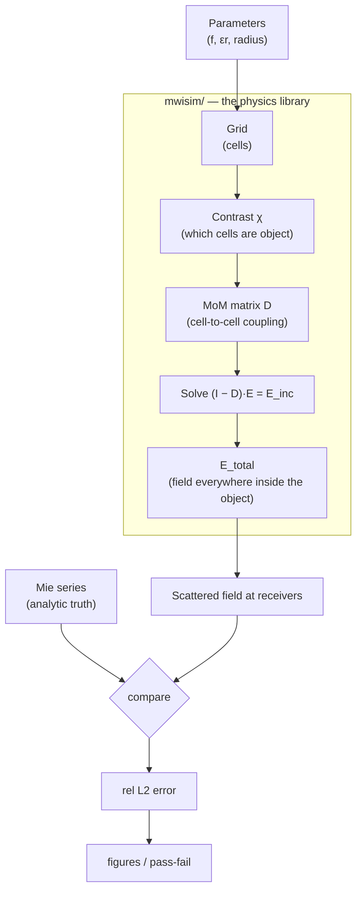
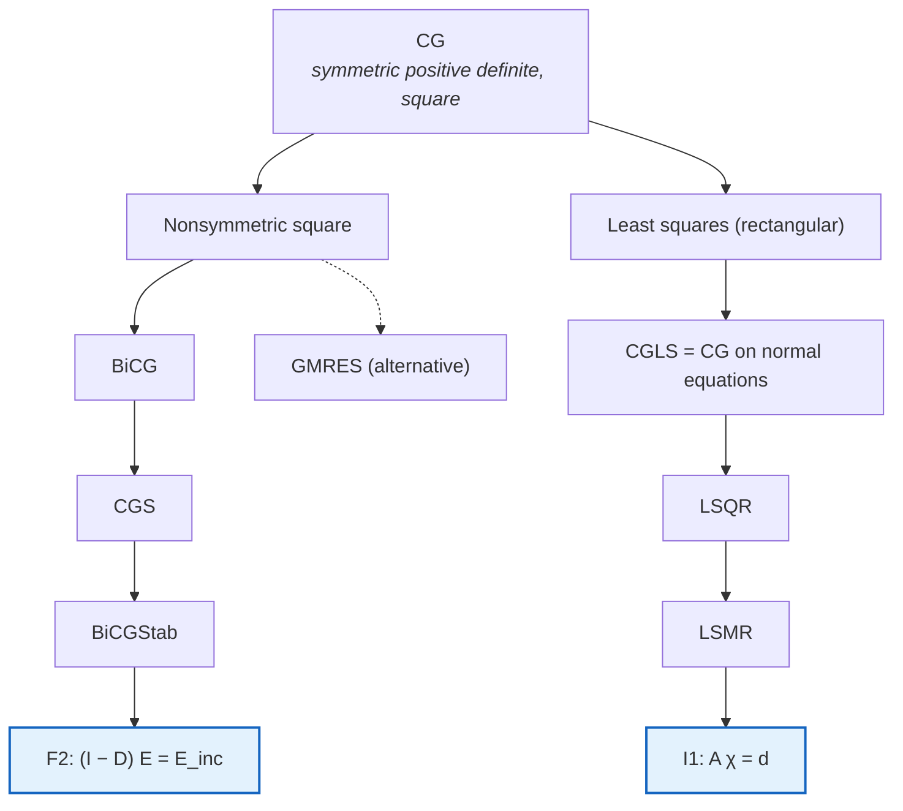

# Codebase & Algorithm Guide — from 0 to 1

> **Who this is for:** you, six months from now, opening this repo and thinking "what *is* all this?" It rebuilds the electromagnetic scattering algorithm from scratch, then walks every Python file in `mwisim/`, `scripts/`, and `tests/`, line-ideas explained, with **MATLAB analogies** throughout (you know MATLAB; NumPy is MATLAB with different punctuation). Read Part 1 to refresh the physics, Part 2 for the Python you need, then Part 3 is the file-by-file map.
## Contents

1. The 30-second mental model
2. The algorithm from zero (the physics)
3. NumPy for a MATLAB user (just what this repo uses)
4. File-by-file walkthrough (`mwisim/`)
5. The drivers (`scripts/`)
6. The tests as a specification (`tests/`)
7. One full run, traced end to end
8. Symbol & glossary table

---

## 1. The 30-second mental model

We simulate one experiment: **a plane microwave hits a dielectric cylinder; we compute the scattered field on a ring of receivers around it.** Then we check our answer against the textbook closed-form solution (the *Mie series*). If they agree, our numerical engine is trustworthy — and *that* engine is what later reconstructs unknown objects (breast / bone) from their scattered fields.



- **F1** built this whole chain *densely* (a real $N\times N$ matrix). See [[F1_milestone]].
- **F2** replaced the slow matrix step with an FFT so it scales to huge grids, without changing any physics. See [[F2_milestone]].

---

## 2. The algorithm from zero (the physics)

### 2.1 What field are we even solving for?

In 2D **TM polarization**, the electric field points purely along $z$, so the whole vector problem collapses to **one scalar function** $E_z(x,y)$. That is the single reason 2D-TM is the standard starting point — no vector bookkeeping, just one complex number per point. Everything in this repo is that one scalar field, sampled on a grid.

We use the engineering time convention $e^{+j\omega t}$ (same as radar). Consequence: outgoing waves look like $e^{-jk R}$, and the right special function is the **Hankel function of the second kind** $H^{(2)}$. (If you ever see $H^{(1)}$ and $+i$, that's the physics convention — don't mix them or the imaginary part flips sign.)
### 2.2 Incident, scattered, total

The field splits into two parts:

$$E_z = \underbrace{E_z^{\text{inc}}}_{\text{the wave you sent in}} + \underbrace{E_z^{\text{sc}}}_{\text{what the object re-radiates}}$$

The incident wave is a plane wave travelling along $+x$: $E_z^{\text{inc}}=E_0 e^{-jk_b x}$. The scattered part is what we want to predict (and later, measure and invert).

### 2.3 The contrast — "how different is each point from the background?"

Define the **contrast function**

$$\chi(\mathbf r)=\frac{\varepsilon_r(\mathbf r)}{\varepsilon_b}-1.$$

It is $0$ in empty background and nonzero only inside the object. $\chi$ is the *unknown* in the imaging problem; in the *forward* problem we know it and compute the field.

### 2.4 The master equation (Lippmann–Schwinger)

Every scattering simulation in this repo is one equation:
$$\boxed{\,E_z(\mathbf r)=E_z^{\text{inc}}(\mathbf r)+k_b^2\!\int_S G(\mathbf r,\mathbf r')\,\chi(\mathbf r')\,E_z(\mathbf r')\,dS'\,}$$

In words: **the field at a point = the wave you sent in + the sum of tiny re-radiations from every bit of object, each weighted by how strong it is ($\chi$), how strong the field there is ($E_z$), and how a wave travels from there to here (the Green's function $G$).**

The 2D free-space Green's function (our $e^{+j\omega t}$ convention) is

$$G(\mathbf r,\mathbf r')=\frac{1}{4j}H_0^{(2)}\!\bigl(k_b|\mathbf r-\mathbf r'|\bigr).$$

> **Why is this called nonlinear "in general" but linear here?** $E_z$ appears on *both* sides. In the forward problem $\chi$ is known, so it's a linear equation in the unknown $E_z$ — one solve and done. In the *inverse* problem $\chi$ and $E_z$ are *both* unknown and multiply each other → genuinely nonlinear → that's why inversion (I1–I4) needs iteration (Born, DBIM…).

### 2.5 Turning the integral into a matrix (Method of Moments, Richmond)

A computer can't handle a continuous integral, so we **discretize**:

1. Cover the object region with $N$ tiny **square cells** of side $d$. Assume $E_z$ and $\chi$ are constant inside each cell ("pulse basis").
2. Demand the equation hold exactly at each **cell center** ("point matching").
3. The integral becomes a finite sum. Collect it into matrix form:

$$(\mathbf I-\mathbf D)\,\mathbf E=\mathbf E^{\text{inc}},\qquad D_{mn}=k_b^2\,\chi_n \!\int_{\text{cell}_n}\! G(\mathbf r_m,\mathbf r')\,dS'.$$

$\mathbf E$ is the stacked field values, one per cell. $D_{mn}$ says **how much the field in cell $n$ contributes to the field in cell $m$.** Solve the linear system → you have the field everywhere inside the object. That is the entire forward solver.

### 2.6 The one hard integral: the self-cell

When $m=n$ (a cell's effect on itself), $\mathbf r_m=\mathbf r_n$ and $G$ blows up ($H_0^{(2)}$ is singular at zero distance). **Richmond's trick:** replace the square cell by an equal-area disk of radius $a=d/\sqrt{\pi}$ (so $\pi a^2 = d^2$). The disk integral has a closed form:

$$D_{mn}=\begin{cases}-\,\chi_n\,\dfrac{j\pi k_b a}{2}\,J_1(k_b a)\,H_0^{(2)}(k_b\rho_{mn}), & m\neq n,\\[2mm]-\,\chi_n\Bigl[\dfrac{j\pi k_b a}{2}\,H_1^{(2)}(k_b a)+1\Bigr], & m=n.\end{cases}$$

### 2.7 Getting the scattered field at the receivers

Once we know $\mathbf E$ inside the object, the field at any *exterior* receiver $\mathbf r_r$ is a plain weighted sum (no singularity, receivers are far from cells):

$$E_z^{\text{sc}}(\mathbf r_r)=k_b^2\sum_n G(\mathbf r_r,\mathbf r_n)\,\chi_n\,E_n\,dS.$$

### 2.8 The ground truth: the Mie series

For a *circular* cylinder there is an exact analytic answer — an infinite series of angular modes:

$$E_z^{\text{sc}}(\rho,\phi)=\sum_{n=-\infty}^{\infty}(-j)^n a_n H_n^{(2)}(k_b\rho)\,e^{jn\phi},$$

with mode coefficients $a_n$ built from Bessel/Hankel functions and the boundary conditions. We truncate the sum (it converges fast) and treat it as **truth**. The entire validation philosophy of the project: *compare numerics to an exact answer, in simulation, no lab needed.*

### 2.9 The validation metric

Relative $L_2$ error between our field and Mie's:

$$\text{err}=\frac{\lVert E^{\text{MoM}}-E^{\text{Mie}}\rVert_2}{\lVert E^{\text{Mie}}\rVert_2}.$$

F1 passes when this is small **and** shrinks as the grid is refined (a *convergence curve*).

That's the whole algorithm. Everything below is this maths, written in Python.

---

## 3. NumPy for a MATLAB user (just what this repo uses)

You know MATLAB, so here is only the delta.

| Idea                       | MATLAB              | NumPy (this repo)                         |
| -------------------------- | ------------------- | ----------------------------------------- |
| import the library         | (built in)          | `import numpy as np`                      |
| make a vector              | `linspace(0,1,5)`   | `np.linspace(0,1,5)`                      |
| imaginary unit             | `1i` or `1j`        | `1j` (e.g. `4j` is one literal!)          |
| matrix multiply            | `A*B`               | `A @ B` (the `@` operator)                |
| **elementwise** multiply   | `A.*B`              | `A * B`                                   |
| transpose / conj-transpose | `A.'` / `A'`        | `A.T` / `A.conj().T`                      |
| solve $Ax=b$               | `A\b`               | `np.linalg.solve(A, b)`                   |
| 2-norm                     | `norm(v)`           | `np.linalg.norm(v)`                       |
| build a grid               | `meshgrid`          | `np.meshgrid(..., indexing="ij" or "xy")` |
| indexing base              | **1-based**, `v(1)` | **0-based**, `v[0]`                       |
| index range                | `v(2:5)` (incl.)    | `v[1:5]` (**end-exclusive**)              |
| last element               | `v(end)`            | `v[-1]`                                   |
| reshape to column list     | `reshape`           | `arr.ravel()` / `arr.reshape(...)`        |
| stack columns              | `[a b]`             | `np.column_stack([a, b])`                 |

Five gotchas that matter here:

- **`@` vs `*`.** `@` is real matrix multiply (linear algebra); `*` is elementwise (`.*`). Mixing them up is the #1 NumPy bug for MATLAB users.
- **Broadcasting.** `centers[:, None, :] - centers[None, :, :]` is how we build an all-pairs difference with no loop. `None` inserts a new axis (like making a "page" dimension), and NumPy auto-stretches singleton axes. This single line is what vectorizes the distance matrix.
- **`indexing="ij"` vs `"xy"`.** `"ij"` = matrix/row-column order (axis 0 is $y$ rows); `"xy"` = Cartesian (axis 0 is $x$). The repo deliberately uses each in the right place; the FFT operator depends on the ravel order matching.
- **Slicing is end-exclusive and 0-based.** `vp[:ny, :nx]` keeps rows `0..ny-1`. This is how F2 crops the FFT result.
- **`dtype=complex`.** Arrays must be told they're complex up front, or assigning a complex value silently drops the imaginary part.

A few Python-isms you'll see:

- `def f(x: float) -> np.ndarray:` — the `: float` / `-> np.ndarray` are **type hints**, documentation only; Python doesn't enforce them.
- `"""..."""` right under a `def` is the **docstring** (help text).
- `from __future__ import annotations` — a harmless compatibility line; ignore it.
- `a or b` — returns `a` if it's "truthy", else `b`. Used for defaults: `P["R_cyl"] or 0.5*lam0`.

---

## 4. File-by-file walkthrough (`mwisim/`)

> Mapping: §2.x physics → file. grid/contrast → §2.3, 2.5 · green → §2.4 · mom → §2.5–2.7 · mie → §2.8 · metrics → §2.9 · operators → F2 (§2.5 sped up).

### 4.1 `grid.py` — lay down the cells, mark the object

**`make_grid(domain_size, d)`** builds the $N$ cell centers covering a square $[-L/2,L/2]^2$ and returns them as an `(N, 2)` array of $(x,y)$ plus the cell area `dS = d**2`.

- `N_cells = math.ceil(domain_size / d)` — how many cells per side.
- The `if N_cells % 2 == 0` branch just centers the grid nicely on the origin whether the count is even or odd (`%` is modulo; `//` is integer division).
- `X, Y = np.meshgrid(x_, y_, indexing="xy")` then `centers = np.column_stack([X.ravel(), Y.ravel()])` — flatten the 2D grid into a flat list of points. *MATLAB:* `[X(:) Y(:)]`.

**`assign_contrast(centers, R_cyl, eps_r, eps_b=1.0)`** decides which cells are "object."

- `r = np.hypot(centers[:,0], centers[:,1])` — distance of each cell to the origin (`hypot` = $\sqrt{x^2+y^2}$, the whole vector at once).
- `chi = np.where(r <= R_cyl, eps_r/eps_b - 1, 0.0)` — *vectorized if/else*: where the cell is inside the radius use $\varepsilon_r/\varepsilon_b-1$, else $0$. This is §2.3.
- `.astype(complex)` — force complex storage so lossy $\varepsilon_r$ works.

### 4.2 `green.py` — how a wave travels from one point to another

**`green_2d(k_b, R)`** returns $G(R)=\frac{1}{4j}H_0^{(2)}(k_b R)$ — §2.4, exactly. `hankel2(0, k_b*R)` is SciPy's $H_0^{(2)}$. Note `1/4j` parses as `1/(4j)` (since `4j` is a single complex literal), which is correct. The self term $R=0$ is *not* handled here — it's done specially in `mom.py` (§2.6).

### 4.3 `mom.py` — the heart: build the matrix, solve, radiate

This file is the forward solver (§2.5–2.7). Four functions:

**`build_D(centers, chi, k_b, d)`** → the $N\times N$ coupling matrix (§2.5–2.6). The file keeps a commented-out *slow, readable* double loop on top (great for understanding) and a *fast vectorized* version below. The fast one:

```python
a = d / np.sqrt(np.pi)                       # equal-area disk radius (§2.6)
pref = -(1j * np.pi * k_b * a / 2)           # the shared prefactor in the boxed formula
diff = centers[:, None, :] - centers[None, :, :]   # all-pairs (r_m - r_n), shape (N,N,2)
rho  = np.sqrt((diff**2).sum(axis=-1))       # all-pairs distances rho_mn, shape (N,N)
D = pref * jv(1, k_b*a) * hankel2(0, k_b*rho)      # off-diagonal entries
np.fill_diagonal(D, pref * hankel2(1, k_b*a) - 1)  # SELF term incl. the famous "-1" (§2.6!)
D = D * chi[None, :]                          # multiply each COLUMN n by chi_n
return D
```

Why column multiply (`chi[None, :]`)? Because $\chi_n$ belongs to the *source* cell $n$, which is the **column** index. `chi[None, :]` is a `(1, N)` row that broadcasts down every row. After this, the diagonal `-1` has become $-\chi_n$ — that is the self-cell term.

**`incident_plane_wave(centers, k_b, E0=1.0)`** → $E_0 e^{-jk_b x}$ at each cell (§2.2). `centers[:,0]` is the $x$ column. One line, fully vectorized.

**`solve_total_field(D, E_inc)`** → solves $(\mathbf I-\mathbf D)\mathbf E=\mathbf E^{\text{inc}}$ with `np.linalg.solve(I - D, E_inc)` (*MATLAB:* `(I-D)\E_inc`). This is the dense direct solve that F2 later replaces. Returns the field inside the object.

**`scattered_field(rx_points, centers, chi, E_tot, k_b, dS)`** → the field at exterior receivers (§2.7): builds receiver-to-cell distances by broadcasting, forms $G$, then `E_sc = pref * (G @ (chi * E_tot))`. Here `G @ (...)` is a real matrix-vector product (the weighted sum), while `chi * E_tot` is elementwise. Receivers are outside the object so no singularity.

### 4.4 `mie.py` — the analytic ground truth (§2.8)

**`mie_an(n, k_b, k_1, R_cyl)`** computes one mode coefficient $a_n$ from the boundary-condition ratio of Bessel/Hankel terms. `jv, jvp` are $J_n$ and its derivative; `hankel2, h2vp` are $H_n^{(2)}$ and its derivative.

**`mie_scattered(rx_points, k_b, k_1, R_cyl, Nmax=None)`** sums the series over modes $-N_{\max}..N_{\max}$:

- `rho, phi = np.hypot(...), np.arctan2(...)` — convert receivers to polar.
- default `Nmax = ceil(|k_b| R_cyl) + 10` — enough modes for convergence (more modes for bigger/faster-varying objects).
- the `for n in range(-Nmax, Nmax+1)` loop adds each mode's contribution.
- *sanity check baked into the tests:* increase `Nmax` and the answer must stop changing (T5).

> **Get this file right FIRST.** If the "truth" is wrong, every comparison downstream lies. That's why Mie has its own self-convergence test before MoM is ever trusted.

### 4.5 `metrics.py` — score and convergence (§2.9)

**`rel_l2_error(approx, ref)`** = $\lVert \text{approx}-\text{ref}\rVert / \lVert \text{ref}\rVert$, complex-aware. A helper, used everywhere.

**`convergence_study(d_list, params)`** runs the *entire* pipeline for several cell sizes $d$ and records the error each time, returning `(cells_per_wavelength, errors)` for the log-log convergence plot. Note the line `m = chi != 0; centers, chi = centers[m], chi[m]` — **boolean-mask indexing** keeps only object cells to shrink the dense system (MATLAB logical indexing `centers(m,:)`). The derived wavenumbers use $k=2\pi f/c\cdot\sqrt{\varepsilon}$.

### 4.6 `operators.py` — the F2 fast engine (same physics, FFT speed)

This is the F2 deliverable; full theory in [[F2_Tutorial_CG-FFT-matrix-free-solver]] and [[F2_milestone]]. The key realisation: on a regular grid $D_{mn}=g(\mathbf r_m-\mathbf r_n)\chi_n$ depends only on the **displacement** $\mathbf r_m-\mathbf r_n$, so $\mathbf D$ is **block-Toeplitz with Toeplitz blocks (BTTB)**, and "multiply by a Toeplitz matrix" = "do a convolution" = "multiply in Fourier space." So we never store $\mathbf D$:

- **`infer_grid_shape(centers)`** — recover $(N_y,N_x)$ from the flat `centers` (the FFT needs the regular grid back in 2D).
- **`GreenFFT.__init__`** — compute the kernel $g$ over *all* displacements once, zero-pad it to `next_fast_len(2N-1)` (the **circulant embedding** that prevents FFT wrap-around), and cache `self.G_hat = fft2(g_pad)`. The self entry carries the same `- 1` as `build_D`.
- **`_conv(v_grid)`** — one convolution: pad `v` into a zeros canvas, `ifft2(G_hat * fft2(vp))`, then crop `[:ny, :nx]`. The wrap-around garbage lives entirely in the discarded part.
- **`apply_D(x)`** — reshape `x` to a grid, multiply by $\chi$ (source/column), convolve, ravel back. This *equals* `build_D @ x` but in $O(N\log N)$ (test T9 proves it).
- **`apply_IminusD(x)`** — `x - apply_D(x)`: the operator $(\mathbf I-\mathbf D)$.
- **`as_linear_operator()`** — wraps the above so SciPy's iterative solvers can call it with just matvecs (no matrix needed).
- **`solve_total_field(...)`** — BiCGStab or GMRES iterates to the answer; a callback counts iterations; it reports an honest residual $\lVert b-A\mathbf E\rVert/\lVert b\rVert$.

In the `operators.py`, `g` is the kernel evaluated at _every possible displacement_ $\mathbf r_n-\mathbf r_m$  between two cells on the grid. With cells indexed $i_y\in[0,n_y), i_x\in[0,n_x)$, the index _differences_ run $\Delta i_y\in[-(n_y-1),\,n_y-1]$  and $\Delta i_x\in[-(n_x-1),\,n_x-1]$ — that's $2n_y-1$ by $2n_x-1$ distinct displacements. So `g` is `(2ny-1, 2nx-1)`, while $\chi$ (and the field) are `(ny, nx)`. That size difference is exactly _why_ we then circulant-embed `g` and zero-pad the field to a common `(py, px)` before the FFT.

Also in this file: **`A_op` / `AH_op`** — the Born forward operator and its adjoint for the *inversion* stage (I1+). `A_op(v) = k_b^2 dS · G_tr @ (E_inc * v)` maps a contrast guess to predicted receiver fields; `AH_op` back-projects a residual onto the grid. These are the seeds of the imaging work to come.

### 4.7 `inverse/__init__.py` — placeholder for I1–I4

Empty package with a docstring roadmap (Born → BIM/DBIM → CGLS/LSQR → PnP-DBIM). Nothing to run yet; this is where I1 will land.

---

## 5. The drivers (`scripts/`)

These are *orchestration only* — they import the library and make figures. No physics lives here.

### 5.1 `run_f1.py`

- A parameter dict `P` (frequency, $\varepsilon_r$, geometry). `_derived(P)` turns it into wavelengths and wavenumbers.
- `run_pointwise(P)` runs one grid, computes MoM and Mie scattered fields on the receiver ring, prints the error, and saves `docs/fig_pointwise.png` (Re/Im overlay: dots = MoM, line = Mie).
- `run_convergence(P)` calls `convergence_study` over several cell sizes and saves `docs/fig_convergence.png` (log-log error vs cells-per-wavelength — should slope down).
- `sys.path.insert(0, ...)` at the top is the "no `pip install` needed" trick: it adds the repo root to Python's import search path so `import mwisim...` works.

### 5.2 `run_f2.py`

The F2 benchmark. `setup`/`bench` build a problem at a target grid size, time both the **CG-FFT** path and (when it still fits in RAM) the **dense** path, record iterations and memory, and confirm they agree (`match` column). `main()` sweeps a list of sizes, prints the table you saw, and saves `docs/fig_f2_scaling.png` (time and memory vs $N$, dense vs FFT). The headline line at the end reports the largest case.

---

## 6. The tests as a specification (`tests/`)

The tests *are* the contract — read them as "what correct looks like." They're written for `pytest`; run `python -m pytest -q` (the `python -m` form makes `import mwisim` resolve).

### 6.1 `test_f1.py` (T1–T8) — does the forward solver match physics?

- **helper / T2** — incident wave has unit magnitude.
- **T3** — Green depends only on distance (equal distances → equal values).
- **T4** — *weak* scatterer: total field ≈ incident field (object barely perturbs).
- **T5** — Mie self-convergence: `Nmax=8` vs `Nmax=25` agree (truth is trustworthy).
- **T6/T7** — MoM matches Mie for a weak cylinder (<5%).
- **T8** — MoM *still* matches Mie for a **strong** cylinder ($\varepsilon_r=8$) — this is the test the self-cell "+1" bug used to fail.

### 6.2 `test_f2.py` (T9–T14) — does the fast path equal the slow path?

- **T9** — `apply_D @ x` equals `build_D @ x` on a *random* complex vector (<1e-12 target; your run ~1e-8). Random input is deliberate: it stresses every matrix entry.
- **T10** — $(\mathbf I-\mathbf D)\mathbf x$ matches.
- **T11/T12** — BiCGStab and GMRES solves match the dense direct solve.
- **T13** — end-to-end: fast-path scattered field = slow-path = Mie.
- **T14** — `infer_grid_shape` works and rejects a non-rectangular grid.

> Note F1 tests **mask** to object cells (smaller dense system); F2 tests use the **full regular grid** because the FFT structure needs it. The $\chi=0$ exterior cells cost almost nothing.

---

## 7. One full run, traced end to end

Following `run_f1.run_pointwise` with the default weak cylinder:

1. `_derived(P)` → $\lambda_0$, $k_b$, $k_1$, cylinder radius, receiver radius.
2. `make_grid` → ~thousands of cell centers; `assign_contrast` → $\chi$ (nonzero inside).
3. mask to object cells → smaller system.
4. `build_D` → the $N\times N$ coupling matrix (§2.5–2.6).
5. `incident_plane_wave` → $\mathbf E^{\text{inc}}$.
6. `solve_total_field` → solve $(\mathbf I-\mathbf D)\mathbf E=\mathbf E^{\text{inc}}$ → field inside (§2.5).
7. `scattered_field` at the receiver ring → predicted $E^{\text{sc}}$ (§2.7).
8. `mie_scattered` at the same ring → analytic truth (§2.8).
9. `rel_l2_error` → the score; plot dots vs line.

F2 only changes steps 4+6: instead of building `D` and factorising, `GreenFFT` applies $\mathbf D$ via FFT and iterates. Steps 1–3, 5, 7–9 are untouched.

---

## 8. Symbol & glossary table

| Symbol / name                   | Meaning                                                                        |
| ------------------------------- | ------------------------------------------------------------------------------ |
| $E_z$                           | the scalar field we solve for (2D TM)                                          |
| $E^{\text{inc}}, E^{\text{sc}}$ | incident (sent-in) and scattered (re-radiated) field                           |
| $\chi$ (`chi`)                  | contrast $\varepsilon_r/\varepsilon_b-1$; nonzero inside object                |
| $k_b, k_1$                      | wavenumber in background, inside cylinder                                      |
| $G$                             | 2D Green's function $\frac{1}{4j}H_0^{(2)}(k_bR)$ — point-to-point wave travel |
| $\mathbf D$                     | MoM coupling matrix; $(\mathbf I-\mathbf D)\mathbf E=\mathbf E^{\text{inc}}$   |
| $d$, $a$, `dS`                  | cell side, equal-area disk radius $d/\sqrt\pi$, cell area $d^2$                |
| $\rho_{mn}$                     | distance between cell $m$ and cell $n$                                         |
| Mie series                      | exact analytic scattered field for a circular cylinder (ground truth)          |
| BTTB                            | block-Toeplitz w/ Toeplitz blocks — structure that makes $\mathbf D$ an FFT    |
| MoM                             | Method of Moments (Richmond) — the discretization scheme                       |
| L-S                             | Lippmann–Schwinger — the master integral equation                              |
| BiCGStab / GMRES                | iterative linear solvers that need only matrix-vector products                 |
| $H_n^{(2)}, J_n, Y_n$           | Hankel (2nd kind), Bessel 1st kind, Bessel 2nd kind                            |

---

*Living document — update as F3/inversion/HLS land. See [[F1_Tutorial_2D-MoM-and-Mie-validation]] and [[F2_Tutorial_CG-FFT-matrix-free-solver]] for the full derivations behind §2 and §4.6.*

---

## Appendix A — FAQ / deep dives

> These are the questions that actually tripped me up, with the durable answer kept here so I don't re-derive it. Grouped by topic; the §-references point back into the guide.

### A.1 Physics & algorithm

**Q. The receiver physically measures the *total* field, not the scattered field — right?** Yes. A real probe at $\mathbf r_r$ sees $E^{\text{tot}}=E^{\text{inc}}+E^{\text{sc}}$. But we only predict/compare $E^{\text{sc}}$, recovered by subtracting the known background. Precisely: **object measurement** $=E^{\text{tot}}$; **background measurement** (no object) $=E^{\text{inc}}$; so **object − background $=E^{\text{tot}}-E^{\text{inc}}=E^{\text{sc}}$**. The quantity *subtracted away* is $E^{\text{inc}}$ (the background); the *result* is $E^{\text{sc}}$ — not $E^{\text{inc}}$ and not $E^{\text{tot}}$. Both `scattered_field` and `mie_scattered` return the scattered part only, so they compare like-for-like. Scattered field = the information; incident field = known background. (§2.2, §2.7)

**Q. In $D_{mn}$, is $m$ the sensor position?** No — common trap. In `build_D`, **both $m$ and $n$ are imaging-domain cells**. $n$ = source cell, $m$ = observation/test cell (point-matching at each cell center). $\mathbf D$ is a cell↔cell coupling matrix ($N\times N$). The **sensors** are separate: they appear only in `scattered_field` as `rx_points`, through a rectangular receiver×cell Green matrix. Pipeline: first solve the field among domain cells ($\mathbf D$), then radiate that field out to exterior sensors. (§2.5 vs §2.7)

**Q. $\rho_{mn}=\lVert\mathbf r_m-\mathbf r_n\rVert$?** Yes — center-to-center distance between cells $m$ and $n$. (§2.6)

**Q. Why does the current code get $E^{\text{sc}}$ in one shot with no outer iteration?** Because this is the **forward** problem (χ known). Two distinct "loops" must not be confused:
- *Linear solve* of $(\mathbf I-\mathbf D)\mathbf E=\mathbf E^{\text{inc}}$: F1 uses a direct solver (truly one shot); F2 uses BiCGStab (which *is* iterative, but converges in ~7 steps — that's the `iters` column).
- *DBIM outer nonlinear loop*: exists **only in inversion**, because there χ is unknown. The forward problem has no outer loop. So "one shot" is about forward-vs-inverse, not about the cylinder being simple. (§2.4 note; inversion comes in I1+)

**Q. Is the inversion loop "estimate χ by inversion, estimate E by forward, repeat"?** Yes, essentially DBIM: given current χ → solve forward for the in-domain field $E_n$ → predict scattered data → compare to measured → linearize → update χ → repeat. The scattered-field formula is used *every* iteration (to form the residual), not just at the end. The final image is the converged χ.

### A.2 NumPy / broadcasting 

**Q. `indexing="ij"` vs `"xy"` — concrete example.** Take `x_=[10,20,30]`, `y_=[1,2]`.
- `"xy"` → shape `(len(y), len(x))=(2,3)`; element `[r,c]` is $(x_c,y_r)$ — first index runs over $y$ (image/Cartesian style).
- `"ij"` → shape `(len(x), len(y))=(3,2)`; element `[i,j]` is $(x_i,y_j)$ — first index runs over $x$ (matrix style). The FFT operator assumes a row-major ravel `n = iy*Nx + ix`, so the kernel axes and `infer_grid_shape` must follow the same order — mismatch is exactly the DX/DY swap bug. (§3, §4.6)

**Q. Why flatten the grid to 1D and then re-insert a dimension with `None`?** The dense linear system $(\mathbf I-\mathbf D)\mathbf E=\mathbf E^{\text{inc}}$ wants $\mathbf E$ as a flat **vector** and $\mathbf D$ as $N\times N$; the all-pairs distance needs `centers[:,None,:]-centers[None,:,:]` → `(N,N,2)`. So flattening is natural for the *matrix* view. F2 does the opposite (reshape back to a 2D grid) because FFT convolution is inherently 2D — that's the "reshape and it clicks" insight. Dense MoM = vector/matrix view; CG-FFT = grid view. (§4.3 vs §4.6)

**Q. `D * chi[None,:]` vs `chi[:,None] * D` — can I swap them?** No, they differ.
- `chi[None,:]` is shape `(1,N)` → broadcasts down rows → scales **column** $n$ by $\chi_n$ ✓ (χ belongs to the *source* = column index).
- `chi[:,None]` is `(N,1)` → scales **row** $m$ by $\chi_m$ ✗ (wrong physics). Rule for placing `None`: the axis you add becomes size 1 (the "stretched" one); the real `N` must align with the axis of `D` you want to scale. To scale columns (axis 1), put real `N` on axis 1 → `chi[None,:]`. Left/right order of `*` is irrelevant (elementwise multiply commutes); only the `None` placement decides correctness.

**Q. `rx_points` is `(Nrx,2)` and `centers` is `(N,2)` — different leading sizes, can they subtract?** Yes, via broadcasting: `rx_points[:,None,:]`→`(Nrx,1,2)`, `centers[None,:,:]`→`(1,N,2)`. Broadcasting needs each axis equal or one of them `1`: `(Nrx,1)`×`(1,N)`→`(Nrx,N)`, last axis `2==2`. Result `(Nrx,N,2)`; `.sum(axis=-1)` collapses the coord axis → `(Nrx,N)` distance matrix. (§4.3)

**Q. `m = chi != 0`?** A boolean **mask** array (True where χ≠0 = object cells). `centers[m], chi[m]` keep only those cells, shrinking the dense system (background χ=0 contributes nothing). MATLAB: `m = (chi~=0); centers = centers(m,:);`. (§4.5)

### A.3 Python idioms

- **`np.where(cond, a, b)`** — vectorized ternary; pick `a` where `cond` else `b`. Rare in MATLAB (which uses logical indexing). Used in `assign_contrast` and the F2 kernel.
- **`a = x if cond else y`** — inline ternary expression (e.g. `offset = d/2 if N%2==0 else 0.0`). No direct MATLAB equivalent.
- **`with np.errstate(invalid="ignore"):`** — a *context manager*: temporarily sets a scope/precondition for the indented statements (here, suppress the `hankel2(0,0)=NaN` warning), auto-restored on exit. This is the "precondition for these statements" construct.
- **`arr[mask]`** — boolean-mask indexing (see A.2).
- **`np.asarray(x)`** — defensive: type hints aren't enforced, so a caller might pass a list/scalar; `asarray` is a zero-cost pass-through for real arrays, a converter otherwise. Cheap insurance.
- **First-class functions + dict unpacking** (the `solver, extra = ...; solver(..., **extra)` pattern):
- `solver = spla.bicgstab` (no parentheses) names the *function itself* — like a MATLAB function handle `@bicgstab`. Call it later with `solver(...)`.
- `extra = {"callback_type":"pr_norm"}`; `**extra` *unpacks* the dict into keyword arguments at call time (`callback_type="pr_norm"`); `**{}` adds nothing.
- Net effect: one call line works for both solvers — the dict absorbs the argument that differs, eliminating an if/else. "Use data to remove branches."

### A.4 Grid & green_2d

**Q. In `make_grid`, can the spacing end up ≠ d (breaking `dS=d**2`)?** No — spacing is exactly `d` by construction. `linspace(a,b,N)` has step `(b-a)/(N-1)`; the endpoints are chosen so the span is exactly `(N-1)*d` in both even/odd cases, giving step `=d`. The only slack is `N_cells=ceil(domain/d)` makes the *covered area* slightly ≥ requested, but the cell size stays exactly `d`, so `dS=d**2` is consistent. (§4.1)

**Q. Why define `green_2d` at all?** *(Resolved — it is now used.)* It was originally only exercised by test T3 while the hot paths inlined `hankel2`. As of this guide, **`scattered_field` calls `green_2d`** (DRY: one definition of the convention $\frac1{4j}H_0^{(2)}$), so it is no longer a "decoration." `build_D` still inlines its kernel because it needs the disk-integral form ($J_1$ prefactor, self-cell), not the bare point Green function. Future reuse: the inversion $G_{tr}$ matrix builds on `green_2d`. (§4.2)

### A.5 operators.py specifics

**Q. `self.d * np.sqrt(DX**2 + DY**2)` — DX/DY are integer cell offsets, so ×d gives metric distance?** Yes. `DX,DY` come from `np.arange(-(n-1),n)` (integer displacements in *cell units*); ×`self.d` converts to physical ρ in meters. Same ρ as `build_D`, computed from integer offsets instead of coordinate differences. (§4.6)

**Q. `g_pad[np.mod(DY,py), np.mod(DX,px)] = g` — why is this so striking?** Three NumPy powers in one line:
1. **Integer-array (fancy) indexing**: `DY,DX` are *same-shape integer arrays*; NumPy pairs them elementwise as coordinates, so hundreds of scattered targets are written in one assignment.
2. **`np.mod` for negative offsets**: `-1 % py = py-1` wraps a negative displacement to the array's tail — the "ring seat" required by *circulant* (circular-convolution) embedding.
3. **Shape-matched assignment**: the indexed positions and the right-hand `g` have the same shape, so values drop in by position. MATLAB equivalent needs `sub2ind` + `mod(...)+1`: `idx=sub2ind([py px],mod(DY,py)+1,mod(DX,px)+1); g_pad(idx)=g;` — doable but far less direct.

**Q. After `fft2(g_pad)`, why no `fftshift`?** Because we're *computing* a convolution, not *displaying* a spectrum. The convolution theorem `ifft2(fft2(g)*fft2(v))` requires both transforms in FFT's native (un-shifted) frequency order; `fftshift` would misalign them and corrupt the result. We already laid the kernel out in space with `np.mod` (zero-displacement at `[0,0]`, negatives wrapped to the tail) — exactly the layout FFT expects. Rule: **shift to look, never to compute.** (§4.6)

**Q. `A = self.as_linear_operator()` — what is this, and why "no matrix needed"?** A direct solve (`A\b`) needs a real stored matrix. Ours is $N\times N$; at $N=10^5$ that's 167 GB — unbuildable. But iterative solvers (BiCGStab/GMRES) only ever need one capability: **"given $x$, return $Ax$"** (a matvec) — never the individual entries, no inverse, no factorization. SciPy's `LinearOperator` lets you supply *that function* instead of a matrix:
```python
spla.LinearOperator(shape=(N,N), matvec=self.apply_IminusD, dtype=complex)
```
`shape` just tells the solver "pretend I'm this big"; `matvec` is the real engine — and ours computes $(\mathbf I-\mathbf D)x$ via two FFTs, building nothing. The solver thinks it's multiplying by an $N\times N$ matrix; each "multiply" is secretly an FFT. That is "no matrix needed": only the matrix's *action* exists. (MATLAB analogue: `gmres(@(x) apply_IminusD(x), b)`.) (§4.6)

**Q. `E_tot, status = solver(A, E_inc, rtol=tol, maxiter=maxiter, callback=_cb, **extra)` — every argument, and why it works.**
- `A` — the LinearOperator standing for $(\mathbf I-\mathbf D)$.
- `E_inc` — the right-hand side $b$. Yes, this solves $(\mathbf I-\mathbf D)\mathbf E_{\text{tot}}=\mathbf E_{\text{inc}}$.
- `rtol=tol` — stop when relative residual $\lVert b-Ax\rVert/\lVert b\rVert<$ tol.
- `maxiter` — iteration cap (safety against non-convergence).
- `callback=_cb` — called once per iteration; we use it to count iterations.
- `**extra` — expands to `callback_type="pr_norm"` for GMRES, nothing for BiCGStab.
- returns `(solution, status)`; `status==0` = converged. *Why it works:* a Krylov solver starts from a guess, uses matvecs to measure the residual $b-Ax$, and corrects $x$ along directions that shrink it fastest. Because $(\mathbf I-\mathbf D)$ is well-conditioned (spectrum clustered near 1), the residual drops below tol in a handful of steps (your 7). It solves the *same* equation as the direct method — iterate-to-converge instead of eliminate-once — trading a little accuracy for huge memory savings (T11 confirms agreement <1e-7). (§4.6)

**Q. `A_op` / `AH_op` — what are they and why "seeds of imaging"?** These are the **Born forward operator and its adjoint**, for the inversion stage (not used by the forward solver).
- `A_op(v) = k_b² · dS · G_tr @ (E_inc * v)`: input a contrast guess $v$ (one value per grid cell), output the scattered field it would produce at the probes. Plainly: *"give me a hypothetical object, tell me its echo."*
- `AH_op(u) = k_b² · dS · conj(E_inc) * (G_tr.conj().T @ u)`: the conjugate-transpose ("adjoint") of `A_op`. Input a probe-space residual $u$ (measured − predicted), output its **back-projection onto the imaging grid**. The inversion loop is: measure echoes → `A_op` predicts current model's echoes → residual → `AH_op` back-projects residual to the grid → update χ per cell. `AH_op(residual)` is literally a first, crude image (cells aligned with the residual light up). Born inversion = `A_op`/`AH_op` + CGLS/LSQR least squares; DBIM wraps a nonlinear loop around that. Hence "seeds of the imaging work."
> Math caveat: `AH_op` must be the *exact* adjoint of `A_op` ($\langle Av,u\rangle=\langle v,A^Hu\rangle$), or CGLS/LSQR won't converge — the first I1 test will check this. (§4.6, inversion)

---

## Appendix B — `run_f1.py` / `run_f2.py` line by line

> These scripts are *orchestration*, not physics. Read them to see how the library functions are wired into a runnable experiment + figures.

### B.1 `run_f1.py`

```python
sys.path.insert(0, os.path.dirname(os.path.dirname(os.path.abspath(__file__))))
```
- `__file__` = this script's path; `os.path.abspath` makes it absolute; two `dirname`s climb from `scripts/run_f1.py` up to the repo root; `sys.path.insert(0, ...)` puts the root first on Python's import search path. Net: `import mwisim...` works with no `pip install`. (MATLAB analogue: `addpath`.)

```python
P = dict(f=1e9, eps_b=1.0, eps_r=2.0, R_cyl=None, R_obs=None, N_rx=72, domain_factor=2.5)
```
- A parameter **dictionary** (like a MATLAB struct). `None` means "fill in later from a default."

```python
def _derived(P):
    lam0 = C0 / P["f"]
    k_b = 2*np.pi/lam0 * np.sqrt(P["eps_b"])
    k_1 = 2*np.pi/lam0 * np.sqrt(P["eps_r"])
    R_cyl = P["R_cyl"] or 0.5*lam0      # 'or' supplies the default if R_cyl is None/0
    R_obs = P["R_obs"] or 3*R_cyl
    lam1 = lam0 / np.sqrt(P["eps_r"].real if hasattr(P["eps_r"],"real") else P["eps_r"])
    return lam0, lam1, k_b, k_1, R_cyl, R_obs
```
- Converts user parameters to wavelengths/wavenumbers. `a or b` returns `a` unless it's falsy (None/0), else `b` — the default-value idiom. `hasattr(...,"real")` guards complex εr so the grid resolution uses the real part.

```python
def rx_ring(R_obs, N_rx):
    ang = np.linspace(0, 2*np.pi, N_rx, endpoint=False)
    return np.column_stack([R_obs*np.cos(ang), R_obs*np.sin(ang)]), ang
```
- Builds the receiver ring. `endpoint=False` avoids duplicating 0 and 2π (they're the same point). Returns positions `(N_rx,2)` and the angles.

`run_pointwise(P, n_per_lambda=15)` — the full chain at one grid: derive → `make_grid` (cell side `d = lam1/n_per_lambda`) → `assign_contrast` → mask object cells → `build_D` → `incident_plane_wave` → `solve_total_field` → `scattered_field` at the ring → `mie_scattered` → `rel_l2_error` → `matplotlib` two-panel Re/Im plot (`ax[0]`, `ax[1]`), `fig.savefig` to `docs/fig_pointwise.png`. The `f"...{err:.3%}"` is an **f-string** (inline formatting; `.3%` = 3-decimal percent).

`run_convergence(P, d_list_per_lambda=(8,10,15,20,30))` — builds a list of cell sizes, calls `convergence_study`, and `ax.loglog(...)` plots error vs cells-per-wavelength on log-log, saved to `docs/fig_convergence.png`.

```python
if __name__ == "__main__":
    run_pointwise(P); run_convergence(P)
```
- The "only run this when the file is executed directly (not imported)" guard. Standard Python entry point.

### B.2 `run_f2.py`

Same `sys.path` prelude, plus `matplotlib.use("Agg")` (a non-interactive backend so it renders to a file with no display — important on headless/remote runs).

- `setup(n_side_target, eps_r, f)` — builds a problem ~`n_side_target` cells per side (computes `d = L/n_side_target`).
- `bench(n_side, eps_r, do_dense=True)` — times **both** paths:
- CG-FFT: `op = GreenFFT(...)` (build), then `op.solve_total_field(...)`; records `t_fft`, `info["iters"]`, and an FFT-memory estimate.
- dense (optional): `build_D` + `solve_total_field`; records `t_dense`, `D.nbytes/1e6` MB, and `match = rel_l2_error(E_fft, E_dir)`. `del D, E_dir; gc.collect()` frees the big matrix immediately (so the next size has RAM).
- `time.perf_counter()` is a high-resolution timer (MATLAB `tic/toc`).
- `main()` — sweeps `dense_sides` (small enough for dense) then `fft_only_sides` (dense skipped), prints the aligned table (the `f"{x:>9.3f}"` specifiers right-align/format columns), then draws the two-panel time/memory log-log figure with reference slopes `∝N^3` and `∝N log N`, saves `docs/fig_f2_scaling.png`, and prints the headline.

---

## Appendix C — pytest & debugging from zero

> New territory if you've only used MATLAB. This is how the `tests/` files work, how to run them, and how to debug when one goes red.

### C.1 What a test *is*

A test is just a function named `test_*` that **asserts** something is true. `pytest` finds every `test_*` function in `tests/`, runs it, and reports pass/fail. The core statement is `assert <condition>` — if the condition is false, the test fails and pytest shows you the values. Example (T2):
```python
def test_T2_incident_unit_magnitude():
    s = _setup()
    E_inc = incident_plane_wave(s["centers"], s["k_b"])
    assert np.allclose(np.abs(E_inc), 1.0)   # plane wave has |E|=1 everywhere
```
`np.allclose(a, b)` = "equal within floating-point tolerance" (never use `==` on floats).

### C.2 `_setup()` — a fixture by convention

`_setup(...)` is a **helper** that builds a consistent little problem (grid, contrast, wavenumbers) and returns it as a dict, so every test starts from the same physics without copy-pasting. It's the leading-underscore convention for "internal helper" (pytest won't mistake it for a test because it isn't named `test_*`). The F1 version masks to object cells; the F2 `_full_setup` keeps the full grid (the FFT needs it). Returning a `dict` lets tests pull what they need: `s["centers"]`, `s["k_b"]`, etc.

### C.3 `@pytest.mark.parametrize` — one test, several inputs

```python
@pytest.mark.parametrize("eps_r", [2.0, 8.0])
def test_T9_apply_D_matches_dense(eps_r):
    ...
```
This runs the test **twice**, with `eps_r=2.0` then `eps_r=8.0`, reported as two cases (`[2.0]` and `[8.0]`). That's why "8 passed" came from 6 test functions — two are parametrized. It's how you cover weak *and* strong contrast without duplicating code.

### C.4 `pytest.raises` — asserting that an error happens

```python
with pytest.raises(ValueError):
    infer_grid_shape(centers[:-1])   # dropping a cell must raise
```
The test passes **only if** the indented code raises `ValueError`. Use this to verify guard clauses fire.

### C.5 Running tests

```bash
python -m pytest -q                         # everything, quiet (the python -m fixes imports)
python -m pytest tests/test_f2.py -q        # one file
python -m pytest tests/test_f2.py -k T9 -q  # only tests whose name contains "T9"
python -m pytest -x                         # stop at the first failure
python -m pytest -q -s                      # don't capture stdout — let print() show
```
- `-k` is a name filter (substring/expression). `-x` stops on first red. `-s` let‘s your `print(...)` appear (pytest normally hides output of passing tests).
- The earlier "no tests ran … not found: test_T9" error was just a wrong name — the function is `test_T9_apply_D_matches_dense`; use `-k T9` or the full name.

### C.6 Reading a failure & debugging

When a test fails, pytest prints the assert line and the offending values, e.g. `assert 0.83 < 0.05`. Workflow that found the F1/F2 bugs:
1. **Isolate**: run the single failing test with `-k name -s`.
2. **Print**: drop `print(np.abs(a-b).max())` (or the rel error) right before the assert; run with `-s` to see it.
3. **Drop in a debugger**: insert `breakpoint()` in the code; running pytest stops there (it's Python's built-in `pdb`). Useful commands: `p expr` (print), `n` (next line), `c` (continue), `q` (quit). MATLAB analogue: `keyboard` / `dbstop`.
4. **Compare against the oracle**: the whole test design is "fast/new path vs slow/known path." A failing `match` means *your* path differs from the trusted one — bisect by testing the operator (T9) before the solver (T11).
5. **Red → green**: fix, rerun the single test, then rerun the full suite to confirm no regression.

> The deepest habit this repo teaches: **write the test that encodes "correct" first, watch it fail (red), then make it pass (green).** The tests aren't an afterthought — they're the specification, and they're what lets you refactor (like swapping in `green_2d`, or the FFT operator) without fear.

---

## Appendix D — Python from zero (for a newcomer)

> Systematic walkthrough of the Python language features this repo (and the platform design) relies on. Written assuming **no prior Python**. MATLAB analogies throughout.

### D.1 Functions, parameters, and arguments

A function is defined with `def`, takes inputs (*parameters*), and may `return` a value:

```python
def add(a, b):
    return a + b
y = add(2, 3)        # y == 5
```

There are two ways to pass arguments at the call site:

```python
add(2, 3)            # positional: matched by ORDER (a=2, b=3)
add(a=2, b=3)        # keyword:    matched by NAME (order-independent)
add(2, b=3)          # mix: positional first, then keyword
```

**Default values** make a parameter optional:

```python
def grid(domain, d=0.01):     # d defaults to 0.01 if not given
    ...
grid(0.2)            # uses d=0.01
grid(0.2, d=0.005)  # overrides
```

This is exactly why the design puts implementation-specific knobs in `__init__` with defaults: `MoM2D(tol=1e-8, method="bicgstab")` — the caller overrides only what they care about, and every `ForwardSolver` is still *called* the same minimal way later.

### D.2 `*args` and `**kwargs` — collecting and unpacking arguments

This is the single most-confusing-for-newcomers feature, so here it is from both sides.

**Side 1 — in a function definition (`*`/`**` = "collect the extras"):**

```python
def f(a, *args, **kwargs):
    # a       -> first positional argument
    # args    -> a TUPLE of any EXTRA positional arguments
    # kwargs  -> a DICT of any EXTRA keyword arguments
    ...
f(1, 2, 3, x=10, y=20)
# a == 1
# args == (2, 3)
# kwargs == {"x": 10, "y": 20}
```

So `def solve_total_field(self, scene, E_inc, freq, **kwargs):` means "accept the three named parameters, and silently collect *any other keyword arguments* into a dict called `kwargs`." That is the **escape hatch**: a subclass can accept extra options without breaking the shared interface, because unknown keywords land in `kwargs` instead of raising an error.

**Side 2 — at the call site (`*`/`**` = "unpack/spread out"):**

```python
nums = [2, 3]
add(*nums)                 # same as add(2, 3)   -- list spread into positionals

opts = {"a": 2, "b": 3}
add(**opts)                # same as add(a=2, b=3) -- dict spread into keywords
```

So in `solver(A, E_inc, rtol=tol, maxiter=maxiter, callback=_cb, **extra)`:
- `extra` is a dict, e.g. `{"callback_type": "pr_norm"}` (for GMRES) or `{}` (for BiCGStab).
- `**extra` **spreads that dict into keyword arguments** at the call. So when `extra` is `{"callback_type":"pr_norm"}`, the call becomes `solver(..., callback_type="pr_norm")`; when `extra` is `{}`, it adds nothing.
- Net: one call line serves both solvers — the dict absorbs the argument that differs.

MATLAB has no direct equivalent; the closest mental model is building a name/value pair list and splatting it into a function call.

### D.3 Classes, objects, composition — and what `pipeline` is

A **class** is a blueprint; an **instance** is a built object. Methods take `self` (the instance) as the first parameter:

```python
class Counter:
    def __init__(self, start=0):   # constructor: runs when you build an instance
        self.n = start             # 'self.n' is data stored ON the instance
    def bump(self):
        self.n += 1
c = Counter(start=5)   # build an instance (calls __init__)
c.bump()               # call a method; Python passes c as 'self'
print(c.n)             # 6
```

`self.n` is an **attribute** (data living on the object); `bump` is a **method** (a function living on the class). MATLAB analogy: `classdef`, `obj.n`, `obj.bump()`.

**Composition** = an object that holds *other* objects. The platform's `pipeline` is exactly this — a class (we will write it in Phase 0) that holds the chosen forward solver, preprocessor, imager, inverter, and runs them in order:

```python
class Pipeline:
    def __init__(self, forward, inverter, preprocessor=None, imager=None):
        self.forward = forward          # store the components handed in
        self.inverter = inverter
        self.preprocessor = preprocessor
        self.imager = imager
    def run(self, data):
        if self.preprocessor: data = self.preprocessor.apply(data)
        chi = self.inverter.reconstruct(data, self.forward)
        return chi

# usage:
pipe = Pipeline(forward=MoM2D(), inverter=MyInverter())
result = pipe.run(data)
```

So `pipeline.run(inverter=MyInverter())` (shorthand earlier) just means: **build a pipeline that uses your inverter instance, and run it.** `pipeline` is not a Python built-in — it's our own orchestration object. The point: the pipeline only knows the *interfaces* (`ForwardSolver`, `Inverter`), so swapping in any conforming object Just Works (polymorphism, §4.6 / Appendix A.5).

### D.4 Decorators and the registry — from zero

**Step 1: functions are objects.** You can pass a function around like any value:

```python
def shout(s): return s.upper()
f = shout          # no parentheses: 'f' now refers to the function itself
f("hi")            # "HI"
```

**Step 2: a decorator is a function that takes a function/class and returns one.** `@deco` written above a definition is *sugar* for `thing = deco(thing)`:

```python
def trace(func):                 # a decorator
    def wrapper(*args, **kwargs):
        print("calling", func.__name__)
        return func(*args, **kwargs)
    return wrapper

@trace                           # == greet = trace(greet)
def greet(name):
    print("hello", name)
greet("charley")                 # prints "calling greet" then "hello charley"
```

**Step 3: a decorator *with arguments* is a function that returns a decorator** (one extra layer). This is the registry:

```python
REGISTRY = {"inverter": {}}            # a dict mapping name -> class

def register(kind, name):              # called with arguments first...
    def deco(cls):                     # ...returns the actual decorator
        REGISTRY[kind][name] = cls     # store the class under its name
        return cls                     # return it unchanged
    return deco

@register("inverter", "dbim")          # == DBIM = register("inverter","dbim")(DBIM)
class DBIM:                            # so DBIM gets stored in REGISTRY["inverter"]["dbim"]
    ...

def build(kind, name, **cfg):          # look up by name and instantiate
    return REGISTRY[kind][name](**cfg) # e.g. build("inverter","dbim", tol=1e-3)
```

**When you need it vs not (important):**
- *Don't* need it: to add your own algorithm, just subclass the interface and pass the instance (D.3). This is the primary path.
- *Do* want it: when a user picks an algorithm by **string** from a config file or command line (`inverter: dbim`), the registry maps that string to the class. It's optional sugar for config-driven selection, nothing more.

### D.5 Underscore naming conventions

Three *different* uses of `_` — don't conflate them:

1. **Underscore as a word separator (`snake_case`)** — just style, no special meaning: `R_cyl`, `k_b`, `solve_total_field`, `n_per_lambda`. Python convention is lowercase words joined by `_` (MATLAB people often use camelCase; Python prefers snake_case).
2. **Leading underscore `_name`** — "internal / private by convention." It signals "this is a helper, not part of the public interface; don't rely on it from outside." Examples in this repo: `_setup`, `_derived`, `_cb`, `_conv`, `_ring`. Python does *not* enforce it (you *can* still call it); it's a politeness signal. (`pytest` also uses it: a function named `_setup` is **not** collected as a test, only `test_*` are.)
3. **Trailing underscore `name_`** — used to avoid clashing with a Python keyword or built-in name. E.g. you can't name a variable `class` (keyword), so people write `class_`; `type_`, `id_` avoid shadowing built-ins `type`/`id`. In `run_f1.py`, `x_` and `y_` use a trailing underscore as a mild "this is the raw 1-D axis" marker (and to avoid colliding with the 2-D `X`, `Y`). Not mandatory, just a habit.

Bonus: **double underscores** `__init__`, `__name__` ("dunder") are Python *special* names with defined meanings — `__init__` is the constructor; `__name__` is the module's name (see D.7).

### D.6 `or` for defaults, and "truthiness"

`a or b` evaluates to `a` if `a` is "truthy", otherwise to `b`:

```python
R_cyl = P["R_cyl"] or 0.5*lam0
# if P["R_cyl"] is None/0/empty -> use 0.5*lam0; otherwise use P["R_cyl"]
```

So yes: "if there's no usable `R_cyl`, fall back to `0.5*lam0`." Python treats these as **falsy**: `None`, `0`, `0.0`, `""` (empty string), `[]`/`{}` (empty containers), `False`. Everything else is **truthy**.

> ⚠️ Gotcha: because `0` is falsy, `x or default` will *replace a legitimate zero*. Fine for `R_cyl` (a radius is never 0), but for values where 0 is valid, use the explicit `x if x is not None else default` instead.

### D.7 File paths and imports: `__file__`, `os.path`, `sys.path`

```python
sys.path.insert(0, os.path.dirname(os.path.dirname(os.path.abspath(__file__))))
```

Read it inside-out:
- `__file__` — a built-in variable: the path of the current `.py` file, e.g. `.../mwi/scripts/run_f1.py`.
- `os.path.abspath(__file__)` — make it absolute (full path from the drive root).
- `os.path.dirname(p)` — drop the last component, i.e. **go up one folder**:
- `.../mwi/scripts/run_f1.py` → `dirname` → `.../mwi/scripts`
- `.../mwi/scripts` → `dirname` again → `.../mwi`  ← the repo root
- So **two `dirname`s** because the script is *two levels deep* (`mwi/scripts/run_f1.py`): one hop to `scripts`, a second to the repo root `mwi`.

**How to decide how many `dirname`s:** count the folders from the file *up to* the target. A file at `repo/a/b/c/run.py` needs three `dirname`s to reach `repo`. (Each `dirname` = one `..` in path terms.)

- `sys.path` is Python's **list of folders it searches when you `import`**. `insert(0, ...)` puts the repo root at the front, so `import mwisim...` finds the `mwisim/` package there.
- **"works with no `pip install`"**: normally you'd run `pip install -e .` so Python knows where `mwisim` lives. By prepending the repo root to `sys.path` at runtime, the script makes `import mwisim` resolve *without* installing anything — handy offline / behind a proxy. (Tests use `python -m pytest`, which adds the current directory to `sys.path` for the same reason.)

### D.8 `matplotlib.use("Agg")`

```python
import matplotlib
matplotlib.use("Agg")
```

matplotlib has interchangeable **backends** — the engine that turns a figure into pixels. `"Agg"` is a *non-interactive* backend that renders straight to an image file (PNG) with **no GUI window**. You select it when running as a script / on a headless or remote machine (no display), so `fig.savefig(...)` works and nothing tries to pop up a window. Must be set *before* `import matplotlib.pyplot as plt`.

### D.9 Reading `run_f2.py`: `do_dense`, `bench()`, `main()`

`do_dense` is just a **boolean flag** (a parameter that's `True`/`False`) meaning "should I also run the slow dense path for comparison?" — set `False` for the big grids where the dense matrix won't fit in RAM.

`bench(n_side, eps_r=2.0, do_dense=True)` builds one problem and **times both solver paths**:

```python
def bench(n_side, eps_r=2.0, do_dense=True):
    centers, chi, dS, k_b = setup(n_side, eps_r)   # build a grid ~n_side cells/side
    N = centers.shape[0]                           # total unknowns
    d = np.sqrt(dS)                                # cell size back from area
    E_inc = incident_plane_wave(centers, k_b)      # right-hand side b
    row = {"N": N, "n_side": int(round(np.sqrt(N)))}   # a dict to collect results

    # --- CG-FFT (fast) path ---
    t0 = time.perf_counter()                       # start a high-res timer (MATLAB tic)
    op = GreenFFT(centers, chi, k_b, d)            # build the matrix-free operator
    t_build_fft = time.perf_counter() - t0         # elapsed = toc
    t0 = time.perf_counter()
    E_fft, info = op.solve_total_field(E_inc, tol=1e-8, method="bicgstab")
    t_solve_fft = time.perf_counter() - t0
    row.update(t_fft=t_build_fft + t_solve_fft, iters=info["iters"],
               mem_fft_MB=(op.G_hat.nbytes + 4*N*16)/1e6)   # store into the dict

    # --- dense path (only if it fits) ---
    if do_dense:
        t0 = time.perf_counter()
        D = build_D(centers, chi, k_b, d)          # the N×N matrix (expensive!)
        E_dir = solve_total_field(D, E_inc)        # direct solve
        t_dense = time.perf_counter() - t0
        row.update(t_dense=t_dense, mem_dense_MB=D.nbytes/1e6,
                   match=rel_l2_error(E_fft, E_dir))   # fast vs slow agreement
        del D, E_dir; gc.collect()                 # free the big matrix NOW
    else:
        row.update(t_dense=np.nan, mem_dense_MB=(N*N*16)/1e6, match=np.nan)
    return row                                     # one table row
```

Key bits: `time.perf_counter()` = high-resolution stopwatch (call twice, subtract); `row` is a dict accumulating one benchmark row; `row.update(key=val, ...)` adds entries; `del D; gc.collect()` immediately releases the huge matrix so the next size has memory; `np.nan` ("not a number") is a placeholder for "not measured."

`main()` drives the sweep and plots:

```python
def main():
    dense_sides = [16, 24, 32, 48, 64, 80]     # small enough for dense
    fft_only_sides = [112, 160, 224, 320]      # dense skipped (too big)
    rows = []
    print(header)                              # column titles
    for s in dense_sides:
        r = bench(s, do_dense=True); rows.append(r); print(formatted r)
    for s in fft_only_sides:
        r = bench(s, do_dense=False); rows.append(r); print(formatted r)
    # pull columns out of the list-of-dicts into arrays:
    N = np.array([r["N"] for r in rows], float)       # list comprehension (see below)
    t_fft = np.array([r["t_fft"] for r in rows], float)
    ...
    fig, (ax1, ax2) = plt.subplots(1, 2, ...)  # two side-by-side plots
    ax1.loglog(N, t_fft, ...)                  # time vs N on log-log axes
    ax2.loglog(N, mem_dense, ...)              # memory vs N
    fig.savefig(".../fig_f2_scaling.png")      # write the PNG
    print(headline)
```

`[r["N"] for r in rows]` is a **list comprehension** — "make a list of `r["N"]` for each `r` in `rows`" (MATLAB: `arrayfun`/a loop building a vector). `plt.subplots(1,2)` returns a figure and two axes; `loglog` plots on logarithmic x and y (so a power law looks like a straight line). The `f"{x:>9.3f}"` in the prints are **f-strings** with format specs (`>9.3f` = right-aligned, width 9, 3 decimals).

### D.10 Reading the tests: `s["centers"]` and `np.allclose`

`s` is a **dict** returned by `_setup()`. `s["centers"]` is **dict indexing** — "look up the value stored under the key `"centers"`." It is *not* creating a string; the quotes just write the key (which happens to be a string). MATLAB analogy: a struct field `s.centers`, or a `containers.Map` lookup `s('centers')`.

```python
s = _setup()
centers = s["centers"]      # fetch the (N,2) array stored under "centers"
k_b     = s["k_b"]          # fetch the wavenumber
```

`np.allclose(a, b)` returns `True` if `a` and `b` are **equal within a small floating-point tolerance** (default ~1e-8). You use it instead of `==` because floating-point arithmetic almost never gives bit-exact equality:

```python
np.allclose(np.abs(E_inc), 1.0)   # "is |E_inc| ≈ 1 everywhere?" -> True/False
```

Here `np.abs(E_inc)` is the magnitude of every element; comparing to `1.0` checks the plane wave has unit amplitude (T2). A bare `np.abs(E_inc) == 1.0` would fail on rounding; `allclose` is the correct floating-point "equal."

---

*Appendix D added 2026-06-17 for newcomer onboarding. Pair it with Appendix A (FAQ) and Appendices B/C (drivers, tests).*

---

## Appendix E — Krylov solvers: from zero to the algorithms (CG · BiCGStab · CGLS · LSQR · LSMR)

> One unified, progressive treatment (this merges the former Appendices E and F). For each method: **the idea → the LaTeX derivation → the code**. Read top to bottom; nothing assumed beyond high-school algebra. Notation: `·` between vectors means the inner product; for complex vectors use the Hermitian (conjugate) inner product $\langle a,b\rangle=a^{H}b$, and replace every transpose $(\cdot)^{\mathsf T}$ by $(\cdot)^{H}$.

### E.0 The problem, and why the school method dies

A linear system $A\mathbf x=\mathbf b$ is a **mixing machine** $A$ acting on a recipe $\mathbf x$ to make a smoothie $\mathbf b$; solving means recovering $\mathbf x$ from $\mathbf b$. The method you learned in school — Gaussian elimination (make the matrix triangular, then back-substitute) — *is* the **LU factorization** $A=LU$. It is exact, but costs $\sim n^3/3$ operations and needs the **whole matrix in memory** ($n^2$ numbers).

For our grids $n\sim10^5$: storing $A$ would be $\sim160$ GB and factorizing $\sim10^{15}$ ops — impossible. And F2 never even builds $A$ (it's matrix-free). So we need methods that touch $A$ **only by multiplying it onto a vector** (a *matvec*) and reach a good-enough answer in a handful of matvecs. That is exactly what Krylov methods do.

### E.1 The iterative idea: residual and a first attempt

The **residual** measures how wrong a guess is:

$$\mathbf r=\mathbf b-A\mathbf x\qquad(\mathbf r=\mathbf 0 \iff \mathbf x \text{ is exact}).$$

The simplest iteration nudges $\mathbf x$ along $\mathbf r$ (Richardson iteration):

$$\mathbf x_{k+1}=\mathbf x_k+\omega\,\mathbf r_k .$$

Like adjusting a shower tap: too cold (residual) → nudge hotter → feel again. It converges if $\omega$ is small enough relative to $A$'s eigenvalues, but it is slow. The smarter methods below choose the *direction* and *step* optimally.

### E.2 The unifying idea: the Krylov subspace

Every method here builds $\mathbf x$ out of $\mathbf b, A\mathbf b, A^2\mathbf b,\dots$ — because multiplying by $A$ is the only move available. Their span is the **Krylov subspace**

$$\mathcal K_k(A,\mathbf b)=\operatorname{span}\{\mathbf b,\,A\mathbf b,\,A^2\mathbf b,\,\dots,\,A^{k-1}\mathbf b\}.$$

Why the answer lives there: the **Cayley–Hamilton theorem** says $A$ satisfies its own characteristic polynomial, which rearranges to "$A^{-1}$ is a polynomial in $A$." Hence $\mathbf x^*=A^{-1}\mathbf b=q(A)\mathbf b\in\mathcal K_n$. Each method just picks the **best** $\mathbf x_k=p_k(A)\mathbf b$ after $k$ terms, and converges fast when a low-degree polynomial can be made small on all eigenvalues at once — i.e. when **eigenvalues/singular values cluster** (the reason F2 needs only ~7 iterations).

The family (solid = "refined into"; dotted = sibling alternative; blue = where this repo lands):



> ⚠️ **Terminology trap — "conjugate" has three unrelated meanings in this appendix.** Keep them apart; only #3 is what "Conjugate Gradient" refers to.
>
> 1. **Matrix similarity (conjugation / conjugacy):** $\mathbf B=\mathbf P^{-1}\mathbf A\mathbf P$ for some invertible $\mathbf P$. A relation between **two matrices** (they share eigenvalues). *Not used in CG.*
> 2. **Conjugate transpose (adjoint / Hermitian):** $\mathbf A=\mathbf B^{H}=\overline{\mathbf B}^{\mathsf T}$ — transpose *and* complex-conjugate every entry. One operation on **one matrix**. This is the $A^{H}$ in the least-squares / adjoint material (CGLS/LSQR/LSMR, I1).
> 3. **$A$-conjugate (= $A$-orthogonal) vectors:** $\mathbf p_i^{\mathsf T}A\,\mathbf p_j=0$ for $i\ne j$ — a relation between **two vectors**, mediated by an SPD matrix $A$; it just means "orthogonal in the $A$-inner-product" $\langle\mathbf a,\mathbf b\rangle_A=\mathbf a^{\mathsf T}A\mathbf b$. **This is the meaning in CG (E.3)** — the "Conjugate" in Conjugate Gradient. Nothing to do with #1 or #2.
>
>

Quick discriminator:
 1. relates *matrix↔matrix* (needs an invertible $\mathbf P$);
 2. relates *matrix↔its own transpose-conjugate* (one matrix);
 3. relates *vector↔vector* through a matrix $A$, and equals zero.

### E.3 CG (Conjugate Gradient) — derivation, then code

**Applies to:** $A$ symmetric positive definite (SPD), square.

**Setup — why minimizing this "bowl" *is* solving $A\mathbf x=\mathbf b$.** Consider the quadratic

$$\phi(\mathbf x)=\tfrac12\,\mathbf x^{\mathsf T}A\mathbf x-\mathbf b^{\mathsf T}\mathbf x,\qquad \nabla\phi(\mathbf x)=A\mathbf x-\mathbf b=-\mathbf r.$$

Take its gradient (using $A^{\mathsf T}=A$): $\nabla\phi=A\mathbf x-\mathbf b$. Setting it to zero gives $A\mathbf x=\mathbf b$ — so the **minimizer of $\phi$ is exactly the solution of the linear system.** And because $A$ is SPD, the *Hessian of $\phi$ is $A\succ0$* : the bowl is strictly convex, so that one stationary point is the unique global minimum (a single bottom, no false valleys). Reading $\nabla\phi=A\mathbf x-\mathbf b=-\mathbf r$, the residual $\mathbf r=\mathbf b-A\mathbf x$ points **straight downhill** — "how wrong you are" and "which way is down" are the *same* vector.

> ⚠Hessian Matrix is second derivative of $\phi$, which is $\mathbf A$ and $A\succ0$ means that the matrix is positive definite.

**Your instinct — minimize $\lVert A\mathbf x-\mathbf b\rVert^2$ — is a *different* functional, and a worse one here.** Its gradient is $2A^{\mathsf T}(A\mathbf x-\mathbf b)=0\Rightarrow A^{\mathsf T}A\mathbf x=A^{\mathsf T}\mathbf b$ (the **normal equations**). Same solution — but the surface you'd descend has Hessian $A^{\mathsf T}A$, whose condition number is $\kappa(A)^2$. For an SPD square $A$ you don't pay that: the "energy" $\phi$ uses $A$ *once*, so CG works at $\kappa(A)$, not $\kappa(A)^2$. (Minimizing $\lVert A\mathbf x-\mathbf b\rVert^2$ through its normal equations is precisely **CGLS**, E.6 — the right tool when $A$ is *rectangular* and no clean SPD bowl exists, but the wrong tool for SPD square $A$.) There's also a clean geometric reading of $\phi$: completing the square with $\mathbf x^\star=A^{-1}\mathbf b$ gives

$$\phi(\mathbf x)=\tfrac12(\mathbf x-\mathbf x^\star)^{\mathsf T}A(\mathbf x-\mathbf x^\star)-\text{const},$$

so **minimizing $\phi$ = minimizing the $A$-norm of the error $\lVert\mathbf x-\mathbf x^\star\rVert_A$.** That is the quantity CG drives down monotonically (and the one in the convergence bound at the end).

**Why step along a *direction* $\mathbf p_k$, and where it comes from.** We can't afford $\mathbf x^\star=A^{-1}\mathbf b$ directly (that inversion is the whole thing we're avoiding), so we walk to the bottom in steps: $\mathbf x_{k+1}=\mathbf x_k+\alpha_k\mathbf p_k$ — choose a **direction** $\mathbf p_k$, then a **distance** $\alpha_k$ along it. **The obvious direction is straight downhill, $\mathbf p=\mathbf r$ (steepest descent)** — and CG does start with $\mathbf p_0=\mathbf r_0$. The catch: in a *stretched* bowl (an elongated ellipsoid, large $\kappa$) steepest descent **zig-zags**, repeatedly re-fixing directions it already worked on, because consecutive residuals are orthogonal in the ordinary sense but blind to $A$'s stretching. So $\mathbf p_k$ *comes from* the residual $\mathbf r_k$ — but CG keeps it only as the **seed** and corrects it so later steps can't spoil earlier ones. CG fixes the zig-zag with **A-conjugate** directions (next).

**Derivation of the step length $\alpha_k$.** Move from $\mathbf x_k$ along a direction $\mathbf p_k$ and choose $\alpha$ to minimize $\phi(\mathbf x_k+\alpha\mathbf p_k)$. Expand:

$$\phi(\mathbf x_k+\alpha\mathbf p_k)=\phi(\mathbf x_k)-\alpha\,\mathbf p_k^{\mathsf T}\mathbf r_k+\tfrac12\alpha^2\,\mathbf p_k^{\mathsf T}A\mathbf p_k .$$

Set the derivative in $\alpha$ to zero:

$$\frac{d}{d\alpha}=-\mathbf p_k^{\mathsf T}\mathbf r_k+\alpha\,\mathbf p_k^{\mathsf T}A\mathbf p_k=0\ \Longrightarrow\ \alpha_k=\frac{\mathbf p_k^{\mathsf T}\mathbf r_k}{\mathbf p_k^{\mathsf T}A\mathbf p_k}.$$

Because $\mathbf p_{k+1}=\mathbf r_{k+1}+\beta_k\mathbf p_k$ (will be discussed later in this part), so $\mathbf p_k^{\mathsf T}\mathbf r_k=(\mathbf r_k + \beta_{k-1}\mathbf p_{k-1})^{\mathsf T}\mathbf r_k = \mathbf r_k^{\mathsf T}\mathbf r_k+\beta_{k-1}\mathbf p^{\mathsf T}_{k-1} \mathbf r_k$. CG keeps the residuals mutually orthogonal and the directions conjugate, which makes $\mathbf p_{k-1}^{\mathsf T}\mathbf r_k=0$, so  $\mathbf p_k^{\mathsf T}\mathbf r_k=\mathbf r_k^{\mathsf T}\mathbf r_k$. so

$$\boxed{\ \alpha_k=\frac{\mathbf r_k^{\mathsf T}\mathbf r_k}{\mathbf p_k^{\mathsf T}A\mathbf p_k}\ }.$$

**Residual update (no extra matvec).** From $\mathbf x_{k+1}=\mathbf x_k+\alpha_k\mathbf p_k$,

$$\mathbf r_{k+1}=\mathbf b-A\mathbf x_{k+1}=\mathbf r_k-\alpha_k\,A\mathbf p_k .$$

The vector $A\mathbf p_k$ was already computed for $\alpha_k$ — reuse it.

**Why $\mathbf p_{k+1}=\mathbf r_{k+1}+\beta_k\mathbf p_k$, and why *A-conjugacy*.** The property that stops steps from undoing one another *(the zig-zag problem)* is **$A$-conjugacy**: $\mathbf p_i^{\mathsf T}A\mathbf p_j=0$ for $i\ne j$. Why that property: in a conjugate basis the bowl $\phi$ **separates** into independent 1-D parabolas, one per direction — so minimizing along $\mathbf p_0,\mathbf p_1,\dots$ one at a time reaches the exact bottom in at most $n$ steps with **zero interference** (each step "locks in" its coordinate permanently; that's the cure for the zig-zag). $A$-conjugacy is nothing exotic — it is just **orthogonality measured in the $A$-inner-product** $\langle\mathbf a,\mathbf b\rangle_A=\mathbf a^{\mathsf T}A\mathbf b$. So CG is "steepest descent, but with the directions orthogonalized in the $A$-geometry." Concretely: take the fresh downhill vector $\mathbf r_{k+1}$ and subtract its $A$-overlap with the previous direction — one step of **Gram–Schmidt in the $A$-inner-product**. That is exactly $\mathbf p_{k+1}=\mathbf r_{k+1}+\beta_k\mathbf p_k$ with $\beta_k$ chosen to force $\mathbf p_k^{\mathsf T}A\mathbf p_{k+1}=0$.

**Why only against $\mathbf p_k$ — not against *all* previous directions?** This is CG's "miracle," the short recurrence. A textbook Gram–Schmidt would remove the $A$-overlap with *every* earlier $\mathbf p_j$ (growing memory, exactly GMRES's problem). But because $A$ is symmetric, the new residual $\mathbf r_{k+1}$ is **already** $A$-conjugate to all the *older* directions for free: $\mathbf r_{k+1}$ is orthogonal to the whole Krylov subspace $\mathcal K_{k+1}=\text{span}(\mathbf p_0,\dots,\mathbf p_k)$, and $A\mathbf p_j$ lands *inside* that subspace for every $j\le k-1$, so $\mathbf r_{k+1}^{\mathsf T}A\mathbf p_j=0$ automatically. Only the overlap with the **most recent** $\mathbf p_k$ survives and needs correcting — hence a single $\beta_k$ (two-term recurrence, fixed memory) does the job. That collapse from "all previous vectors" down to "just the last one" is the *same* Lanczos short-recurrence that E.7's bidiagonalization leaned on — symmetry buys it.

**Derivation of $\beta_k$ (keep directions conjugate).** Pick $\mathbf p_{k+1}=\mathbf r_{k+1}+\beta_k\mathbf p_k$ and require A-conjugacy $\mathbf p_k^{\mathsf T}A\mathbf p_{k+1}=0$:

$$\mathbf p_k^{\mathsf T}A\mathbf r_{k+1}+\beta_k\,\mathbf p_k^{\mathsf T}A\mathbf p_k=0\ \Longrightarrow\ \beta_k=-\frac{\mathbf p_k^{\mathsf T}A\mathbf r_{k+1}}{\mathbf p_k^{\mathsf T}A\mathbf p_k}.$$

Using $A\mathbf p_k=(\mathbf r_k-\mathbf r_{k+1})/\alpha_k$ and the residual orthogonality $\mathbf r_i^{\mathsf T}\mathbf r_j=0$ ($i\neq j$), this collapses to the cheap form

$$\boxed{\ \beta_k=\frac{\mathbf r_{k+1}^{\mathsf T}\mathbf r_{k+1}}{\mathbf r_k^{\mathsf T}\mathbf r_k}\ }.$$

**Algorithm (one matvec `A p_k` per iteration):**

```
x0 given (often 0);  r0 = b − A x0;  p0 = r0
for k = 0, 1, 2, ...:
    αk = (rk·rk) / (pk·(A pk))          # step length (derived above)
    x_{k+1} = xk + αk pk
    r_{k+1} = rk − αk (A pk)            # residual update, reuses A pk
    if ||r_{k+1}|| ≤ rtol·||b||: stop
    βk = (r_{k+1}·r_{k+1}) / (rk·rk)    # keeps p's A-conjugate (derived above)
    p_{k+1} = r_{k+1} + βk pk
```

**Convergence:** $\lVert\mathbf e_k\rVert_A\le 2\big((\sqrt\kappa-1)/(\sqrt\kappa+1)\big)^k\lVert\mathbf e_0\rVert_A$ with $\kappa=\kappa(A)$ — fast when well-conditioned or clustered. **Parameters:** `rtol` (≈1e-8), `maxiter` ($\le n$), `x0`, optional preconditioner `M`.

### E.4 Nonsymmetric square: BiCG → CGS → BiCGStab — derivation, then code

CG needs the bowl (SPD). F2's $(\mathbf I-\mathbf D)$ is **complex, nonsymmetric** → no bowl. A theorem (Faber–Manteuffel) says you cannot keep both CG's short recurrence and its optimality for general $A$; two escapes:

- **GMRES** keeps optimality (minimizes $\lVert\mathbf b-A\mathbf x\rVert$ over $\mathcal K_k$ via Arnoldi) but stores all $k$ basis vectors → needs restarts.
- **BiCG → CGS → BiCGStab** keeps the short recurrence: **BiCG** runs two coupled sequences using $A$ and $A^{\mathsf T}$ (can break down); **CGS** squares the polynomial to drop $A^{\mathsf T}$ (erratic residual); **BiCGStab** adds a one-step smoothing.

**Full derivation — CG → BiCG → CGS → BiCGStab.** The pseudocode below is *not* guessed; it falls out of three successive fixes to CG. (This family uses the **bilinear** product $\langle a,b\rangle=a^{\mathsf T}b$, *no* conjugation — that is the `·` in the code.)

**(a) BiCG — restore a short recurrence with a shadow sequence.** CG's short recurrence came from one-sided orthogonality, which needs SPD. For a general $A$, run **two** coupled sequences — a primal one driven by $A$ and a *shadow* driven by $A^{\mathsf T}$ — and demand they be **mutually** (bi-) orthogonal:

$$x_{k+1}=x_k+\alpha_k p_k,\quad r_{k+1}=r_k-\alpha_k A p_k,\quad \hat r_{k+1}=\hat r_k-\alpha_k A^{\mathsf T}\hat p_k,$$

$$p_{k+1}=r_{k+1}+\beta_k p_k,\quad \hat p_{k+1}=\hat r_{k+1}+\beta_k\hat p_k,$$

with the conditions $\hat r_i^{\mathsf T} r_j=0$ and $\hat p_i^{\mathsf T} A p_j=0$ for $i\neq j$. **The shadow carries the *same* scalars $\alpha_k,\beta_k$ (no conjugates) and uses $A^{\mathsf T}$ (transpose, not conjugate-transpose)** — this bilinear/unconjugated convention is exactly what makes the CGS polynomial-squaring in (b) work; conjugating the shadow (using $\bar\alpha_k$, $A^{H}$) is a *different* (Hermitian) variant of BiCG that does **not** lead to CGS/BiCGStab. Write $\rho_k=\hat r_k^{\mathsf T} r_k$. Imposing $\hat r_k^{\mathsf T} r_{k+1}=0$ gives the step length:

$$\alpha_k=\frac{\hat r_k^{\mathsf T} r_k}{\hat r_k^{\mathsf T} A p_k}=\frac{\rho_k}{\hat p_k^{\mathsf T} A p_k}.$$

Imposing $\hat p_k^{\mathsf T} A p_{k+1}=0$, then substituting $A^{\mathsf T}\hat p_k=(\hat r_k-\hat r_{k+1})/\alpha_k$ and using bi-orthogonality, the numerator collapses to $-\rho_{k+1}/\alpha_k$ and the denominator to $\rho_k/\alpha_k$, so:

$$\beta_k=\frac{\rho_{k+1}}{\rho_k}.$$

This is exactly CG, doubled. Its flaws: it needs $A^{\mathsf T}$ (annoying when matrix-free — you must also supply a transpose-matvec), and the residual can swing wildly or break down ($\rho_k=0$).

**Algorithm — BiCG (two matvecs per iteration: `A pk` and `Aᵀ p̂k`; bilinear `·`=aᵀb, no conjugation):**

```
r0 = b − A x0;      p0 = r0
r̂0 = shadow start (e.g. r̂0 = r0);   p̂0 = r̂0
ρ0 = r̂0·r0
for k = 0, 1, 2, ...:
    if ρk == 0: breakdown                # BiCG's fragility
    q  = A pk                            # matvec 1
    q̂  = Aᵀ p̂k                           # matvec 2 (the transpose — the annoying part)
    αk = ρk / (p̂k·q)                     # = ρk / (p̂kᵀ A pk)
    x_{k+1} = xk + αk pk
    r_{k+1} = rk − αk q
    r̂_{k+1} = r̂k − αk q̂                  # shadow: SAME αk, uses Aᵀ (no conjugate)
    if ||r_{k+1}|| ≤ tol·||b||: stop
    ρ_{k+1} = r̂_{k+1}·r_{k+1}
    βk = ρ_{k+1} / ρk                    # SAME β for both sequences
    p_{k+1} = r_{k+1} + βk pk
    p̂_{k+1} = r̂_{k+1} + βk p̂k
```

**(b) CGS — square the polynomial, drop $A^{\mathsf T}$.** The hidden structure: BiCG's residual is a polynomial in $A$ applied to the start residual,

$$r_k=P_k(A)\,r_0,\qquad \hat r_k=P_k(A^{\mathsf T})\,\hat r_0,\qquad P_k(0)=1,$$

and the only scalars BiCG needs are

$$\rho_k=\hat r_k^{\mathsf T} r_k=\big\langle\hat r_0,\,P_k^2(A)\,r_0\big\rangle=\hat{r}_0^\mathsf T P_k^2(A) r_0$$

They depend on $P_k^2(A)\,r_0$ **only** — never on the shadow vectors! So (Sonneveld) recurse the **squared** residual $r_k^{\text{CGS}}=P_k^2(A)\,r_0$ directly: the same $\alpha,\beta$ are computable, but **only $A$ is used** (no $A^{\mathsf T}$), and convergence roughly doubles. The price: squaring $P_k$ squares its oscillations too, so CGS's residual is erratic and overflow-prone.

**Algorithm — CGS (two matvecs per iteration, both with `A`; no transpose):**

```
r0 = b − A x0;   r̂ = shadow start (e.g. r̂ = r0)    # need r̂·r0 ≠ 0
for k = 1, 2, ...:
    ρk = r̂·r_{k−1}
    if ρk == 0: breakdown
    if k == 1:
        u = r0;   p = u
    else:
        β = ρk / ρ_{k−1}
        u = r_{k−1} + β q                # q from the previous iteration
        p = u + β (q + β p)              # p from the previous iteration
    v = A p                              # matvec 1 (A only — no Aᵀ)
    α = ρk / (r̂·v)
    q = u − α v                          # the two "halves" u, q of the squared step
    w = u + q
    x_k = x_{k−1} + α w
    r_k = r_{k−1} − α (A w)              # matvec 2 (A only)
    if ||r_k|| ≤ tol·||b||: stop
    ρ_{k−1} ← ρk                         # carry ρ for next β
```

Note both matvecs are $A$ — the shadow $A^{\mathsf T}$ has vanished (that's the whole point of squaring the polynomial), and there is no $\hat p$/$\hat r$ sequence to carry anymore.

**(c) BiCGStab — replace the second $P_k$ by a smoothing factor.** Instead of $r_k=P_k^2(A)r_0$, use

$$r_k=Q_k(A)\,P_k(A)\,r_0,\qquad Q_k(A)=\prod_{j=1}^{k}\big(I-\omega_j A\big),$$

where $P_k$ is still the BiCG polynomial (gives convergence) and each $(I-\omega_j A)$ is a one-step smoother whose $\omega_j$ is chosen to **minimize** the residual (a one-step GMRES). One iteration is "advance $P$, then advance $Q$":

1. $v_k=A p_k$, and the BiCG step length $\displaystyle\alpha_k=\frac{\rho_k}{\langle\hat r_0,\,v_k\rangle}=\frac{\hat{r}_0^\mathsf T r_{k-1}}{\hat{r}_0^\mathsf T A p_k}$.
2. half-step (advances the $P$ factor): $\ \mathbf s=r_{k-1}-\alpha_k v_k=Q_{k-1}(A)\,P_k(A)\,r_0$.
3. smoother (advances the $Q$ factor): choose $\omega_k$ to minimize $\lVert\mathbf s-\omega A\mathbf s\rVert$. With $\mathbf t=A\mathbf s$, $\ \tfrac{d}{d\omega}\lVert\mathbf s-\omega\mathbf t\rVert^2=-2\,\mathrm{Re}\,\mathbf t^{H}(\mathbf s-\omega\mathbf t)=0$ gives

$$\boxed{\ \omega_k=\frac{\mathbf t^{H}\mathbf s}{\mathbf t^{H}\mathbf t}\ }.$$

4. updates: $\ r_k=\mathbf s-\omega_k\mathbf t=Q_k(A)P_k(A)r_0$, and $\ x_k=x_{k-1}+\alpha_k p_k+\omega_k\mathbf s$ (two corrections: $\alpha$ along $p$, $\omega$ along $\mathbf s$).
5. direction + $\beta$: with $\rho_{k}=\langle\hat r_0,r_{k-1}\rangle$,

$$\beta=\frac{\rho_{k}}{\rho_{k-1}}\cdot\frac{\alpha_{k-1}}{\omega_{k-1}},\qquad p_k=r_{k-1}+\beta\big(p_{k-1}-\omega_{k-1} v_{k-1}\big).$$

The extra factor $\alpha_k/\omega_k$ and the $-\omega_k v_k$ term are **leading-coefficient bookkeeping**: $\alpha$ sets the top-degree coefficient of $P_k$ and $\omega$ that of $Q_k$, so $\beta$ must cancel their ratio to keep the implicit $P_k$ equal to the *true* BiCG polynomial (otherwise bi-orthogonality fails). Intuition: "$\alpha$ drives $P$, $\omega$ drives $Q$, $\beta$ puts the leading coefficients back in balance."

**Algorithm (two matvecs per iteration — `A pk` and `A s`):**

```
r0 = b − A x0;   choose r̂0 (e.g. r̂0 = r0);   ρ0 = α = ω0 = 1;   v0 = p0 = 0
for k = 1, 2, ...:
    ρk = r̂0·r_{k−1};   β = (ρk/ρ_{k−1})·(α/ω_{k−1})
    pk = r_{k−1} + β (p_{k−1} − ω_{k−1} v_{k−1})
    vk = A pk                                   # matvec 1
    α  = ρk / (r̂0·vk)
    s  = r_{k−1} − α vk
    if ||s|| ≤ tol·||b||: x_k = x_{k−1} + α pk; stop
    t  = A s                                    # matvec 2
    ωk = (t·s) / (t·t)                          # stabilizer (derived above)
    x_k = x_{k−1} + α pk + ωk s
    r_k = s − ωk t
    if ||r_k|| ≤ tol·||b||: stop
```

**Line-by-line (each line ↔ its origin in the derivation):**
- `ρk = r̂0·r_{k−1}` — the BiCG scalar $\rho_k=\langle\hat r_0,r_{k-1}\rangle$ (step b).
- `β = (ρk/ρ_{k−1})·(α/ω_{k−1})` — step (c.5): BiCG ratio × leading-coefficient correction.
- `pk = r_{k−1} + β(p_{k−1} − ω_{k−1}v_{k−1})` — direction update, with the $-\omega v$ term (c.5).
- `vk = A pk` — matvec 1; $v_k=A p_k$.
- `α = ρk/(r̂0·vk)` — BiCG step length (c.1).
- `s = r_{k−1} − α vk` — the half-step (c.2); if `‖s‖` is already small, finish early with `x += α pk`.
- `t = A s` — matvec 2; $\mathbf t=A\mathbf s$.
- `ωk = (t·s)/(t·t)` — the smoother / one-step GMRES (c.3).
- `x_k = x_{k−1} + α pk + ωk s` ; `r_k = s − ωk t` — the two updates (c.4).

`r̂0` (shadow) is arbitrary — usually `=r0`; it only *samples* the $\langle\hat r_0,\cdot\rangle$ scalars. The inits `ρ0=α=ω0=1`, `v0=p0=0` make the first iteration's formulas reduce correctly. The two matvecs (`A pk`, `A s`) are F2's two FFTs.

**Parameters:** `rtol`/`tol`, `maxiter`, `x0`, `M`. F2 uses `tol=1e-8`, no preconditioner (spectrum near 1 → ~7 iters). `GMRES` is the robust alternative; `callback_type="pr_norm"` makes it report the per-inner-iteration residual.

### E.5 GMRES — the optimal sibling of BiCGStab (same branch, opposite trade-off)

**Plain-words walkthrough (read this first).** GMRES looks scary only because of three jargon words — *Arnoldi*, *Hessenberg*, *Givens* — and each is simple. Goal: from the Krylov subspace $\mathcal K_k$ (all combinations of $\mathbf b, A\mathbf b, A^2\mathbf b,\dots$) pick the $\mathbf x$ with the **smallest residual** $\lVert\mathbf b-A\mathbf x\rVert$. Three moves:
- **Straighten the basis (Arnoldi = Gram–Schmidt).** The raw vectors $\mathbf b, A\mathbf b, A^2\mathbf b,\dots$ are nearly parallel (they all drift toward the dominant eigenvector), so numerically useless. Orthonormalize them into clean perpendicular axes $\mathbf q_1,\mathbf q_2,\dots$: each new axis = take $A\mathbf q_j$ (one matvec), subtract its overlap with the axes you already have, normalize.
- **The "Hessenberg" $\bar H$ is just the bookkeeping of those subtractions.** The overlap sizes $h_{ij}=\mathbf q_i^{H}(A\mathbf q_j)$, stacked in a table, *are* $\bar H$ — shape $(k{+}1)\times k$, "upper-triangular plus one extra subdiagonal." It satisfies $A Q_k=Q_{k+1}\bar H_k$ ("apply $A$ to the axes = recombine the axes via $\bar H$").
- **The magic.** Write the candidate as $\mathbf x=\mathbf x_0+Q_k\mathbf y$ ($\mathbf y$ = just $k$ unknown coordinates). Because $Q$'s columns are orthonormal — they never change a vector's length — the residual in the huge $N$-dimensional space collapses to a **tiny $(k{+}1)$-number** expression $\lVert\beta\mathbf e_1-\bar H_k\mathbf y\rVert$. GMRES minimizes *that* little thing, then maps back with $\mathbf x_k=\mathbf x_0+Q_k\mathbf y$. *Picture:* the true answer lives in a huge room, but you only search a small flat plane inside it, using clean coordinate axes laid out on that plane.

The rest of this section is the same three moves stated precisely.

**Idea.** Same problem as BiCGStab (square, nonsymmetric $A\mathbf x=\mathbf b$), opposite strategy. At step $k$, GMRES (Generalized Minimal RESidual) returns the $\mathbf x_k\in\mathbf x_0+\mathcal K_k$ that **exactly minimizes the residual** $\lVert\mathbf b-A\mathbf x\rVert$ — no approximation, never breaks down, residual monotonically non-increasing. The catch: it must store an orthonormal basis of $\mathcal K_k$, so memory and work grow with $k$; in practice you **restart** every $m$ steps → GMRES($m$).

**Derivation (two pieces).**

*(1) Arnoldi — build an orthonormal basis of $\mathcal K_k$.* Start $\mathbf q_1=\mathbf r_0/\lVert\mathbf r_0\rVert$ and orthogonalize each new $A\mathbf q_j$ against the previous $\mathbf q_i$ (modified Gram–Schmidt):

$$\mathbf w=A\mathbf q_j,\quad h_{ij}=\mathbf q_i^{H}\mathbf w,\quad \mathbf w\leftarrow\mathbf w-\sum_{i\le j}h_{ij}\mathbf q_i,\quad h_{j+1,j}=\lVert\mathbf w\rVert,\quad \mathbf q_{j+1}=\mathbf w/h_{j+1,j}.$$

This produces the **Arnoldi relation** $A Q_k=Q_{k+1}\bar H_k$, where $Q_k=[\mathbf q_1\dots\mathbf q_k]$ and $\bar H_k$ is the $(k{+}1)\times k$ **upper-Hessenberg** matrix of the $h_{ij}$.

*(2) Minimize over the subspace.* Write the candidate as $\mathbf x=\mathbf x_0+Q_k\mathbf y$. Then, with $\beta=\lVert\mathbf r_0\rVert$,

$$\mathbf b-A\mathbf x=\mathbf r_0-AQ_k\mathbf y=Q_{k+1}\big(\beta\mathbf e_1-\bar H_k\mathbf y\big),$$

and since $Q_{k+1}$ has orthonormal columns the residual norm is just

$$\lVert\mathbf b-A\mathbf x\rVert=\big\lVert\beta\mathbf e_1-\bar H_k\mathbf y\big\rVert.$$

So GMRES minimizes a **tiny $(k{+}1)\times k$ least-squares** problem in $\mathbf y$ — solved by Givens-rotation QR of the Hessenberg, which also hands you the current residual norm for free (a cheap stopping test). Then $\mathbf x_k=\mathbf x_0+Q_k\mathbf y_k$.

**First, one correction that trips everyone up: $\mathbf r_0$ is the *residual*, not $A\mathbf x_0$.** $\mathbf r_0=\mathbf b-A\mathbf x_0$ ("how wrong the current guess is," measured in data space). If you start from $\mathbf x_0=\mathbf 0$ (the usual choice) then $\mathbf r_0=\mathbf b$ — read it that way everywhere below.

**Reading the five Arnoldi expressions — they are one ordered recipe, run in a loop.** For each $j=1,2,\dots,k$ you execute them left-to-right, and the inner $h_{ij}$ part is itself a small loop over $i=1\dots j$:

```
w = A q_j                       # push q_j through A (one matvec)
for i = 1 … j:                  # remove overlap with every earlier axis q_i
    h_ij = q_i^H w              #   how much of q_i is in w
    w    = w − h_ij q_i         #   subtract it off
h_{j+1,j} = ||w||               # length of what's left over
q_{j+1}   = w / h_{j+1,j}       # normalize → the new basis vector
```

That is the whole of Arnoldi: **push through $A$, subtract off all earlier directions, normalize.** It is just Gram–Schmidt applied to $\mathbf q_1, A\mathbf q_1, A\mathbf q_2,\dots$

**Worked example (3×3, two Arnoldi steps).** Take

$$A=\begin{bmatrix}2&1&0\\1&2&1\\0&1&2\end{bmatrix},\qquad \mathbf b=\begin{bmatrix}1\\0\\0\end{bmatrix},\qquad \mathbf x_0=\mathbf 0\ \Rightarrow\ \mathbf r_0=\mathbf b.$$

*Start:* $\beta=\lVert\mathbf r_0\rVert=1$, $\mathbf q_1=\mathbf r_0/\beta=[1,0,0]^{\mathsf T}$.

*Step $j=1$:* $\ \mathbf w=A\mathbf q_1=[2,1,0]^{\mathsf T}$; $\ h_{11}=\mathbf q_1^{H}\mathbf w=2$, $\ \mathbf w\leftarrow\mathbf w-2\mathbf q_1=[0,1,0]^{\mathsf T}$; $\ h_{21}=\lVert\mathbf w\rVert=1$, $\ \mathbf q_2=[0,1,0]^{\mathsf T}$.

*Step $j=2$:* $\ \mathbf w=A\mathbf q_2=[1,2,1]^{\mathsf T}$; $\ h_{12}=\mathbf q_1^{H}\mathbf w=1$, $\ \mathbf w\leftarrow[0,2,1]^{\mathsf T}$; $\ h_{22}=\mathbf q_2^{H}\mathbf w=2$, $\ \mathbf w\leftarrow[0,0,1]^{\mathsf T}$; $\ h_{32}=1$, $\ \mathbf q_3=[0,0,1]^{\mathsf T}$.

Collecting the $h$'s gives the Hessenberg matrix and basis

$$\bar H_2=\begin{bmatrix}h_{11}&h_{12}\\h_{21}&h_{22}\\0&h_{32}\end{bmatrix}=\begin{bmatrix}2&1\\1&2\\0&1\end{bmatrix},\qquad Q_2=\begin{bmatrix}1&0\\0&1\\0&0\end{bmatrix}.$$

Check the **Arnoldi relation** $AQ_2=Q_3\bar H_2$: the left side is the first two columns of $A=\begin{bmatrix}2&1\\1&2\\0&1\end{bmatrix}$; the right side is $I\cdot\bar H_2=\bar H_2$ — identical. ✓
That one identity is the whole engine; everything else falls out of it.

**Why $\mathbf r_0=Q_{k+1}\,\beta\mathbf e_1$.** This is just "$\mathbf r_0$ is $\beta$ times the first basis vector," rewritten in matrix form. By construction $\mathbf q_1=\mathbf r_0/\beta$, so $\mathbf r_0=\beta\mathbf q_1$; and $\mathbf q_1$ is the **first column** of $Q_{k+1}$, i.e. $\mathbf q_1=Q_{k+1}\mathbf e_1$ with $\mathbf e_1=[1,0,\dots,0]^{\mathsf T}$. Hence $\mathbf r_0=\beta\mathbf q_1=Q_{k+1}(\beta\mathbf e_1)$. In the example $\mathbf r_0=[1,0,0]^{\mathsf T}=Q_3(1\cdot\mathbf e_1)$ — the first column of $Q_3$ scaled by $\beta=1$.

**What $\mathbf y$ is.** $\mathbf y$ is the **coordinate vector** of the answer in the Arnoldi basis — just $k$ numbers saying "use this much of $\mathbf q_1$, this much of $\mathbf q_2$, …". We restrict the solution to the subspace, $\mathbf x=\mathbf x_0+Q_k\mathbf y$, so finding $\mathbf x$ ($N$ entries) shrinks to finding $\mathbf y$ ($k$ entries, $k\ll N$) — that shrinking is the entire point. The collapse $\lVert\mathbf b-A\mathbf x\rVert=\lVert\beta\mathbf e_1-\bar H_k\mathbf y\rVert$ above means GMRES picks the $\mathbf y$ minimizing that little expression. In the example it is $\min_{\mathbf y}\big\lVert[1,0,0]^{\mathsf T}-\begin{bmatrix}2&1\\1&2\\0&1\end{bmatrix}\mathbf y\big\rVert$, whose minimizer is $\mathbf y\approx[0.571,\,-0.214]^{\mathsf T}$.

**Why Givens rotations give $\mathbf y$, and then $\mathbf x_k=\mathbf x_0+Q_k\mathbf y_k$.** $\min_{\mathbf y}\lVert\beta\mathbf e_1-\bar H_k\mathbf y\rVert$ is a small least-squares problem solved by **QR of $\bar H_k$**; Givens rotations are merely the cheap tool for that QR (one rotation per column zeros the single subdiagonal entry, because $\bar H_k$ is upper-Hessenberg). Apply the same rotations to $\beta\mathbf e_1$, call the result $\mathbf g$; length is preserved so $\lVert\beta\mathbf e_1-\bar H_k\mathbf y\rVert=\lVert\mathbf g-[R;0]\mathbf y\rVert$, minimized by back-substitution $R\mathbf y=\mathbf g[1{:}k]$, and the leftover $|g_{k+1}|$ **is the residual norm for free**. Finally $\mathbf y$ is in basis coordinates, so map it back to a real model vector by recombining the columns: $\mathbf x_k=\mathbf x_0+Q_k\mathbf y_k=\mathbf x_0+\sum_{i=1}^{k}y_i\mathbf q_i$. In the example $\mathbf x_2=Q_2\mathbf y=[0.571,-0.214,0]^{\mathsf T}$ — a partial answer in the 2-D subspace (the exact solution is $[0.75,-0.5,0.25]^{\mathsf T}$, reached at $k=3$ when the subspace fills the whole space).

**Algorithm (restarted GMRES($m$); one matvec per inner step):**

```
choose x0, restart length m
repeat:                                       # outer restart loop
    r0 = b − A x0;   β = ||r0||;   if β ≤ rtol·||b||: stop
    q1 = r0/β;   g = (β, 0, …, 0)ᵀ            # RHS of the small LS problem
    for j = 1..m:
        w = A qj                              # the only matvec
        for i = 1..j: h_{ij}=qiᴴ w;  w = w − h_{ij} qi   # modified Gram–Schmidt
        h_{j+1,j} = ||w||;   q_{j+1} = w / h_{j+1,j}
        apply stored Givens rotations to column j of H;  make a new one to zero
            h_{j+1,j} and apply it to H and to g
        if |g_{j+1}| ≤ rtol·||b||: break       # |g_{j+1}| = current residual norm
    solve R y = g[1..j]   (R = upper-triangular part; back-substitution)
    x0 = x0 + Q_j y                            # form the iterate, then restart here
```

**Where `R` and the free residual come from (the one cryptic line).** After Arnoldi, `H` (the $\bar H$) is upper-triangular *except* for one subdiagonal (the entries $h_{j+1,j}$). A **Givens rotation** is a 2×2 rotation that zeros one entry; applying one per column zeros the whole subdiagonal, turning `H` into upper-triangular — its top $j\times j$ block is **`R`**. The *same* rotations applied to `g` leave its **last entry equal to the current residual norm** (hence the free stopping test). So the line "apply rotations to `H` … and to `g`" **overwrites `H` in place**: by the end of the inner loop, `H` already *is* `R` and `g` is the rotated right-hand side. `R = upper-triangular part` only *names* that block — nothing extra is computed — and `R y = g[1..j]` is then one cheap back-substitution.

⚠️ **`R` is *not* "drop the subdiagonal of the original `H`."** The rotation doesn't delete the subdiagonal — it **folds it into the diagonal**, changing the values above it. Worked 2×1 example: $\bar H=\begin{bmatrix}a\\b\end{bmatrix}$ ($a$ = diagonal, $b$ = subdiagonal). Naively "taking the upper part" gives $R=[a]$ — **wrong**. The Givens rotation that zeros $b$ uses $\rho=\sqrt{|a|^2+|b|^2}$, $c=a/\rho$, $s=b/\rho$:

$$\begin{bmatrix}c&s\\-s&c\end{bmatrix}\begin{bmatrix}a\\b\end{bmatrix}=\begin{bmatrix}\rho\\0\end{bmatrix},$$

so the true $R=[\rho]=\big[\sqrt{a^2+b^2}\,\big]$ — the diagonal **changed** from $a$ to $\sqrt{a^2+b^2}$. Dropping $b$ instead of rotating it away would make $R\mathbf y=\mathbf g$ no longer the least-squares solution. Formally this is just the QR factorization $\bar H=\tilde Q\begin{bmatrix}R\\0\end{bmatrix}$, and the rotations are $\tilde Q^{H}$; applying them to $\beta\mathbf e_1$ (giving `g`) is required because $\lVert\beta\mathbf e_1-\bar H\mathbf y\rVert=\lVert\tilde Q^{H}\beta\mathbf e_1-[R;0]\mathbf y\rVert$ (length preserved by the orthonormal $\tilde Q$).

**GMRES vs BiCGStab (same nonsymmetric-square branch, opposite trade-offs):**

| | GMRES($m$) | BiCGStab |
|---|---|---|
| each step | minimizes the residual (optimal) | short recurrence (not optimal) |
| memory | grows with $k$ → restart every $m$ | fixed, small |
| matvecs / step | 1 | 2 |
| robustness | monotone, never breaks down | can stall / break down |
| needs $A^{H}$? | no | no |

F2 defaults to **BiCGStab** (cheap, fixed memory; the spectrum near 1 makes it converge in ~7 and never stall); **GMRES** (`method="gmres"`) is the robust fallback when BiCGStab stalls. The restart length $m$ trades memory for robustness (small $m$ = less memory but can stagnate).

### E.6 Least squares → CGLS — derivation, then code

**A new branch.** Everything above (CG, BiCGStab, GMRES) solved a *square* $A\mathbf x=\mathbf b$. CGLS/LSQR/LSMR solve a **different question**: I1's $\mathbf A$ is **rectangular**, so $A\mathbf x=\mathbf b$ has no exact solution — we **minimize** $\lVert A\mathbf x-\mathbf b\rVert$ (least squares). The progression CGLS→LSQR→LSMR is not "more general $A$" but "**numerically more robust**" (all cost ~2 matvecs/iter).

**Derivation of the normal equations.** Minimize $f(\mathbf x)=\lVert A\mathbf x-\mathbf b\rVert^2=(A\mathbf x-\mathbf b)^{H}(A\mathbf x-\mathbf b)$:

$$\nabla f=2\,A^{H}(A\mathbf x-\mathbf b)=0\ \Longrightarrow\ \boxed{\,A^{H}A\,\mathbf x=A^{H}\mathbf b\,}\quad(\text{normal equations}).$$

$A^{H}A$ is SPD (full column rank), so run CG on it — **but never form $A^{H}A$**; apply it as two matvecs $A^{H}(A\mathbf v)$. That is **CGLS**.

**Tikhonov by augmentation.** To solve $\min\lVert A\mathbf x-\mathbf b\rVert^2+\mu\lVert\mathbf x\rVert^2$, stack

$$\tilde A=\begin{bmatrix}A\\\sqrt\mu\,I\end{bmatrix},\quad \tilde{\mathbf b}=\begin{bmatrix}\mathbf b\\\mathbf 0\end{bmatrix}\ \Longrightarrow\ \lVert\tilde A\mathbf x-\tilde{\mathbf b}\rVert^2=\lVert A\mathbf x-\mathbf b\rVert^2+\mu\lVert\mathbf x\rVert^2,$$

whose normal equations are $(A^{H}A+\mu I)\mathbf x=A^{H}\mathbf b$. In code this is `damp=√μ`.

**Algorithm (two matvecs per iteration — `A pk` and `Aᴴ r`):**

```
x0 = 0;  r0 = b − A x0;  s0 = Aᴴ r0;  p0 = s0;  γ0 = ||s0||²
for k = 0, 1, 2, ...:
    qk = A pk                        # matvec 1
    αk = γk / ||qk||²
    x_{k+1} = xk + αk pk
    r_{k+1} = rk − αk qk             # data-space residual b − A x
    s_{k+1} = Aᴴ r_{k+1}            # matvec 2 — gradient of f
    γ_{k+1} = ||s_{k+1}||²
    βk = γ_{k+1} / γk
    p_{k+1} = s_{k+1} + βk pk
```

**Drawback:** CGLS works with $A^{H}A$, whose condition number is $\kappa(A)^2$ — bad for ill-posed $A$. LSQR fixes this.

### E.7 LSQR — from zero (it is "GMRES for tall matrices")

You already own the two ideas LSQR is built from — this section just snaps them together. From **E.6 (CGLS)** you know the least-squares problem and the normal equations $A^{H}A\mathbf x=A^{H}\mathbf b$. From **E.5 (GMRES)** you know the master move: *build an orthonormal basis of the Krylov subspace, which collapses a giant problem into a tiny one, then finish it with Givens-QR.* LSQR is exactly that GMRES move, adapted from square $A$ to tall (rectangular) $A$. Nothing new in spirit — only two small adjustments, both forced by the rectangular shape. Read this slowly; every step is multiply / subtract / divide-by-length.

#### E.7.0 Why not just use CGLS? (the $\kappa^2$ disease, with numbers)

CGLS runs CG on $A^{H}A$. The trouble is the **condition number** $\kappa$ (E.9) — the ratio of the largest to the smallest "stretch factor" (singular value) of a matrix. CG's cost scales with $\sqrt\kappa$, and its attainable accuracy degrades as $\kappa$ grows. Squaring the matrix squares the condition number:

> Suppose $A$ stretches by at most $1$ and at least $0.001$, so $\kappa(A)=1{,}000$. Then $A^{H}A$ stretches by at most $1^2=1$ and at least $0.001^2=10^{-6}$, so $\kappa(A^{H}A)=1{,}000{,}000$.

CGLS *secretly* lives in that $10^{6}$ world (it multiplies by $A^{H}A$ every step), so it converges slowly and loses ~half its significant digits. **LSQR gets CGLS's exact answer while only ever "seeing" $\kappa(A)=10^{3}$**, never $\kappa(A)^2$. That is the whole reason it exists. (It does this by touching $A$ and $A^{H}$ separately and *never* letting the product $A^{H}A$ appear.)

#### E.7.1 The plan in one sentence

Build an orthonormal basis for the subspace your answer is allowed to live in; in that basis the tall least-squares problem turns into a tiny one; solve the tiny one with the Givens-QR you already learned in E.5. Done.

#### E.7.2 Two spaces, so two bases (the one structural difference from GMRES)

GMRES had a *square* $A$: input and output lived in the **same** space, so one basis $Q$ sufficed. Our $A$ is **tall**: it eats a model vector $\chi$ (length $N$ = number of cells, call it **model space**) and produces a data vector (length $M{\cdot}N_v$ = receiver readings, call it **data space**). Two different spaces ⇒ we need **two** orthonormal bases:

- $V=[\mathbf v_1,\mathbf v_2,\dots]$ — orthonormal directions in **model space** (where the image $\chi$ lives).
- $U=[\mathbf u_1,\mathbf u_2,\dots]$ — orthonormal directions in **data space** (where $\mathbf b$ and the residual live).

That is the *entire* added complication. Everything else is GMRES.

#### E.7.3 Building the two bases — the "ping-pong" (Golub–Kahan)

How do you grow two orthonormal bases at once? You bounce between the spaces with $A$ and $A^{H}$, and after each bounce you **subtract off the part you've already seen and rescale to unit length** — the exact same "make it orthonormal" hygiene as Gram–Schmidt in GMRES. Step by step, using only the operations named:

1. Start in data space pointing along the data: $\mathbf u_1=\mathbf b/\lVert\mathbf b\rVert$. Call $\beta_1=\lVert\mathbf b\rVert$.
2. Bounce to model space: $A^{H}\mathbf u_1$ lands in model space; normalize it → $\mathbf v_1$, with $\alpha_1=\lVert A^{H}\mathbf u_1\rVert$.
3. Bounce back to data space: $A\mathbf v_1$ lands in data space. **Subtract** its overlap with what we already have ($\alpha_1\mathbf u_1$), then normalize → $\mathbf u_2$, with $\beta_2$ = the length you divided by.
4. Bounce to model space: $A^{H}\mathbf u_2$; **subtract** $\beta_2\mathbf v_1$; normalize → $\mathbf v_2$, length $\alpha_2$.
5. Repeat. In symbols, for $k=1,2,\dots$:

$$\beta_{k+1}\mathbf u_{k+1}=A\mathbf v_k-\alpha_k\mathbf u_k,\qquad \alpha_{k+1}\mathbf v_{k+1}=A^{H}\mathbf u_{k+1}-\beta_{k+1}\mathbf v_k.$$

Each line is: *apply the matrix, subtract one previous vector, divide by the new length.* Two matvecs per step ($A\mathbf v_k$ and $A^{H}\mathbf u_{k+1}$) — the same budget as CGLS.

> **"Why subtract only ONE previous vector?"** This is the one fact to take on faith (or verify numerically). In GMRES you had to subtract *all* previous $\mathbf q$'s to stay orthonormal. Here, because the hidden operator $A^{H}A$ is **symmetric**, the bookkeeping miraculously telescopes: removing just the single immediately-preceding vector leaves the new one automatically orthogonal to *all* earlier ones. (This is the Lanczos short-recurrence; it is exactly why CG itself only kept the previous direction.) A great unit test for your own code: form $U$ and $V$ and check $U^{H}U=I$, $V^{H}V=I$ to ~1e-12.

#### E.7.4 What the bases buy you — a tiny bidiagonal matrix

Collect the coefficients $\alpha_i$ (diagonal) and $\beta_{i+1}$ (one slot below the diagonal) into a small $(k{+}1)\times k$ matrix $B_k$:

$$B_k=\begin{bmatrix}\alpha_1&&&\\ \beta_2&\alpha_2&&\\ &\beta_3&\ddots&\\ &&\ddots&\alpha_k\\ &&&\beta_{k+1}\end{bmatrix}.$$

This is **lower-bidiagonal** — only two nonzero diagonals, *even simpler than GMRES's Hessenberg* (which had a full upper triangle). The bounce-recurrence is precisely the statement

$$A\,V_k=U_{k+1}\,B_k\qquad(\text{"$A$ acting on the model basis = the data basis times $B_k$"}).$$

That one identity is the bridge — it lets us replace the giant $A$ by the tiny $B_k$.

#### E.7.5 The magic collapse (identical to GMRES, here it is in full)

We only allow answers built from the model basis: $\mathbf x=V_k\mathbf y$, where $\mathbf y$ is just $k$ numbers (the tiny unknown). Plug into the residual and use the bridge identity plus $\mathbf b=\beta_1\mathbf u_1=U_{k+1}(\beta_1\mathbf e_1)$:

$$\mathbf b-A\mathbf x=\beta_1\mathbf u_1-A V_k\mathbf y=U_{k+1}\big(\beta_1\mathbf e_1-B_k\mathbf y\big).$$

Now the punchline. $U_{k+1}$ has **orthonormal columns**, and multiplying by an orthonormal matrix **never changes a vector's length** (it just rotates it). So the length we care about collapses:

$$\lVert \mathbf b-A\mathbf x\rVert=\big\lVert\,\beta_1\mathbf e_1-B_k\mathbf y\,\big\rVert.$$

A least-squares problem with $M{\cdot}N_v$ rows just became one with $k{+}1$ rows. **This is exactly the GMRES move** ($\lVert\beta\mathbf e_1-\bar H\mathbf y\rVert$) — only $B_k$ is bidiagonal instead of Hessenberg.

#### E.7.6 Finish the tiny problem with Givens-QR (you already know this — E.5)

Solve $\min_{\mathbf y}\lVert\beta_1\mathbf e_1-B_k\mathbf y\rVert$ by QR, using the **Givens rotations** from E.5: one rotation per column zeros the single subdiagonal entry $\beta_{k+1}$, folding it into the diagonal (recall the ⚠️ note: the rotation *changes* the diagonal, it doesn't just drop $\beta$). After the rotations $B_k$ becomes upper-triangular $R_k$, the rotated right-hand side's last entry **is the residual norm for free**, and back-substitution gives $\mathbf y$. Same machine as GMRES, fed a simpler matrix.

#### E.7.7 The short-recurrence trick (why you never store all the $\mathbf v$'s)

If you stopped here you'd have to keep every $\mathbf v_i$ to form $\mathbf x=V_k\mathbf y$ — growing memory, like un-restarted GMRES. LSQR avoids it with a clean observation: because $R_k$ (the QR factor of a bidiagonal matrix) is itself **upper-bidiagonal** (only diagonal + one superdiagonal), the columns of $W_k=V_kR_k^{-1}$ obey a **two-term recurrence**

$$\mathbf w_k=\tfrac{1}{\rho_k}\big(\mathbf v_k-\theta_k\,\mathbf w_{k-1}\big),\qquad \mathbf x_k=\mathbf x_{k-1}+\phi_k\,\mathbf w_k.$$

So you carry only the *latest* $\mathbf w$ and update $\mathbf x$ in place — **fixed, tiny memory**, exactly like CG/BiCGStab. This is LSQR's practical advantage over GMRES: rectangular *and* short-recurrence.

#### E.7.8 The annotated algorithm

The bidiagonalization (E.7.3) feeds a running Givens-QR of $B_k$ (E.7.6, the $c,s,\rho$ lines), which drives the short-recurrence solution update (E.7.7) and reads the residual norm off $\bar\phi$ (E.7.6) for free:

```
# init: first ping-pong step
β1 = ||b||;   u1 = b / β1
α1 = ||Aᴴ u1||;   v1 = Aᴴ u1 / α1               # matvec Aᴴ
x0 = 0;   w1 = v1;   φ̄1 = β1;   ρ̄1 = α1
for k = 1, 2, ...:
    # --- one bidiagonalization (ping-pong) step: two matvecs ---
    p = A v_k − α_k u_k;          β_{k+1} = ||p||;   u_{k+1} = p / β_{k+1}     # matvec A v_k
    q = Aᴴ u_{k+1} − β_{k+1} v_k; α_{k+1} = ||q||;   v_{k+1} = q / α_{k+1}     # matvec Aᴴ u
    # --- Givens rotation: zero β_{k+1}, fold it into the diagonal (E.5) ---
    ρ_k = sqrt(ρ̄_k² + β_{k+1}²)
    c_k = ρ̄_k / ρ_k;   s_k = β_{k+1} / ρ_k
    θ_{k+1} = s_k · α_{k+1};   ρ̄_{k+1} = −c_k · α_{k+1}
    φ_k = c_k · φ̄_k;   φ̄_{k+1} = s_k · φ̄_k          # |φ̄_{k+1}| = current residual norm, free
    # --- short-recurrence solution update (E.7.7) ---
    x_k = x_{k−1} + (φ_k / ρ_k) · w_k
    w_{k+1} = v_{k+1} − (θ_{k+1} / ρ_k) · w_k
    if |φ̄_{k+1}| ≤ atol·||b||: stop
```

Tikhonov damping `damp=λ` (set $\lambda=\sqrt\mu$, solving $\min\lVert A\mathbf x-\mathbf b\rVert^2+\lambda^2\lVert\mathbf x\rVert^2$) just inserts **one extra rotation** per step that mixes in the $\lambda I$ row — the structure is unchanged. **Bottom line vs CGLS:** same two matvecs per step, identical answer in exact arithmetic, but LSQR works at $\kappa(A)$ instead of $\kappa(A)^2$.

**`scipy.sparse.linalg.lsqr(A, b, ...)`:** `damp`=$\sqrt\mu$; `atol`,`btol` stopping tolerances (~1e-6, tighten to 1e-8/1e-10); `conlim` caps the estimated $\kappa$; `iter_lim` max iterations. Returns `x` + stop reason + estimates.

### E.8 LSMR — from zero (LSQR that stops on the *right* quantity)

LSMR is LSQR with one idea changed: **which number it drives to zero.** To see why that matters you need one picture from calculus.

#### E.8.0 The right finish line: gradient zero, not residual zero

When can you no longer reduce $\lVert A\mathbf x-\mathbf b\rVert$ by nudging $\mathbf x$? Set the derivative to zero (E.6 did this): the optimum is where

$$A^{H}\mathbf r=\mathbf 0,\qquad \mathbf r=\mathbf b-A\mathbf x.$$

So the quantity that **must reach zero at the answer is $A^{H}\mathbf r$ (the gradient), not $\mathbf r$ itself.** For a tall/inconsistent system $\mathbf r$ *never* reaches zero — the target $\mathbf b$ sits off the reachable set, so there's always a leftover "miss distance" $\lVert\mathbf r^\star\rVert>0$. You converge when the *gradient* $A^{H}\mathbf r$ vanishes, i.e. when $\mathbf r$ becomes perpendicular to everything $A$ can produce.

#### E.8.1 LSQR vs LSMR in one line each

- **LSQR** drives the **data residual** $\lVert\mathbf r_k\rVert$ down monotonically (toward the miss distance). But the thing you actually care about, $\lVert A^{H}\mathbf r_k\rVert$, can **wobble** up and down along the way — a noisy stopping signal.
- **LSMR** drives the **gradient norm** $\lVert A^{H}\mathbf r_k\rVert$ down **monotonically** — the curve is smooth and is the genuine convergence measure.

(The textbook pairing: LSQR is "CG on the normal equations" — it tracks residual energy; LSMR is "**MINRES** on the normal equations" — MINRES is the cousin of CG that minimizes the residual itself and brings it down monotonically even for nasty matrices. Same relationship, lifted to least squares.)

#### E.8.2 Why monotone $\lVert A^{H}\mathbf r\rVert$ is worth it (semi-convergence)

On ill-posed, noisy problems like I1 you do **not** want to converge all the way — you want to **stop early**, while the solver has recovered the stable, large-scale features but before it starts fitting noise into the small-scale ones (this "good first, garbage later" behavior is **semi-convergence**, E.9, and early stopping is itself a regularizer). Early stopping is only as trustworthy as the number you watch. Because LSMR's watched number falls smoothly and monotonically, its stopping test is **more reliable** and its early-stop point **safer** than LSQR's wobbling one. That is the whole practical payoff — and why I1 defaults to LSMR.

#### E.8.3 What it costs (almost nothing)

LSMR runs the **identical ping-pong bidiagonalization** as LSQR (same two matvecs `A v_k` / `Aᴴ u`, E.7.3), then applies **two** Givens rotations per step instead of one — LSQR's rotation on $B_k$, plus a second rotation that re-factors the result so the iterate minimizes $\lVert A^{H}\mathbf r\rVert$ rather than $\lVert\mathbf r\rVert$. The gradient norm then falls out of that second factorization for free.

**The annotated algorithm (Fong–Saunders).** Read it in four blocks: the **ping-pong** (identical to LSQR), **rotation 1** (LSQR's, eats $\beta_{k+1}$), **rotation 2** (the *extra* one, the only thing that makes this LSMR), then the **three-term solution update** carrying two basis vectors $\mathbf h,\bar{\mathbf h}$. Every line is multiply / divide / `sqrt` on scalars, except the four vector lines (the two matvecs and the two `h` updates).

```
# ---- init ----
β1 = ||b||;        u1 = b / β1
α1 = ||Aᴴ u1||;    v1 = Aᴴ u1 / α1            # matvec Aᴴ
ᾱ1 = α1;           ζ̄1 = α1·β1                  # ζ̄ tracks the gradient norm
ρ0 = 1;  ρ̄0 = 1;  c̄0 = 1;  s̄0 = 0            # rotation-2 carries (start neutral)
h1 = v1;  h̄0 = 0;  x0 = 0

for k = 1, 2, 3, ...:
    # ---- (1) ping-pong bidiagonalization: the two matvecs (E.7.3) ----
    β_{k+1} u_{k+1} = A v_k      − α_k u_k       # matvec A v_k ; β_{k+1}=||·||, normalize
    α_{k+1} v_{k+1} = Aᴴ u_{k+1} − β_{k+1} v_k   # matvec Aᴴ u ; α_{k+1}=||·||, normalize

    # ---- (2) rotation 1: zero β_{k+1} (exactly LSQR's rotation on B_k) ----
    ρ_k   = sqrt(ᾱ_k² + β_{k+1}²)
    c_k   = ᾱ_k / ρ_k;        s_k = β_{k+1} / ρ_k
    θ_{k+1} = s_k · α_{k+1};   ᾱ_{k+1} = c_k · α_{k+1}

    # ---- (3) rotation 2: the EXTRA rotation (re-factor for min ||Aᴴ r||) ----
    θ̄_k  = s̄_{k−1} · ρ_k
    ρ̄_k  = sqrt( (c̄_{k−1}·ρ_k)² + θ_{k+1}² )
    c̄_k  = c̄_{k−1}·ρ_k / ρ̄_k;   s̄_k = θ_{k+1} / ρ̄_k
    ζ_k     = c̄_k · ζ̄_k
    ζ̄_{k+1} = −s̄_k · ζ̄_k                        # |ζ̄_{k+1}| = ||Aᴴ r_k||, free

    # ---- (4) three-term solution update (two carried bases h, h̄) ----
    h̄_k    = h_k − (θ̄_k·ρ_k / (ρ_{k−1}·ρ̄_{k−1})) · h̄_{k−1}
    x_k     = x_{k−1} + (ζ_k / (ρ_k·ρ̄_k)) · h̄_k
    h_{k+1} = v_{k+1} − (θ_{k+1} / ρ_k) · h_k

    if |ζ̄_{k+1}| ≤ atol·||Aᴴ b||: stop          # stop on the gradient, not the residual
```

Compare line-for-line with LSQR (E.7.8): block (1) is **identical**; block (2) is LSQR's lone rotation; blocks (3)–(4) are the LSMR-only additions — one more rotation $(\bar\rho,\bar c,\bar s,\bar\theta)$ and one more carried vector $\bar{\mathbf h}$. The single scalar $\zeta$ does all the new work: $|\bar\zeta_{k+1}|$ **is** $\lVert A^{H}\mathbf r_k\rVert$, so the stopping test reads the gradient norm straight off block (3) — and because rotation 2 makes that quantity shrink monotonically (E.8.1–8.2), the test never sees the wobble LSQR's $\lVert\mathbf r\rVert$-based test would. Tikhonov `damp`=$\sqrt\mu$ adds one more rotation per step that folds in the $\sqrt\mu\,I$ row, exactly as in LSQR — structure unchanged.

Per-step cost is the same as LSQR (two matvecs); the extra work is the handful of $\bar{}$-scalars and the one vector $\bar{\mathbf h}$. **Same interface/params** as LSQR (`damp`=$\sqrt\mu$, `atol`, `btol`, `conlim`, `maxiter`). For I1 it is the recommended default; LSQR is the fallback.

> The scalar bookkeeping above is fiddly and very easy to get subtly wrong by hand (the $\rho_{k-1},\bar\rho_{k-1}$ in block (4) reach one step back — that's why the init seeds $\rho_0=\bar\rho_0=1$, $\bar{\mathbf h}_0=\mathbf 0$). You never type it yourself — `scipy.sparse.linalg.lsmr` is the tested implementation; the value of the listing is *following* the process. Full derivation: Fong & Saunders 2010. Mental model to keep: **same bidiagonalization as LSQR, one extra rotation, $|\bar\zeta|=\lVert A^{H}\mathbf r\rVert$ monotone, safer early stopping.**

### E.9 How fast? — condition number, clustering, preconditioning

The speed knob is the **condition number** $\kappa(A)$ = (largest stretch)/(smallest stretch). Round bowl ($\kappa\approx1$) → ~1 step; long thin valley ($\kappa$ huge) → many steps. Equivalently, clustered eigenvalues → few steps. This is why F2's count is a flat 7 (spectrum near 1) and why ill-posed I1 needs regularization (singular values spread down toward zero). A **preconditioner** $M$ reshapes the valley rounder (solve $M^{-1}A\mathbf x=M^{-1}\mathbf b$); buy one when iteration counts grow. For ill-posed least squares, **early stopping** of LSQR/LSMR is itself a regularizer (semi-convergence: stable components recovered first, noise fitted only later).

### E.10 Map back to the repo

- **F2** — solve the *square* $(\mathbf I-\mathbf D)\mathbf E=\mathbf E^{\text{inc}}$ → **BiCGStab** (or GMRES), matrix-free via FFT, ~7 iters, `tol=1e-8`.
- **I1** — minimize the *rectangular* $\lVert\mathbf A\chi-\mathbf d\rVert^2$ → **LSMR/LSQR**, matrix-free via `A_op`/`AH_op`, `damp=√μ`.
- Both are Krylov: only matvecs, build the answer in the Krylov subspace, fast when the spectrum is friendly. Why not the closed-form inverse $(A^{H}A+\mu I)^{-1}A^{H}\mathbf d$: it would force building/inverting a matrix and square the condition number — see Appendix A.5.

---

*Appendix E (merged from the former E and F) — 2026-06-20. Derivation-first, then code; pairs with the F2/I1 tutorials and Appendix A.5/G.*

---

## Appendix G — More FAQ (deep-dives from the 2026-06-17/18 sessions)

> Follows Appendix A; same "the question that tripped me up + the durable answer" format.

**Q. Is "matrix-free" just "don't compute $A^{H}A$ or $A^{-1}$"?**
Close, but sharper: matrix-free means you **never materialize *any* matrix as a stored 2-D array** — not $A$, not $A^{H}$, not $A^{H}A$, not $A^{-1}$. You only ever compute the **action** of $A$ (and maybe $A^{H}$) on a vector, via a function. It's fine to *conceptually* involve $A^{H}A$ (CGLS does) as long as you realize it as two matvecs $A^{H}(Av)$ and never build the product. (Appendix A.1, A.5.)

**Q. The solver gets `A = LinearOperator(...)` that nests `apply_IminusD → apply_D → fft`. Is the nesting OK? Does the solver rebuild a 2-D matrix?**
The nesting is fine — the solver only ever calls `A @ x` (a matvec) and doesn't care how deep the function stack is; each call is ~2 FFTs. And **no, the solver never builds a 2-D matrix**: `apply_D` takes a length-$N$ **1-D** vector, reshapes to `(ny,nx)` *only to run the 2-D FFT*, then ravels back to length $N$. The operator maps `(N,)→(N,)`; `shape=(N,N)` is just metadata telling the solver the vector lengths. Staying 1-D / never forming the matrix is the entire point of matrix-free.

**Q. Why don't `A_op`/`AH_op` use FFT like `apply_D` does?**
`apply_D` acts on the $N\times N$ **grid-to-grid** operator, whose entries depend only on cell displacement → Toeplitz/BTTB → FFT-able, and $N$ is huge so FFT is essential. `A_op` uses `G_tr`, the **receiver×cell** matrix: receivers sit on an arbitrary ring, *not* on the cell grid, so it's **not** displacement-invariant → not FFT-able. And it's only $M\times N$ with $M$ ≈ tens, so the dense matvec is already cheap. Right tool per structure.

**Q. CODE_GUIDE §2.4 shows the integral with bare $G=\frac{1}{4j}H_0^{(2)}$, but F2 shows $(\mathbf I-\mathbf D)\mathbf E=\mathbf E^{\text{inc}}$ with a different-looking $g$. Why different?**
Same equation, two forms. §2.4 is the **continuous** Lippmann–Schwinger integral. F2's $\mathbf D$ is its **discretization**: $D_{mn}\approx k_b^2\chi_n\!\int_{\text{cell}_n}G(\mathbf r_m,\mathbf r')\,dS'$. Doing that per-cell disk integral (equal-area disk, $a=d/\sqrt\pi$) turns the bare $H_0^{(2)}$ into $\text{pref}\cdot J_1(k_b a)H_0^{(2)}(k_b\rho)$ off-diagonal and $\text{pref}\cdot H_1^{(2)}(k_b a)-1$ on the diagonal — the `g` already **folds in** $k_b^2$, the cell area, the $\frac{1}{4j}$, and the integration. Continuous kernel vs cell-integrated matrix entry.

**Q. Bessel/Hankel quick reference.**
$J_0,J_1$ = Bessel functions of the **first kind** (orders 0,1), finite at the origin. $Y_0,Y_1$ = Bessel of the **second kind** (Neumann), **singular at the origin** ($Y_0\sim\ln$, $Y_1\sim-1/x$). Hankel of the second kind $H_n^{(2)}=J_n-jY_n$ (outgoing wave under $e^{+j\omega t}$). The $Y_1$ blow-up is what produced the self-cell "+1" in F1.

**Q. SPD?** Symmetric ($A^{\mathsf T}=A$; complex: Hermitian $A^{H}=A$) **and** positive definite ($x^{H}Ax>0$ for all $x\ne0$ ⇔ all eigenvalues real and $>0$).

**Q. `[-L/2, L/2]^2`?** The superscript 2 is the Cartesian product $S\times S$ — the 2-D square in $(x,y)$, not a number squared.

**Q. `D = D * chi[None,:]`?** Broadcasting, **element-wise** (not matmul): `chi[None,:]` is `(1,N)`, stretched down every row, so **column $n$ is scaled by $\chi_n$** (χ belongs to the source/column cell).

**Q. Are the F1 `green_2d` tests (T3) actually checking correctness?**
No — T3 is a **smoke/sanity test**: `green_2d(k,0.3)==green_2d(k,0.3)` only checks determinism, and `g[0]==g[1]` for equal distances only checks it's a consistent element-wise function of distance. Neither checks the *value*. `green_2d`'s real correctness is covered **indirectly** by the Mie comparison (T6/T8) and the convergence study, since `scattered_field` now uses it. (A stronger T3 would check a hand-computed Hankel value or the far-field asymptotic.)

**Q. T13 (F2) — `E_slow` and `E_fast` both call `scattered_field`; is that a bug?**
No. Both use the same trusted radiator `scattered_field`, but on **different total fields**: `E_dir` (dense solve) vs `E_fft` (CG-FFT/`GreenFFT` solve). `GreenFFT` only accelerates the in-domain $(\mathbf I-\mathbf D)$ solve; the exterior radiation is a separate step shared by both paths. The test checks the two *solvers* agree (`E_fast≈E_slow`, <1e-7) and that both match Mie (<5%).

**Q. `test_T14_infer_grid_shape`?** Builds a regular grid, checks `infer_grid_shape` recovers `(ny,nx)` with `ny*nx==N`, and checks it **raises `ValueError`** when given a non-rectangular grid (a dropped cell) — guarding the FFT operator from a silently-wrong shape.

**Q. The F1 convergence figure wasn't monotone / was flat — bug?**
Two separate things: (1) a real bug — `convergence_study` had `k_1 = f/lam0·…` instead of `f/C0·…`, off by ~$10^9$, making the Mie truth garbage and the curve flat ~93%; fixed, now ~15%→~1.4%. (2) Even fixed, the curve is **overall-decreasing but not strictly monotone** — small bumps because, as $d$ changes, which cells fall inside the circle changes in a staircase. Guarded now by `test_T8b_convergence_decreases`. (F1 milestone §2 records both.)

---

*Appendix G — session FAQ (pairs with Appendix A). The former Appendix F was merged into Appendix E on 2026-06-20.*

---

## Appendix H — Phase 2 measured-data entrance

### H.1 P2-A — trustworthy measured-data entrance

Phase 1's synthetic inversion dictionary and Phase 2's real measurement record are intentionally different at this stage. The synthetic dictionary already assumes Phoenix's 2-D plane-wave model and contains `d`, `E_inc`, `G_tr`, and the inversion grid. A real VNA file does not justify those assumptions merely because it contains complex numbers; it first enters as a neutral `MeasurementSet` with named axes, physical coordinates, geometry, metadata, and provenance.

The new file path is:

```text
mwisim/data/schema.py
    MeasurementSet + AuxiliaryArray + safe NPZ
            ↓
mwisim/data/um_bmid.py
    verified UM-BMID ingest + canonical metadata + geometry
            ↓
mwisim/preprocessing/calibration.py
    ComplexGainCalibrator + ReferenceSubtract
            ↓
mwisim/preprocessing/pipeline.py
    ordered Preprocessor composition
            ↓
mwisim/evaluation/measured.py
    inverse Fourier/ICZT + independent numerical reference
            ↓
scripts/run_p2_um_bmid.py
    public measured workflow → JSON + sinogram
```

The complete school-math-to-code explanation, arithmetic examples, security boundary, pseudocode, benchmark numbers, and next-step boundary are in [P2_Tutorial_Measured-Data-from-zero-to-100.md](P2_Tutorial_Measured-Data-from-zero-to-100.md). The exact axis/storage contract is in [P2_Measurement_Schema_Reference.md](P2_Measurement_Schema_Reference.md).

The durable rule is: **ingest first without changing physics, preprocess with explicit named operations, and attach an imager/inverter only after its acquisition-model assumptions are declared.** This is why `UMBMIDDataSource` does not feed UM-BMID S11 directly into the existing plane-wave Born/DBIM/CSI code.

### H.2 P2-B — attach a declared monostatic radar model

P2-B adds the first measured spatial operator only after stating its assumptions. For antenna $a$, pixel $p$, frequency $f$, homogeneous speed $v$, and distance $R_{a,p}$, the forward entry is

$$
G_{(f,a),p}=e^{-j4\pi fR_{a,p}/v}.
$$

The factor two inside $4\pi$ is the monostatic round trip. The measured DAS image is the exact adjoint back-projection

$$
\mathbf b=G^H\mathbf d,
$$

followed by normalized intensity $|b_p|^2/\max_q|b_q|^2$. ORR starts from zero and repeatedly evaluates forward prediction, data residual, and adjoint gradient:

$$
\nabla J(\boldsymbol\sigma)=\operatorname{Re}\{G^H(G\boldsymbol\sigma-\mathbf d)\}+\lambda\boldsymbol\sigma.
$$

The code path is:

```text
mwisim/imaging/measured.py
    ImageGrid2D + MonostaticScan
    MonostaticImagingOperator: matvec G and rmatvec G^H
    MeasuredDAS + ORRImager
            ↓
mwisim/preprocessing/artifacts.py
    AngularMeanSubtract + LowRankClutterFilter
            ↓
mwisim/evaluation/measured_imaging.py
    coordinate peak + localization error + SCR + aggregation
            ↓
mwisim/evaluation/measured_benchmark.py
    ID-safe references + disjoint speed split + ablations + gate
            ↓
scripts/run_p2b_measured_imaging.py
    verified public data → JSON + Markdown + two figures
```

The most important implementation gate is the complex adjoint identity $\langle Gx,u\rangle=\langle x,G^Hu\rangle$. A wrong phase sign or missing conjugate can still produce an attractive picture, but ORR's update would no longer be the gradient of its stated objective.

Do not merge the three overloaded meanings of “image/inverse”: measured DAS returns a normalized focus intensity, ORR returns a scaled qualitative reflectivity proxy $\sigma$, and Born/DBIM/CSI aim at dielectric contrast $\chi$ under the separate 2-D tomographic model. Their shared platform interface does not make their physical outputs interchangeable.

The complete from-school-mathematics derivation, arithmetic examples, algorithm pseudocode, artifact-removal explanation, mixed-cohort numbers, code walkthrough, and interpretation boundary are in [P2B_Tutorial_Measured-DAS-ORR-and-artifact-removal-from-zero-to-100.md](P2B_Tutorial_Measured-DAS-ORR-and-artifact-removal-from-zero-to-100.md). The acceptance evidence is in [P2B_milestone.md](P2B_milestone.md).
