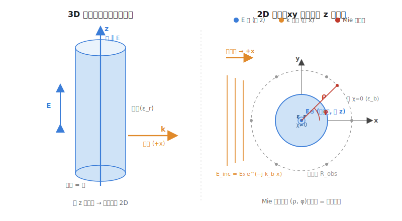

# F1 Tutorial: 2D TM scattering — MoM/L-S forward + Mie validation

> **How to use this tutorial:** read it through once to get the big picture, then
> implement it yourself, returning to the relevant section when stuck. It gives
> formulas, principles, a function checklist, and self-tests — **not** a full solution,
> so there is room to practise. When done you get the project's first hard result: a
> **scattered-field error vs grid-density convergence curve**.

---

## 0. Goal and acceptance criteria

**Goal:** write a 2D TM forward solver that, for "a dielectric cylinder illuminated by
a plane wave", computes the scattered field, and validate it against the **Mie series
analytic solution**.

**Why this problem:**
- Cylinder scattering has a **closed-form analytic solution** (Mie series), a "ground
  truth" that needs no phantom or measurement.
- 2D exercises every building block (Green's function, self-cell singularity, MoM
  discretization, linear solve); 3D just swaps the Green kernel and adds a dimension.
- Validation is "numerical vs analytic", doable purely in simulation.

**Acceptance criteria (F1 passes when all hold):**
1. At a fixed grid, the scattered field's relative $L_2$ error vs Mie is $<5\%$ ($<1\%$
   for weak scattering).
2. Refining the grid makes the error **decrease monotonically**, with a clear
   convergence order (slope ~$1\sim2$ on log-log).
3. A convergence-curve figure + a real/imag pointwise overlay (numerical vs analytic).

---

## 1. Physical setup: 2D TM, plane wave, contrast



**TM polarization (E along $z$):** the field has a single scalar component $E_z(x,y)$,
so the problem reduces from vector to **scalar** — the reason 2D beginners pick TM.

- **Background:** uniform unbounded medium, wavenumber
  $k_b=\omega\sqrt{\mu_0\varepsilon_0\tilde\varepsilon_b}$ (vacuum: $k_b=k_0=\omega/c$).
- **Scatterer:** dielectric cylinder of radius $R_{\text{cyl}}$, relative permittivity
  $\varepsilon_r$ (inside wavenumber $k_1=k_0\sqrt{\varepsilon_r}$).
- **Contrast function:**
  $\chi(\mathbf r)=\dfrac{\tilde\varepsilon_r(\mathbf r)-\tilde\varepsilon_b}{\tilde\varepsilon_b}$;
  inside $\chi=\varepsilon_r/\varepsilon_b-1$, outside $\chi=0$.
- **Incident field:** plane wave $E_z^{\text{inc}}(\mathbf r)=E_0\,e^{-jk_b x}$
  (propagating along $+x$, $e^{j\omega t}$ engineering convention).

> **Pin the time-harmonic convention first.**
> Use $e^{j\omega t}$ throughout (IEEE convention). This fixes: outgoing wave
> $\sim e^{-jk_bR}$, 2D Green uses $H_0^{(2)}$, Mie scattering uses $H_n^{(2)}$.
> **As long as Green / incident / Mie all use the same convention you are fine;** a
> mismatch flips the imaginary-part sign and you'll never match the analytic solution.
> If you prefer the physics convention $e^{-i\omega t}$, replace all $H^{(2)}\to H^{(1)}$
> and $-j\to +i$.

---

## 2. Lippmann–Schwinger equation (continuous form)

Total field = incident field + secondary radiation from the scatterer:

$$
\boxed{\;E_z(\mathbf r) = E_z^{\text{inc}}(\mathbf r) + k_b^2\!\int_S G(\mathbf r,\mathbf r')\,\chi(\mathbf r')\,E_z(\mathbf r')\,dS'\;}
$$

The integral is only over the cylinder cross-section $S$ (outside $\chi=0$). The 2D
free-space Green's function ($e^{j\omega t}$ convention):

$$
G(\mathbf r,\mathbf r')=\frac{1}{4j}H_0^{(2)}\!\bigl(k_b|\mathbf r-\mathbf r'|\bigr)
$$

$H_0^{(2)}$ is the zeroth-order Hankel function of the second kind (outgoing cylindrical
wave).

> This is a **nonlinear** equation in general ($E_z$ appears on both sides), but in the
> **forward problem $\chi$ is known**, so it is linear in the unknown $E_z$ — which is
> why the forward problem solves in one shot.

### 2.1 Zeroth-order Hankel function of the second kind

$$H_0^{(2)}(x)=J_0(x)-jY_0(x)$$

- $J_0(x)$: Bessel function of the first kind (the real / standing-wave part);
- $Y_0(x)$: Bessel function of the second kind (Neumann), singular at $x=0$ (tends to
  $-\infty$);
- $j$: imaginary unit.

---

## 3. MoM discretization (Richmond): integral equation -> matrix equation

### 3.1 Three-step idea

1. Split the square region containing the cylinder into $N$ square cells of side $d$
   (pulse basis: $E_z$, $\chi$ constant inside each cell);
2. Point-match at each cell center;
3. Evaluate the per-cell integral -> matrix elements.

Grid setup: only cells inside the cylinder get $\chi_n\neq0$; outside $\chi_n=0$ (these
either drop out of the unknowns, or stay but contribute nothing because $\chi=0$).

### 3.2 Discrete equation

At the $m$-th cell center $\mathbf r_m$:

$$
E_m = E_m^{\text{inc}} + k_b^2\sum_{n=1}^{N}\chi_n E_n\underbrace{\int_{\text{cell}_n}G(\mathbf r_m,\mathbf r')\,dS'}_{I_{mn}}
$$

Rearranged into the linear system $(\mathbf I-\mathbf D)\mathbf E=\mathbf E^{\text{inc}}$,
with $D_{mn}=k_b^2\chi_n I_{mn}$. The remaining work is computing $I_{mn}$ accurately,
especially the $m=n$ self term (singular kernel).

### 3.3 Key trick: square cell -> equal-area disk (Richmond)

Integrating $H_0^{(2)}$ over a square has no closed form. Richmond's trick: replace the
square by an **equal-area disk** of radius

$$
a=\frac{d}{\sqrt\pi}\qquad(\pi a^2=d^2)
$$

The disk integral of $H_0^{(2)}$ has a closed form (using the Bessel identity
$\int_0^a rH_0^{(2)}(k_b r)\,dr=\frac{a}{k_b}H_1^{(2)}(k_b a)-\frac{2j}{\pi k_b^2}$ and
Graf's addition theorem). **Do not drop the $-\frac{2j}{\pi k_b^2}$ lower-limit term** —
it comes from the $Y_1$ singularity at the origin
($\lim_{u\to0}uH_1^{(2)}(u)=\frac{2j}{\pi}\neq0$) and is exactly the source of the
$-\chi_n$ in the self term.

### 3.4 Matrix elements (ready to use, but validate the sign with Mie)

$$
\boxed{
D_{mn}=
\begin{cases}
-\,\chi_n\,\dfrac{j\pi k_b a}{2}\,J_1(k_b a)\,H_0^{(2)}(k_b\rho_{mn}), & m\neq n\\
-\,\chi_n\Bigl[\dfrac{j\pi k_b a}{2}\,H_1^{(2)}(k_b a)+1\Bigr], & m=n
\end{cases}}
$$

where $\rho_{mn}=|\mathbf r_m-\mathbf r_n|$, $J_1$ first-order Bessel, $H_1^{(2)}$
first-order Hankel of the second kind. System matrix $A_{mn}=\delta_{mn}-D_{mn}$.

**Two derivation notes (so you can check it yourself):**
- **Off-diagonal**: from "disk integral of $H_0^{(2)}(k_b|\mathbf r_m-\mathbf r'|)$
  $=\frac{2\pi a}{k_b}J_1(k_b a)H_0^{(2)}(k_b\rho_{mn})$", times $\frac{1}{4j}$ (Green
  prefactor) and $k_b^2\chi_n$.
- **Self term** ($m=n$, observation at the center):
  $\int_0^a rH_0^{(2)}(k_br)dr=\frac{a}{k_b}H_1^{(2)}(k_ba)-\frac{2j}{\pi k_b^2}$. The
  first term gives $-\chi_n\frac{j\pi k_ba}{2}H_1^{(2)}(k_ba)$; the second term (from the
  $Y_1$ origin singularity) gives **$-\chi_n$**. Together:
  $-\chi_n[\frac{j\pi k_ba}{2}H_1^{(2)}(k_ba)+1]$. **Dropping $-\chi_n$ makes strong-scatter
  reconstructions disagree with Mie (invisible in the weak limit).**
- Small-argument expansion: $\frac{j\pi k_ba}{2}H_1^{(2)}(k_ba)+1\approx j\frac{k_b^2d^2}{4}$,
  so $D_{nn}\approx-j\chi_n\frac{k_b^2d^2}{4}$, which is $O(d^2)\to0$ — the self term
  vanishes as the cell shrinks, as it physically should.

> **Sign is the easiest trap.**
> The above is for the $e^{j\omega t}$/$H^{(2)}$ convention. **Don't agonize over the
> sign a priori — let Mie be the backstop:** if the scattered field differs from Mie by
> a conjugate (imaginary part flipped), the convention is inconsistent — flip
> $H^{(2)}\leftrightarrow H^{(1)}$ or the exponent sign.

---

## 4. Incident field

Per cell center:

$$
E_m^{\text{inc}}=E_0\,e^{-jk_b x_m}
$$

Take $E_0=1$. Assemble into an $N\times1$ vector $\mathbf E^{\text{inc}}$. Note: for a
plane wave only the $x$-coordinate enters the phase — there is no transmitter point and
no distance.

---

## 5. Solve the linear system for the total field

$$
(\mathbf I-\mathbf D)\,\mathbf E_{\text{tot}}=\mathbf E^{\text{inc}}
$$

- **F1 start:** $N$ is small (cylinder a few wavelengths, a few hundred to thousand
  cells), so `numpy.linalg.solve` is fine — get it correct first.
- **F2 later:** switch to BiCGStab, or CG-FFT when the background is uniform and the
  grid regular (the Green part of $\mathbf D$ is Toeplitz). For F1 **don't use FFT yet** —
  get the physics right first.

The solved $\mathbf E_{\text{tot}}$ is the in-cylinder total field per cell.

---

## 6. Scattered field at observation points ($G_{tr}$)

Take a ring of observation points $\mathbf r_r$ outside the cylinder (radius
$R_{\text{obs}}>R_{\text{cyl}}$, $N_{\text{rx}}$ uniform angles). The scattered field =
equivalent sources radiated out via the Green's function:

$$
\boxed{\;E_z^{\text{sc}}(\mathbf r_r)=k_b^2\sum_{n=1}^{N}G(\mathbf r_r,\mathbf r_n)\,\chi_n\,E_{\text{tot},n}\,\Delta S\;}
$$

Observation points are outside the cylinder, each at nonzero distance from every source
cell, so $\rho>0$ is non-singular — use $G=\frac{1}{4j}H_0^{(2)}(k_b\rho)$ and
$\Delta S=d^2$ directly. This is the "voxel -> receiver" $\mathbf G_{tr}$ operator.

---

## 7. Mie analytic solution (ground truth)

Plane wave on a dielectric cylinder, TM polarization, three expansions ($E_0=1$):

$$
\begin{aligned}
\text{incident:}\quad & E_z^{\text{inc}}=\sum_{n=-\infty}^{\infty}(-j)^n J_n(k_b\rho)\,e^{jn\phi}\\
\text{scattered (outside):}\quad & E_z^{\text{sc}}=\sum_{n}(-j)^n a_n H_n^{(2)}(k_b\rho)\,e^{jn\phi}\\
\text{internal:}\quad & E_z^{\text{int}}=\sum_{n}(-j)^n c_n J_n(k_1\rho)\,e^{jn\phi}
\end{aligned}
$$

**Boundary conditions** ($\rho=R_{\text{cyl}}$, non-magnetic $\mu_1=\mu_b$, so both
$E_z$ and $\partial_\rho E_z$ are continuous):

$$
\begin{aligned}
J_n(k_b R)+a_n H_n^{(2)}(k_b R)&=c_n J_n(k_1 R)\\
k_b\bigl[J_n'(k_b R)+a_n H_n^{(2)\prime}(k_b R)\bigr]&=k_1 c_n J_n'(k_1 R)
\end{aligned}
$$

Eliminating $c_n$ gives the scattering coefficient:

$$
\boxed{\;a_n=-\,\frac{k_1\,J_n'(k_1 R)\,J_n(k_b R)-k_b\,J_n(k_1 R)\,J_n'(k_b R)}{k_1\,J_n'(k_1 R)\,H_n^{(2)}(k_b R)-k_b\,J_n(k_1 R)\,H_n^{(2)\prime}(k_b R)}\;}
$$

> **Implementation notes:**
> - $J_n,H_n^{(2)}$ and derivatives: `scipy.special` `jv, hankel2, jvp, h2vp`
>   (derivatives via `jvp(n,x)`, `h2vp(n,x)`).
> - Series truncation: $n$ from $-N_{\max}$ to $+N_{\max}$, with
>   $N_{\max}\approx k_b R_{\text{cyl}}+10$ (larger object -> more terms). Check: increase
>   $N_{\max}$ until the result stops changing.
> - Evaluate $E_z^{\text{sc,Mie}}$ on the same observation ring used by the MoM, for
>   pointwise comparison.

**What $a_n$ means:** each integer $n$ is an angular mode $e^{jn\phi}$ (a pattern with
$|n|$ lobes around the circle); $a_n$ is the complex weight of that mode in the scattered
field. The total field is the weighted sum of all modes. Because the cylinder is
rotationally symmetric, modes scatter independently, so each $a_n$ comes from a trivial
2x2 boundary-condition system.

---

## 8. Comparison and convergence curve

**Error metric** (on the same observation ring):

$$
\text{err}=\frac{\|\mathbf E^{\text{sc,MoM}}-\mathbf E^{\text{sc,Mie}}\|_2}{\|\mathbf E^{\text{sc,Mie}}\|_2}
$$

**Two figures to produce:**
1. **Pointwise overlay:** at a fixed grid, plot $\text{Re}(E^{\text{sc}})$,
   $\text{Im}(E^{\text{sc}})$ vs observation angle, MoM (dots) vs Mie (line). Matching =
   physics correct.
2. **Convergence curve:** x-axis cells-per-wavelength $N_\lambda=\lambda_1/d$ (use the
   **in-medium** wavelength $\lambda_1=\lambda_0/\sqrt{\varepsilon_r}$), y-axis err,
   log-log. Should decrease monotonically with slope ~$1\sim2$. This is the F1 evidence.

---

## 9. Implementation roadmap (function checklist, you fill in)

Split into these pure functions (easy to unit-test, and reusable as
$\mathbf A\mathbf v$/$\mathbf A^H\mathbf u$ later):

```python
# --- geometry & grid ---
def make_grid(domain_size, d):            # -> cell-center coords (N,2), dS
def assign_contrast(centers, R_cyl, eps_r, eps_b):  # -> chi (N,) complex

# --- MoM forward ---
def green_2d(k_b, R):                     # (1/4j) H0^(2)(k_b R), R may be an array
def build_D(centers, chi, k_b, d):        # -> D (N,N), with self-cell closed form
def incident_plane_wave(centers, k_b, E0=1):   # -> E_inc (N,)
def solve_total_field(D, E_inc):          # solve (I-D)E = E_inc -> E_tot (N,)
def scattered_field(rx_points, centers, chi, E_tot, k_b, dS):  # -> E_sc (Nrx,)

# --- Mie analytic ---
def mie_an(n, k_b, k_1, R_cyl):           # scattering coefficient a_n
def mie_scattered(rx_points, k_b, k_1, R_cyl, Nmax):  # -> E_sc_mie (Nrx,)

# --- validation ---
def rel_l2_error(a, b)
def convergence_study(list_of_d):         # loop over different d, plot err vs N_lambda
```

**Suggested parameters (first run, weak scattering, easy to match):**
- vacuum background $\varepsilon_b=1$, cylinder $\varepsilon_r=2.0$ (weak), radius
  $R_{\text{cyl}}=0.5\lambda_0$;
- any frequency (e.g. 1 GHz), $\lambda_0=c/f$;
- grid $d=\lambda_1/15$ to start, then sweep $d=\lambda_1/\{8,10,15,20,30\}$ for the
  convergence study;
- observation ring $R_{\text{obs}}=3R_{\text{cyl}}$, $N_{\text{rx}}=72$ (every 5deg).

Once matched, increase difficulty: $\varepsilon_r=4\sim10$ (strong scattering, tests MoM
not Born), bigger cylinder.

---

## 10. Common pitfalls (by probability of hitting them)

| Pitfall | Symptom | Fix |
|---|---|---|
| **Convention mismatch** | scattered field differs from Mie by conjugate / sign | unify Green, incident, Mie on $e^{j\omega t}$+$H^{(2)}$; flip one to test |
| **Wrong self-cell** | error won't drop with refinement, or NaN | self term must use the $H_1^{(2)}$ closed form **plus the $-\chi_n$**, not skipped |
| **Wrong equivalent radius** | error large and non-converging | $a=d/\sqrt\pi$ (equal area), not $d/2$ |
| **Wrong wavelength** | convergence x-axis scale looks off | grid density uses the **in-medium** $\lambda_1=\lambda_0/\sqrt{\varepsilon_r}$ |
| **Mie truncation too small** | Mie itself inaccurate | $N_{\max}\approx k_bR+10$, increase until stable |
| **Observation point inside cylinder** | scattered field blows up | $R_{\text{obs}}>R_{\text{cyl}}$ |
| **chi multiplied on the wrong axis** | wrong for non-uniform chi (invisible for uniform) | $D_{mn}\propto\chi_n$ -> multiply by column ($n$ = source) |
| **$\Delta S$ dropped** | scattered field has a systematic amplitude offset | include $\Delta S=d^2$ in section 6 |

---

## 11. Self-test checklist (milestones, tick them off)

- [ ] **T1 geometry**: plot grid + cylinder boundary + observation ring, visually correct.
- [ ] **T2 incident field**: $|E^{\text{inc}}|\equiv1$, phase linear in $x$.
- [ ] **T3 Green symmetric**: $G$ depends only on distance.
- [ ] **T4 weak-scatter sanity**: $\varepsilon_r=1.01$ -> MoM scattered field ~ single-step Born ($\mathbf E_{\text{tot}}\approx\mathbf E^{\text{inc}}$).
- [ ] **T5 Mie self-convergence**: increasing $N_{\max}$, Mie scattered field stable.
- [ ] **T6 pointwise match**: fixed grid, Re/Im overlay MoM on Mie.
- [ ] **T7 convergence order**: err vs $N_\lambda$ monotone decreasing, log-log slope $1\sim2$.
- [ ] **T8 strong scatter**: $\varepsilon_r=8$ still err$<5\%$ at fine grid.

All ticked -> **F1 passes**, proceed to F2 (CG-FFT acceleration).

---

## 12. References

- Richmond, J.H. (1965). *Scattering by a dielectric cylinder of arbitrary cross section
  shape.* IEEE Trans. AP-13. — origin of the MoM matrix elements and equal-area-disk
  self-cell.
- Harrington, *Field Computation by Moment Methods.* — general MoM framework.
- Balanis / Bohren & Huffman — standard derivation of the cylinder Mie series and
  boundary conditions.

> **Interface to the hardware track:** write sections 5 and 6 as operators (given
> $\mathbf v$, return $\mathbf A\mathbf v$). When F2 switches to FFT you only change the
> operator internals. That FFT operator maps directly onto the Zenith-Radar 1D/2D-FFT
> core — where the two projects start to align.
