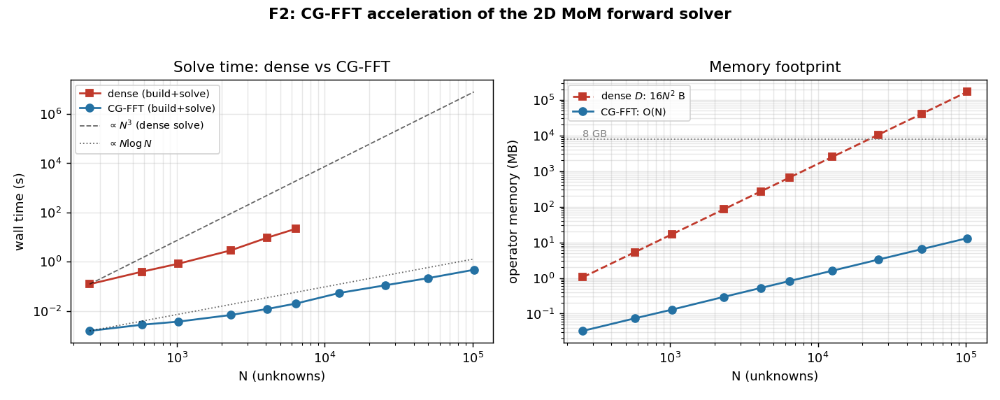

# F2 Milestone — CG-FFT matrix-free forward solver

> **In one line:** the F1 forward solver built a dense $N\times N$ matrix and factorised
> it ($O(N^2)$ memory, $O(N^3)$ time). F2 keeps the *exact same physics* but never builds
> the matrix — the operator $\mathbf D\mathbf x$ is a 2D FFT convolution, and the solve is
> a Krylov iteration. Result: **N = 102 400 solved in 0.47 s / 7 iterations**, where the
> dense matrix alone would need **167.8 GB**. `pytest`: **15/15** (F1 7 + F2 8).

## 1. What was built

All in `mwisim/operators.py`, class `GreenFFT`:

| Method | What it does | Cost |
|---|---|---|
| `infer_grid_shape` | recover $(N_y,N_x)$ from the raveled `centers` (given) | — |
| `__init__` | build displacement kernel $g$, circulant-embed it, cache $\hat g=\text{fft2}(g_{\text{pad}})$ once | one FFT |
| `_conv` | linear 2D convolution $g*v$ via padded FFT, crop `[:ny,:nx]` | 2 FFTs |
| `apply_D` | matrix-free $\mathbf D\mathbf x$: $\chi$-weight then convolve | 2 FFTs |
| `apply_IminusD` | $(\mathbf I-\mathbf D)\mathbf x = \mathbf x-\mathbf D\mathbf x$ | 2 FFTs |
| `solve_total_field` | BiCGStab/GMRES solve of $(\mathbf I-\mathbf D)\mathbf E=\mathbf E^{\text{inc}}$ | iters × matvec |

The kernel reproduces `mom.build_D` exactly, **including the F1 self-cell fix**: the
self entry is $g(0)=\text{pref}\cdot H_1^{(2)}(k_b a)-1$, where the $-1$ is the
lower-limit term we hunted down in F1 §3.3.

## 2. Validation results

`tests/test_f2.py`: **8/8 pass**.

- **T9** — `apply_D @ x` vs dense `build_D @ x` on a *random* complex vector, at
  $\varepsilon_r=2$ and $8$: rel error $\sim10^{-8}$. (Random input exercises every matrix
  entry; a physical field would not.)
- **T10** — $(\mathbf I-\mathbf D)\mathbf x$ matches.
- **T11/T12** — BiCGStab and GMRES solves vs the F1 direct solve, $<10^{-7}$, weak and
  strong contrast.
- **T13** — end-to-end scattered field through the fast path still matches the analytic
  **Mie** series ($<5\%$). F2 changes the *how*, not the physics.
- **T14** — grid-shape inference guard.

Combined suite F1+F2: **15 passed**.

## 3. Benchmark (`scripts/run_f2.py` → `docs/fig_f2_scaling.png`)

| N | iters | t_fft (s) | t_dense (s) | mem_fft (MB) | mem_dense (MB) | match |
|---:|---:|---:|---:|---:|---:|---:|
| 256 | 7 | 0.002 | 0.124 | 0.03 | 1.0 | 8.9e-09 |
| 576 | 7 | 0.003 | 0.394 | 0.07 | 5.3 | 1.2e-08 |
| 1 024 | 7 | 0.004 | 0.841 | 0.13 | 16.8 | 1.1e-08 |
| 2 304 | 7 | 0.007 | 2.897 | 0.29 | 84.9 | 1.3e-08 |
| 4 096 | 7 | 0.012 | 9.612 | 0.52 | 268.4 | 1.3e-08 |
| 6 400 | 7 | 0.020 | 22.089 | 0.82 | 655.4 | 1.2e-08 |
| 12 544 | 7 | 0.054 | — | 1.61 | 2 517.6 | — |
| 25 600 | 7 | 0.111 | — | 3.28 | 10 485.8 | — |
| 50 176 | 7 | 0.218 | — | 6.42 | 40 282.1 | — |
| 102 400 | 7 | 0.474 | — | 13.11 | 167 772.2 | — |

`—` = dense not run (the $N\times N$ matrix no longer fits in RAM).

**The single most important column is `iters`: flat at 7 across a 400× range in N.** The
conditioning of $\mathbf I-\mathbf D$ is mesh-independent here (the spectrum clusters near
1 for $\varepsilon_r=2$), so total cost is (iters)×(FFT) $\approx O(N\log N)$ with no
preconditioner. At N = 6 400 the matrix-free solve is ~1000× faster and ~800× smaller;
beyond N ≈ 12 500 the dense path simply cannot allocate.

## 4. Debug war story

The discipline that made F2 safe: **never benchmark before proving correctness against
the dense oracle.** The plan was strict — first make `apply_D(x)` equal `build_D @ x` on
a *random* vector (T9), then swap in the iterative solver (T11/T12), then time it. What
actually bit me, in order:

- **`__init__` kernel** — early versions had `hankel2(2)` instead of `hankel2(0)/hankel2(1)`,
  a duplicated `jv(1)*jv(1)`, and a DX/DY name-vs-content swap. The decisive fix was
  carrying the F1 self-cell **$-1$** into `g_self`; without it `apply_D` disagrees with
  `build_D` by exactly $\chi_n x_n$ on the diagonal — glaring at $10^{-8}$-vs-$O(1)$,
  invisible in a convergence plot.
- **`_conv` padding** — an invalid `mode="zero"` and wrong pad widths. Fixed to an
  explicit zeros canvas + slice-assign. Padding to `next_fast_len(2N-1)` is what kills
  circular-convolution wrap-around; get it wrong and the error is small but
  mesh-dependent.
- **`apply_IminusD`** — first written as `(np.eye(N) - apply_D(x)) @ x`, which allocates
  the dense identity (defeating the whole point) and does matrix-minus-vector broadcasting.
  Correct is one line: `x - apply_D(x)`.
- **`solve_total_field`** — read the SciPy return as a dict (`info["x"]`); BiCGStab/GMRES
  return a `(x, status)` **tuple**. Also the residual must be a norm ratio
  $\lVert b-A\mathbf E\rVert/\lVert b\rVert$ (not elementwise `np.abs`), iteration count
  needs a `callback`, and `rtol` vs `tol` differs by SciPy version (try/except).

## 5. Transferable lessons

1. **Exploit structure before optimising hardware.** The 1000× win came from *recognising*
   that displacement-only dependence ⇒ Toeplitz (BTTB) ⇒ FFT. Always ask "what does my
   operator's matrix look like?" first.
2. **Validate the fast path against the slow path, on random inputs.** Numerical agreement
   on a random vector is far stronger than "the picture looks right."
3. **Zero-pad to kill circular-convolution aliasing.** The $2N-1$ embedding is the whole
   ballgame for FFT operators; it generalises directly to 3D (per axis) and to the
   inversion $A/A^H$ operators.
4. **Watch the iteration count, not just per-iteration cost.** Flat-in-N iters ⇒ true
   $O(N\log N)$; growing iters ⇒ you need a preconditioner.

## 6. Next steps

- **I1–I4** — inversion (Born → BIM/DBIM → CGLS/LSQR → PnP-DBIM). The matrix-free
  `A_op`/`AH_op` now have a fast in-domain backbone; DBIM reuses `GreenFFT` directly as
  the in-domain Green action.
- **F3** — UWCEM phantom + Cole–Cole multi-frequency (realistic tissue).
- **HLS** — the FFT convolution core maps onto the Zynq-7020 / Zenith-Radar FFT pipeline.

---

*F2 closed 2026-06-15 · "the matrix you never build" · dense `build_D` retained as the
ground-truth oracle, every matvec checked against it.*
