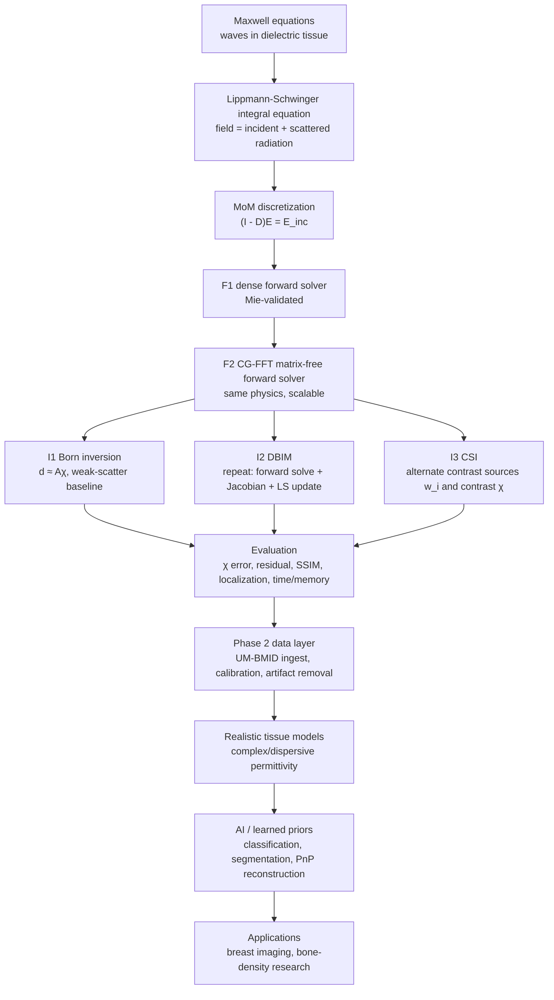

# I3 Tutorial: CSI — Contrast Source Inversion

> **How to use this tutorial:** read it once for the whole arc, then implement or study `mwisim/inverse/csi.py` against this document. Like I1 and I2, this is a *real tutorial*, not just an API note: it gives the physics, the discrete equations, the alternating optimization, the implementation map, and the tests. When the I3 tests go green you have the project's **second** working quantitative inverter — and, more importantly, a proof that the `Inverter` abstraction can support a nonlinear method that is *not* DBIM.

> **Where I3 sits.** I1 solved the inverse problem once under the Born approximation, using a single linear least-squares step. I2 (DBIM) improved on that by repeatedly re-solving the forward problem and re-linearizing around the current object. CSI takes a third path: instead of re-solving the full forward map every outer iteration, it introduces an auxiliary unknown — the **contrast source** — and alternates between updating the contrast source and updating the contrast itself. This is why PROJECT_PLAN singled out **DBIM + CSI** as the ideal pair of early `Inverter` implementations: they solve the same inverse problem with clearly different algorithmic structure.

> In this repo, $G_{\text{tr}}$ means **target/grid-to-receiver Green matrix**, not "transmitter Green." The subscript is best read as **t→r = target cell to receiver**. Also, $dS$ is the **cell area / integration weight**, not the material perturbation. The material perturbation is $\chi$. This matters because the receiver operator is $\mathcal S=k_b^2\,dS\,G_{\text{tr}}$, while the induced source is $w=\chi\odot E$.

---

## 0. Goal and acceptance criteria

**Goal:** from multi-view scattered-field measurements of a nonlinear scatterer, reconstruct its contrast map $\hat{\chi}$ by **Contrast Source Inversion (CSI)** — an alternating nonlinear method that introduces one contrast source $w_i$ per incidence and iterates between:

1. updating $w_i$ to match the measured data *and* the state equation, and
2. updating $\chi$ from the current $w_i$ and the implied interior fields.

The implementation in this repo uses a regularized alternating least-squares form built on the same geometry helpers and Green operators already trusted by I1/I2.

**Does "moderate scatterer" mean CSI is only for moderate scatter, DBIM for weak scatter?** No. The practical ladder is not a strict law like "I1 weak, I2 medium, I3 strong." More accurately: I1/Born is reliable only when the internal total field is close to the incident field; I2/DBIM and I3/CSI are both nonlinear methods intended to go beyond Born. DBIM is a Gauss–Newton-style method that can work well when the current guess is already close enough for local linearization; CSI is often more robust because it solves for the hidden induced sources too, but it is still regularized, nonconvex, and not magic. In this repo we use "moderate/stronger" only to mean "strong enough that one-step Born is visibly poor, but still small enough for a clean synthetic tutorial."

**Acceptance criteria (I3 passes when all hold):**

1. **Operator-shape sanity:** the receiver operator $S$, domain Green operator $G$, and stacked data layout all have the expected dimensions.
2. **Alternating-step consistency:** the source update returns a set of contrast sources $W$ with the same shape as `E_inc_set`, and the contrast update returns a valid $(N,)$ contrast vector plus a per-view total-field set.
3. **Headline result:** on a stronger scatterer where one-step Born is poor, CSI improves both the $\chi$-error and the full nonlinear data residual relative to Born.
4. `build("inverter","csi")` returns a working inverter.

---

## 1. Why CSI exists — the whole picture

The inverse problem is hard for two reasons:

- **nonlinearity:** the unknown contrast $\chi$ changes the field, and the changed field multiplies $\chi$ again;
- **ill-posedness:** many fine details of $\chi$ barely reach the receivers, so the inverse map is unstable.

DBIM handles the nonlinearity by repeatedly differentiating the forward map and taking Gauss–Newton steps. CSI handles it differently: it promotes the product

$$
w_i = \chi \odot E_i
$$

to a new unknown. That product is exactly the induced current / contrast source in cell $n$ for incidence $i$:

$$
w_i[n] = \chi[n]\,E_i[n].
$$

This is powerful because:

- the **receiver data** depend linearly on $w_i$;
- the **field equation** can be rewritten in terms of $w_i$ and $\chi$;
- the two resulting subproblems become much easier than solving directly for $\chi$ through the full nonlinear forward map.

So the whole CSI philosophy is:

> do not eliminate the induced sources; solve for them explicitly, and make them consistent with both the measured data and the object model.

### 1.1 What exactly is the contrast source $w_i$?

Start with the two quantities you already know. $\chi[n]$ is a **property of cell $n$**: how different that cell is from the background medium. It belongs to the object and does not depend on which transmitter angle we use. $E_i[n]$ is the **total field inside cell $n$ under incidence $i$**: it depends on the transmitter direction and also on multiple scattering inside the current object. CSI defines a third quantity,

$$w_i[n]=\chi[n]\,E_i[n].$$

So $w_i$ is not another object map. It is the **induced source/current distribution** for one illumination. Same object $\chi$, different incidence $i$, different field $E_i$, therefore different source $w_i$. A useful radar picture: $\chi$ says "this cell can scatter"; $E_i$ says "how strongly the incoming wave excites this cell under view $i$"; $w_i$ says "how loudly this cell actually re-radiates under view $i$."

Tiny 3-cell example:

$$\chi=\begin{bmatrix}0\\0.4\\0.8\end{bmatrix},\qquad E_1=\begin{bmatrix}1\\2\\0.5\end{bmatrix},\qquad E_2=\begin{bmatrix}1\\-1\\2\end{bmatrix}.$$

Then

$$w_1=\chi\odot E_1=\begin{bmatrix}0\\0.8\\0.4\end{bmatrix},\qquad w_2=\chi\odot E_2=\begin{bmatrix}0\\-0.4\\1.6\end{bmatrix}.$$

The object $\chi$ did not change. The source changed because the illumination changed. That is why CSI has **one $\chi$ shared by all views** but **one $w_i$ per view**.

### 1.2 Symbol table before the equations

| symbol | shape | code name | meaning |
| --- | --- | --- | --- |
| $N$ | scalar | `N` | number of grid cells |
| $M$ | scalar | `M` | number of receivers |
| $N_v$ | scalar | `Nv` | number of incident views / transmitter angles |
| $\chi$ | $(N,)$ | `chi` | contrast map, object property, same for every view |
| $E_i^{\text{inc}}$ | $(N,)$ | `E_inc_set[i]` | incident field on grid for view $i$, before the object scatters |
| $E_i$ | $(N,)$ | `E_tot_i` | total interior field for view $i$, including multiple scattering |
| $w_i$ | $(N,)$ | `W[i]` | contrast source / induced source, $w_i=\chi\odot E_i$ |
| $G_{\text{tr}}$ | $(M,N)$ | `green_matrix(rx, centers, k_b)` | free-space Green matrix from **target/grid cells to receivers** |
| $\mathcal S$ | $(M,N)$ | `receiver_operator(...)` | receiver radiation operator, $\mathcal S=k_b^2\,dS\,G_{\text{tr}}$ |
| $\mathcal G$ | $(N,N)$ | `domain_green_matrix(...)` | discrete in-domain Richmond interaction kernel: source cells to grid cells |
| $D(\chi)$ | $(N,N)$ | `build_D(centers, chi, k_b, d)` | weighted MoM operator, $D(\chi)=\mathcal G\,\operatorname{diag}(\chi)$ |
| $X$ | $(N,N)$ | conceptual only | $X=\operatorname{diag}(\chi)$ |

Be careful: $\mathcal G$ here is the **discrete MoM/Richmond in-domain Green operator**, not just the raw continuous free-space Green function $G(\mathbf r,\mathbf r')=\frac{1}{4j}H_0^{(2)}(k_b|\mathbf r-\mathbf r'|)$. The off-diagonal Richmond kernel includes the equal-area-cell integration factor, and the diagonal includes the self-cell correction. In code, `domain_green_matrix(...)=build_D(..., ones, ...)`, so it is "what $D$ would be if every source-cell contrast were 1."

---

## 2. The exact forward model, rewritten for CSI

Recall the Lippmann–Schwinger structure from F1/F2. For one incidence $i$:

$$
E_i = E_i^{\text{inc}} + \mathcal{G}\big(\chi \odot E_i\big),
$$

where:

- $E_i^{\text{inc}}$ is the incident field on the grid,
- $E_i$ is the total field on the grid,
- $\chi$ is the grid contrast,
- $\mathcal{G}$ is the background grid-to-grid Green operator.

The measured receiver data are:

$$
d_i = \mathcal{S}\big(\chi \odot E_i\big),
$$

where $\mathcal{S}$ is the grid-to-receiver operator.

In code this operator is built from the target-to-receiver Green matrix:

$$G_{\text{tr}}[m,n]=G(\mathbf r_m^{\text{rx}},\mathbf r_n^{\text{cell}})=\frac{1}{4j}H_0^{(2)}\!\left(k_b\left|\mathbf r_m^{\text{rx}}-\mathbf r_n^{\text{cell}}\right|\right),$$

where row $m$ is one receiver and column $n$ is one grid cell. Then

$$\mathcal S=k_b^2\,dS\,G_{\text{tr}},\qquad d_i[m]=k_b^2\,dS\sum_{n=1}^{N}G_{\text{tr}}[m,n]\,w_i[n].$$

Read this physically: every grid cell becomes a tiny secondary radiator with strength $w_i[n]$; $G_{\text{tr}}[m,n]$ propagates that tiny radiator to receiver $m$; the sum adds all cells. Again, $dS$ is the cell area/integration weight. It is not $\chi$, not a source strength by itself, and not a material contrast.

Now define the **contrast source**

$$
w_i = \chi \odot E_i.
$$

Then both equations simplify immediately:

$$
E_i = E_i^{\text{inc}} + \mathcal{G} w_i,
$$

and

$$
d_i = \mathcal{S} w_i.
$$

At this point the receiver equation is linear in $w_i$, and the field equation is linear in $w_i$ once $\chi$ is fixed. The only remaining coupling is in the definition

$$
w_i = \chi \odot E_i.
$$

This is the identity CSI keeps enforcing while alternating between the two unknowns.

### 2.1 Born approximation revisited: your understanding is right

You wrote that I1 does not just "linearize" in a vague way; it specifically **replaces the unknown total field $E_i$ by the known incident field $E_i^{\text{inc}}$**, under the weak-scatterer assumption, and that replacement makes the equation linear in $\chi$. That is exactly right.

The exact data equation is

$$d_i=\mathcal S(\chi\odot E_i).$$

The nonlinear knot is that $E_i$ itself depends on $\chi$. Born says: if $\chi$ is weak, then internal multiple scattering is small, so

$$E_i\approx E_i^{\text{inc}}.$$

Then

$$d_i\approx\mathcal S(\chi\odot E_i^{\text{inc}})=\mathcal S\,\operatorname{diag}(E_i^{\text{inc}})\,\chi=A_i\chi.$$

So "Born cuts the knot by linearizing" means exactly: **freeze the field at the incident field**, turning the product $\chi\odot E_i(\chi)$ into $\chi\odot E_i^{\text{inc}}$. The approximation is physical first (ignore internal multiple scattering), and algebraic second (the map becomes linear in $\chi$).

---

## 3. The state equation in discrete form

Substitute $E_i = E_i^{\text{inc}} + \mathcal{G}w_i$ into $w_i = \chi \odot E_i$:

$$
w_i = \chi \odot \big(E_i^{\text{inc}} + \mathcal{G}w_i\big).
$$

Write $\chi$ as the diagonal matrix

$$
X = \operatorname{diag}(\chi).
$$

Then

$$
w_i = X E_i^{\text{inc}} + X \mathcal{G} w_i.
$$

Move the last term to the left:

$$
(I - X\mathcal{G}) w_i = X E_i^{\text{inc}}.
$$

This is the **CSI state equation**. It says:

- the left-hand side measures how consistent the current source $w_i$ is with the current object $\chi$;
- the right-hand side is the source induced directly by the incident field.

So CSI tries to satisfy **two things at once**:

1. receiver data fit: $d_i \approx \mathcal{S} w_i$,
2. state consistency: $(I - X\mathcal{G}) w_i \approx X E_i^{\text{inc}}$.

That is the whole optimization model.

---

## 4. The CSI objective functional

For each incidence $i$, define a cost that penalizes both receiver mismatch and state mismatch:

$$
\| \mathcal{S} w_i - d_i \|^2
\;+\;
\xi \,\| (I - X\mathcal{G})w_i - X E_i^{\text{inc}} \|^2.
$$

Here $\xi > 0$ balances the two physics:

- small $\xi$: emphasize fitting the measured receiver data;
- large $\xi$: emphasize satisfying the state equation strongly.

To stabilize the numerics, the implementation in this repo adds Tikhonov terms:

$$
\mu_w \|w_i\|^2
\qquad\text{and}\qquad
\mu_\chi \|\chi\|^2.
$$

So the alternating CSI model used here is:

### Source subproblem (fixed $\chi$)

$$
\min_{w_i}\;
\|\mathcal{S}w_i - d_i\|^2
\;+\;
\xi\,\|(I - X\mathcal{G})w_i - X E_i^{\text{inc}}\|^2
\;+\;
\mu_w\|w_i\|^2.
$$

### Contrast subproblem (fixed $w_i$)

$$
\min_{\chi}\;
\sum_i \|w_i - \chi \odot E_i\|^2
\;+\;
\mu_\chi \|\chi\|^2,
\qquad
E_i = E_i^{\text{inc}} + \mathcal{G} w_i.
$$

This is not the only possible CSI formulation in the literature, but it is a clean, stable, pedagogical one that fits the current codebase well.

---

## 5. Deriving the implemented alternating updates

This section is the heart of the tutorial: it explains the exact calculations used in `csi.py`.

### 5.1 The source update $w_i$

Fix $\chi$, so $X=\operatorname{diag}(\chi)$ is known. Then the source subproblem is a regularized least-squares problem in $w_i$.

Define the stacked matrix

$$
B =
\begin{bmatrix}
\mathcal{S} \\
\sqrt{\xi}\,(I - X\mathcal{G}) \\
\sqrt{\mu_w}\,I
\end{bmatrix}
$$

and stacked right-hand side

$$
b_i =
\begin{bmatrix}
d_i \\
\sqrt{\xi}\,X E_i^{\text{inc}} \\
0
\end{bmatrix}.
$$

Then the whole subproblem becomes

$$
\min_{w_i}\; \|B w_i - b_i\|^2.
$$

That is just a standard least-squares solve. In code:

- `S` is the dense receiver operator $\mathcal{S}$,
- `G_dom` is the dense domain Green operator $\mathcal{G}$,
- `chi[:, None] * G_dom` implements $X\mathcal{G}$ row-scaling,
- `np.linalg.lstsq(B, rhs, rcond=None)` solves for $w_i$.

This is why the source update in `update_contrast_sources(...)` is both short and mathematically clean.

### 5.2 The contrast update $\chi$

Fix all $w_i$. Then the total field for each incidence is

$$
E_i = E_i^{\text{inc}} + \mathcal{G}w_i.
$$

Now solve

$$
\min_{\chi}\;
\sum_i \|w_i - \chi \odot E_i\|^2 + \mu_\chi\|\chi\|^2.
$$

This decouples **cell by cell**. For one grid cell $n$:

$$
\min_{\chi_n}\;
\sum_i |w_i[n] - \chi_n E_i[n]|^2 + \mu_\chi |\chi_n|^2.
$$

That is a scalar Tikhonov least-squares problem. Its closed-form minimizer is:

$$
\chi_n =
\frac{\sum_i \overline{E_i[n]}\,w_i[n]}
{\mu_\chi + \sum_i |E_i[n]|^2 }.
$$

Stacking over all cells gives the vector formula used in the code:

$$
\chi =
\frac{\sum_i \overline{E_i}\odot w_i}
{\mu_\chi + \sum_i |E_i|^2},
$$

where the division is elementwise.

In the current synthetic problems, the true contrast is real and nonnegative, so the implementation optionally projects:

$$
\chi \leftarrow \max(\Re(\chi), 0).
$$

This is not required by CSI theory in general; it is a practical prior that matches the current test phantoms.

---

## 6. The CSI algorithm, line by line

Putting the two subproblems together, the implemented algorithm is:

$$
\begin{aligned}
&\chi_0 = \chi_{\text{Born}} \quad \text{or} \quad 0 \\
&w_i^{(0)} = \chi_0 \odot E_i^{\text{inc}} \\
&\textbf{for } n=0,1,2,\dots: \\
&\quad \text{(1)}\ \ w_i^{(n+1)} = \arg\min_w
\|\mathcal{S}w-d_i\|^2
+ \xi\|(I-X_n\mathcal{G})w - X_n E_i^{\text{inc}}\|^2
+ \mu_w\|w\|^2 \\
&\quad \text{(2)}\ \ E_i^{(n+1)} = E_i^{\text{inc}} + \mathcal{G} w_i^{(n+1)} \\
&\quad \text{(3)}\ \ \chi_{n+1} = \arg\min_\chi
\sum_i \|w_i^{(n+1)} - \chi \odot E_i^{(n+1)}\|^2
+ \mu_\chi\|\chi\|^2 \\
&\quad \text{(4)}\ \ \chi_{n+1} \leftarrow (1-\gamma)\chi_n + \gamma \chi_{n+1} \\
&\quad \text{(5)}\ \ \text{stop if } \|d - d_{\text{sim}}\|/\|d\| < \text{tol}
\end{aligned}
$$

### What each line means physically

1. **Source update:** choose the induced sources that best explain the receiver data while remaining compatible with the current object.
2. **Field reconstruction:** from those sources, compute the implied interior total fields.
3. **Contrast update:** find the object that best explains those current sources.
4. **Optional damping:** use `step = γ` to soften aggressive updates.
5. **Stop on data fit:** once the simulated data are close enough to the measurements, stop.

This is why CSI is called an **alternating** method: it minimizes over one block of unknowns while freezing the other, then swaps.

---

## 7. How CSI differs from DBIM

Both CSI and DBIM are nonlinear inverters. But their inner logic is different:

| method | main unknowns | outer-step cost | core idea |
| --- | --- | --- | --- |
| I2 / DBIM | $\chi$ only | full forward solve + Jacobian build + linearized update | re-linearize the forward map around the current $\chi$ |
| I3 / CSI | $\chi$ and $w_i$ | alternating least-squares subproblems | solve directly for contrast sources and enforce consistency |

DBIM says:

> “Given my current object, how should I change it to reduce the data residual?”

CSI says:

> “What source distribution would explain the data, and what object would make that source distribution physically consistent?”

That is exactly why CSI is such a good second `Inverter` implementation for the platform: same interface, genuinely different reasoning.

---

### 7.1 I1, I2, I3 — the clean mental model

It is tempting to say: I1 = weak scatterer, I2 = stronger scatterer, I3 = strongest scatterer. That is a useful first intuition, but not a theorem. The sharper picture is:

| stage | forward model used in the inverse step | unknown solved in the step | main assumption / risk |
| --- | --- | --- | --- |
| I1 Born | $d=A\chi$ | $\chi$ | total field is close to incident field, $E\approx E^{\text{inc}}$ |
| I2 DBIM | $\Delta d=J(\chi_k)\Delta\chi$ | update $\Delta\chi$ | local linearization around current guess is good enough |
| I3 CSI | $d_i\approx \mathcal S w_i$ plus state consistency | both $w_i$ and $\chi$ | alternating nonconvex problem needs regularization and good balance |

So yes: in I1 you can write

$$d=A\chi,\qquad A_i=\mathcal S\,\operatorname{diag}(E_i^{\text{inc}}).$$

In I2 you write the *incremental* equation

$$\Delta d=J(\chi_k)\Delta\chi,\qquad J_i=\mathcal S^{\text{dist}}(\chi_k)\,\operatorname{diag}(E_i(\chi_k)).$$

And in I3 you introduce

$$w_i=\chi\odot E_i,\qquad d_i=\mathcal S w_i,\qquad (I-X\mathcal G)w_i=XE_i^{\text{inc}}.$$

The important correction to a common mistake: $\mathcal S$ is not "part of $A$ and $d=A E_i$." The field $E_i$ is not the image unknown in Born. The Born operator is the composition **field weighting then receiver propagation**:

$$A_i\chi=\mathcal S\big(E_i^{\text{inc}}\odot\chi\big)=\mathcal S\,\operatorname{diag}(E_i^{\text{inc}})\chi.$$

Likewise, DBIM's Jacobian is not just "$J$ times $E_i$." It maps the **contrast update** $\Delta\chi$ to a **data update**:

$$J_i\Delta\chi=\mathcal S^{\text{dist}}\big(E_i\odot\Delta\chi\big)=\mathcal S^{\text{dist}}\operatorname{diag}(E_i)\Delta\chi.$$

### 7.2 Do we need $M\,N_v\gg N$?

You are right to worry about dimensions. One incidence gives $M$ complex data values; $N_v$ incidences give $M\,N_v$ complex data values; the image has $N$ cell unknowns. In small synthetic tests we might make $M\,N_v$ comparable to $N$, but in realistic 2D/3D imaging $N$ can be thousands to millions, so $M\,N_v\gg N$ is usually impossible.

But "more equations than unknowns" is not the real finish line anyway. In inverse scattering, even if $M\,N_v>N$, the problem can still be ill-conditioned because the measurement aperture is finite, noise is present, evanescent/fine-detail information is not recoverable, and different contrast maps can produce almost indistinguishable data. So the inverse problem is not solved by counting rows. It is solved by combining: enough independent views, a correct forward model, regularization, physical priors (real/nonnegative, bounded tissue values, smoothness/TV), calibration, and validation against phantoms/real datasets.

The honest message: more receivers/views help a lot, but they do not remove the need for regularization or priors.

### 7.3 Are I1/I2/I3 enough for breast cancer and bone-density diagnosis?

Not yet. If your current I1/I2/I3 outputs are not good enough for clinical breast/bone imaging, that is expected — not a failure of the project. These are controlled synthetic stepping stones. Real diagnosis needs several additional layers:

- realistic tissue phantoms with complex permittivity and conductivity, often frequency-dependent (Debye/Cole-Cole/Lazebnik-style data);
- multi-frequency data, not only one frequency;
- real antenna models, coupling, calibration, reference subtraction, and artifact removal;
- better regularization than pure Tikhonov, especially TV/sparsity or learned priors;
- quantitative metrics beyond visual χ maps: permittivity RMSE, localization error, contrast recovery, SSIM, uncertainty;
- public benchmark reproduction, e.g. UM-BMID, before any clinical claim.

So the answer to "could this problem be solved?" is: **yes, but not by one algorithm alone.** The platform plan is exactly to layer the missing pieces: validated forward solver → Born baseline → DBIM/CSI nonlinear inverters → realistic data/phantoms → calibration/preprocessing → stronger priors/AI → benchmark evaluation. CSI is one more serious inverter in that stack, not the final clinical system.

---

## 8. Implementation map (`mwisim/inverse/csi.py`)

The file organization in the repo mirrors the math above.

### `receiver_operator(rx, centers, k_b, dS)`

Returns

$$
\mathcal{S} = k_b^2 dS\, G_{\text{tr}}.
$$

This is the same receiver operator used implicitly in I1/I2, just promoted to a named helper.

### `domain_green_matrix(centers, k_b, d)`

Builds the dense domain Green operator

$$
\mathcal{G}.
$$

In the current implementation this reuses `build_D(centers, ones, k_b, d)`, i.e. the geometry-only grid-to-grid interaction matrix. More precisely, this is the **Richmond in-domain interaction kernel** whose column weighting by $\chi$ would produce $D(\chi)=\mathcal G\operatorname{diag}(\chi)$. It is not the raw continuous Green function alone.

### `simulate_csi_data(S, W)`

Stacks the per-view receiver data

$$
d_i = \mathcal{S} w_i
$$

into the global vector shape `(N_v*M,)`.

### `update_contrast_sources(...)`

Implements the regularized least-squares source update from §5.1.

### `update_contrast(...)`

Implements the closed-form contrast update from §5.2, plus optional projection to a real nonnegative contrast.

### `CSIInverter.reconstruct(...)`

Runs the outer alternating loop, records:

- `data_res_history`
- `state_res_history`
- `outer_iters`

and returns `(chi_hat, info)` like the other inverters.

One naming caveat: `data_res_history` records the CSI **source-data residual** $\|d-\mathcal S W\|/\|d\|$, not necessarily the full nonlinear residual $\|d-\mathcal F(\chi)\|/\|d\|$. This is normal for CSI because the data equation is enforced through $w_i$ while the state residual enforces whether those sources are consistent with $\chi$. The I3 headline test separately checks the full nonlinear residual using the forward solver.

### `make_csi_problem(...)`

Builds an I3 test problem using the same synthetic full-forward “physical” data pattern as I2.

---

## 9. Self-test checklist (`tests/test_i3.py`)

- **I3.1** helper operators have the expected dimensions
  - $S$: `(M, N)`
  - $G$: `(N, N)`
  - stacked data: `(N_v M,)`
- **I3.2** one source update + one contrast update are dimensionally consistent and produce valid outputs
- **I3.3 (headline)** CSI beats one-step Born on a stronger scatterer
  - lower full-forward data residual
  - lower $\chi$-error
- **I3.4** `build("inverter","csi")` returns a working `CSIInverter`

These are intentionally the same style as I1/I2: shape checks, a core algorithmic gate, the headline recovery test, and the registry check.

---

## 10. Validation and figures

Run:

```bash
python -m pytest tests/test_i3.py -q
python scripts/run_i3.py
```

The driver writes:

- `docs/fig_i3_chi.png`
- `docs/fig_i3_residual.png`

The first shows true $\chi$, Born $\hat{\chi}$, and CSI $\hat{\chi}$ side by side. The second shows the CSI data residual history, with one-step Born as a reference line.

The milestone is not that CSI must dominate every possible method. The milestone is:

- it plugs into the same interface and registry system,
- it is mathematically and algorithmically distinct from DBIM,
- and it improves on one-step Born on the repo’s synthetic nonlinear benchmark.

---

## 11. Pitfalls (most likely failure modes)

- **Confusing $G$ and $D(\chi)$.** In CSI, the state equation uses the **geometry Green operator** $\mathcal{G}$, not the fully weighted MoM operator $D(\chi) = \mathcal{G}\operatorname{diag}(\chi)$.
- **Dropping the receiver operator scale factor.** The receiver operator is $\mathcal{S}=k_b^2 dS G_{\text{tr}}$, not just `G_tr`.
- **Forgetting that the source update is per incidence.** Each incidence has its own $w_i$, but all share the same $\chi$.
- **Over-trusting the data term alone.** If $\xi$ is too small, the algorithm can fit the measured data with sources that do not correspond to a physically consistent object.
- **No regularization.** As in I1/I2, $\mu_w$ and $\mu_\chi$ are not decoration; they stabilize an ill-posed inverse problem.
- **Projecting away valid physics.** The current real/nonnegative projection is appropriate for the synthetic dielectric test problems, but lossy or dispersive targets may need complex $\chi$.
- **Expecting CSI and DBIM to behave identically.** They optimize different surrogate models and can converge differently, even on the same data.

---

## 12. Appendix — carry-over corrections from the Gemini review

This section exists because the chat with Gemini mixed some correct intuition with notation that is wrong for this repo. Keep these corrections close to I3 because they affect how you read `csi.py`.

### 12.1 Fréchet derivative is linear because "derivative" means best linear local approximation

The full forward map $\mathcal F:\chi\mapsto d$ is nonlinear. Its derivative at a specific current object $\chi_k$ is linear in the small perturbation $\delta\chi$:

$$\mathcal F(\chi_k+\delta\chi)\approx\mathcal F(\chi_k)+J(\chi_k)\delta\chi.$$

The derivative is not claiming the world is linear globally. It is the local tangent map, just like $f(x+\delta x)\approx f(x)+f'(x)\delta x$ in scalar calculus. In finite-dimensional code, $J$ is simply the Jacobian matrix of the forward map at the current $\chi_k$.

### 12.2 Going from $\delta d$ back to $\delta\chi$ is not "just multiply by $J^H$"

$J^H\delta d$ is a **back-projection / gradient-like image**, not the quantitative update itself. To estimate $\delta\chi$, DBIM solves the regularized least-squares problem

$$\Delta\chi=\arg\min_{\Delta\chi}\|J\Delta\chi-\Delta d\|^2+\mu\|\Delta\chi\|^2.$$

The normal equations are

$$\left(J^HJ+\mu I\right)\Delta\chi=J^H\Delta d.$$

LSMR solves this without forming $J^HJ$. So the adjoint is necessary, but the inverse step is **adjoint plus iterative deconvolution plus regularization**, not adjoint alone.

### 12.3 $G_{\text{tr}}$, $\mathcal S$, $\mathcal G$, and $D$ in one place

For receivers outside the object,

$$G_{\text{tr}}[m,n]=\frac{1}{4j}H_0^{(2)}\!\left(k_b|\mathbf r_m^{\text{rx}}-\mathbf r_n^{\text{cell}}|\right),$$

and

$$\mathcal S=k_b^2\,dS\,G_{\text{tr}}.$$

$\mathcal G$ is the **in-domain Richmond interaction kernel** from one grid cell to another. In code it is `build_D(..., chi=ones, ...)`. The weighted forward operator is

$$D(\chi)=\mathcal G\,\operatorname{diag}(\chi),\qquad D_{mn}=\mathcal G_{mn}\chi_n.$$

Do not write $\mathcal G$ with $\chi_n$ inside it. Once $\chi_n$ is inside, you are talking about $D(\chi)$, not the geometry/kernel operator $\mathcal G$.

### 12.4 DBIM reciprocity in plain matrix language

This belongs to I2, but it is worth recording because it is the same Green-operator thinking used throughout I3. DBIM needs the distorted receiver operator

$$\mathcal S^{\text{dist}}=\mathcal S+\mathcal S\,\operatorname{diag}(\chi)(I-D)^{-1}\mathcal G.$$

Naively, to find every column of $\mathcal S^{\text{dist}}$, you could excite each grid cell once, solve the internal scattering problem, and observe all receivers. That is **$N$ solves**. Since $N$ is huge, this is bad.

Reciprocity computes rows instead. For receiver $m$, let $\mathbf s_m$ be row $m$ of $\mathcal S$, transposed into an $(N,)$ vector. The difficult row term is

$$\mathbf z_m^{\mathsf T}=(\chi\odot\mathbf s_m)^{\mathsf T}(I-D)^{-1}.$$

Transpose both sides:

$$\mathbf z_m=(I-D)^{-\mathsf T}(\chi\odot\mathbf s_m).$$

Now multiply by $(I-D)^{\mathsf T}$:

$$ (I-D)^{\mathsf T}\mathbf z_m=\chi\odot\mathbf s_m.$$

That is the whole trick. Instead of explicitly forming $(I-D)^{-1}$, solve one linear system per receiver. Factor $(I-D)^{\mathsf T}$ once, then solve it for all receiver right-hand sides. Since receivers $M$ are far fewer than grid cells $N$, this is $M$ solves instead of $N$ solves.

The "100 people and 4 microphones" metaphor maps to the equation like this: grid cells = 100 people; receivers = 4 microphones; the naive method asks each person to speak and records all microphones ($N$ excitations); reciprocity puts a speaker at each microphone and records the field at every person ($M$ excitations). The wave path is reversible in this reciprocal medium, so the same coupling information is recovered with many fewer solves.

### 12.5 Regenerated end-to-end pipeline map

I do not have evidence that an old "Maxwell to AI" markdown file was deleted; it may simply have had a different filename or lived outside this repo. The content below is the regenerated orientation map, now anchored to the actual Project Phoenix roadmap.



The strategic point is not "one solver diagnoses cancer." The strategic point is a platform pipeline: validated physics first, nonlinear inversion second, real-data calibration third, stronger priors/AI fourth, and rigorous evaluation all the way through.

---

## 13. References

- P. M. van den Berg and R. E. Kleinman, “A contrast source inversion method,” *Inverse Problems* 13(6), 1997 — the canonical CSI paper.
- P. M. van den Berg, A. L. van Broekhoven, and A. Abubakar, “Extended contrast source inversion,” *Inverse Problems* 15, 1999 — broader CSI family and refinements.
- F. Natterer and F. Wübbeling, *Mathematical Methods in Image Reconstruction* — good background on alternating inverse formulations and regularization.

---

*I3 tutorial v1 · 2026-07-09 · “solve for the induced sources, then solve for the object” · pairs with [[I1_Tutorial_Born-linear-inversion]] and [[I2_Tutorial_Distorted-Born-iterative-method]].*
