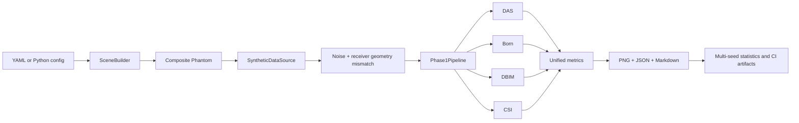

# P1-H Milestone — Phase-1 Hardening and Release Pipeline

## 1. Outcome

P1-H is complete. Phoenix has moved from one favorable centered synthetic example to a reproducible Phase-1 platform baseline that exercises off-centre targets, two targets, nested heterogeneous targets, complex measurement noise, receiver-coordinate model error, multiple random seeds, declarative YAML configuration, a common Pipeline, automated reports, CI, and a publication-facing notebook.

The verified local repository state is **62 tests passed in 95.70 s** on the final run, including **14 new P1-H tests**. The canonical hardening suite completed every scene/seed/method run, produced finite numerical metrics, and confirmed that different corrupted seeds actually produce different measurements. Wall-clock time is machine/load dependent; the pass count and numerical gates are the release evidence.

## 2. What changed from P1-A/B/C

P1-A/B/C proved that DAS, Born, DBIM, and CSI could share one controlled centered scene, one evaluator, and one reporter. P1-H asks the harder engineering question: does that same architecture remain usable when the target moves, the object contains more than one material region, data and assumed geometry disagree, and performance must be summarized across repeatable random trials?



## 3. Acceptance criteria and evidence

| Requirement | Evidence | Status |
| --- | --- | --- |
| Off-centre target | Canonical `off_center` scene and reconstruction report | ✅ |
| Two targets | Canonical `dual_target` scene, component metrics, and an explicit unresolved-resolution result | ✅ |
| Heterogeneous target | Nested background/outer/inner material regions through ordered composite inclusions | ✅ |
| Complex noise | Circular complex Gaussian noise scaled to exact finite-vector SNR | ✅ |
| Geometry error | Data generated at jittered true receiver coordinates and inverted with nominal assumed coordinates | ✅ |
| Multiple seeds | Deterministic `SeedSequence` substreams and mean ± sample standard deviation | ✅ |
| YAML/SceneBuilder | Versioned schema, safe loader, registry integration, and executable example | ✅ |
| Pipeline | One config-driven scene → data → four methods → metrics → report path | ✅ |
| CI | Python 3.10/3.11 tests, notebook validation, Pipeline smoke run, artifact upload | ✅ configured |
| Publication notebook | Output-free, thin orchestration notebook with compiled code cells | ✅ |
| Regression suite | 62/62 tests passing locally | ✅ |

The GitHub Actions workflow is configured but its remote green status can only be observed after the changes are pushed to GitHub. Locally, the same full pytest command and the Pipeline smoke command pass.

## 4. Main implementation artifacts

| File | Responsibility |
| --- | --- |
| `mwisim/phantoms/composite.py` | Circular inclusions, off-centre/multiple/nested material maps, overlap policy, material labels |
| `mwisim/data/synthetic.py` | Full-wave synthetic measurements, exact-SNR complex noise, true/assumed receiver geometry, deterministic seed streams |
| `mwisim/config/yaml_support.py` | PyYAML safe loading plus a restricted offline parser |
| `mwisim/config/yaml_scene.py` | Schema validation and registry-registered `YamlSceneBuilder` |
| `mwisim/pipeline.py` | End-to-end `Phase1Pipeline` orchestration |
| `mwisim/evaluation/image_metrics.py` | Image, support, localization, contrast, and connected-component metrics |
| `mwisim/evaluation/hardening.py` | Canonical scenarios, seed loop, row extraction, aggregation, and acceptance gates |
| `mwisim/reporting/hardening.py` | Representative maps, statistical plots, JSON, and Markdown |
| `scripts/run_phase1_pipeline.py` | One YAML experiment driver |
| `scripts/run_phase1_hardening.py` | Multi-scene, multi-seed release driver |
| `examples/phase1_hardening.yaml` | Executable heterogeneous/noisy/geometry-error example |
| `notebooks/phase1_hardening_platform_demo.ipynb` | Publication-facing thin demonstration |
| `.github/workflows/ci.yml` | Cross-version tests and Pipeline artifact smoke run |

## 5. Canonical hardening problems

All three canonical scenes use a 9×9 grid, eight plane-wave views, twenty receivers, and 1 GHz. This deliberately keeps the test suite fast; it is a regression scale, not a claim of clinically sufficient resolution.

| Scene | Physical challenge | Corruption |
| --- | --- | --- |
| `off_center` | Breaks the centered-target symmetry shortcut | 30 dB SNR, 0.5 mm receiver-coordinate standard deviation |
| `dual_target` | Tests separation and topology, not only centroid localization | 25 dB SNR, 1.0 mm receiver-coordinate standard deviation |
| `heterogeneous_nested` | Tests two contrast levels in nested material regions | 25 dB SNR, 1.0 mm receiver-coordinate standard deviation |

## 6. Verified three-seed result

The table reports contrast relative-L2 mean ± sample standard deviation over seeds 0, 1, and 2. Runtime and all additional metrics are preserved in the generated JSON and Markdown report.

| Scene | Born | DBIM | CSI |
| --- | ---: | ---: | ---: |
| Off-centre | 0.5362 ± 0.0032 | 0.3515 ± 0.0074 | 0.3662 ± 0.0036 |
| Dual target | 0.6175 ± 0.0054 | 0.4358 ± 0.0236 | 0.3645 ± 0.0109 |
| Nested heterogeneous | 0.5267 ± 0.0041 | 0.4138 ± 0.0277 | 0.3711 ± 0.0036 |

Lower relative-L2 is better. These numbers show that the nonlinear methods improve the contrast estimate over Born in this suite, but they do not establish universal algorithm superiority: regularization, initialization, grid resolution, SNR, geometry error, and the selected truth all affect the ranking.

DBIM obtains a lower full-data residual than CSI in these runs while CSI sometimes obtains a lower contrast error. This is not a contradiction: an ill-posed inverse problem can fit measurement data more closely without producing the most accurate material map.

## 7. The most important honest failure

For the dual-target case, DAS, Born, DBIM, and CSI all have connected-component-count error 1 at the chosen 50% support threshold: the truth has two components, while each reconstruction has one merged thresholded component. The targets can appear as two lobes visually, yet the current coarse grid and reconstruction point-spread behavior do not resolve them as two disconnected regions.

This metric was added precisely because centroid error alone can hide this failure. A merged image may have an excellent centroid located between two targets. P1-H therefore passes as a software/reproducibility milestone, but the dual-target result remains a scientific resolution limitation to improve and re-test.

## 8. Design decisions that prevent false confidence

### 8.1 True geometry and assumed geometry are different

The nominal receiver array is stored as `rx` and passed to reconstruction. Synthetic data are generated at `rx_true = rx + error`. If the same jittered coordinates were passed to both generation and inversion, there would be no geometry-model mismatch and the test would falsely advertise robustness.

### 8.2 SNR is checked on the actual generated vector

A circular complex Gaussian direction is generated and then scaled so the realized finite-vector ratio satisfies

$$
\mathrm{SNR}_{\mathrm{dB}}=20\log_{10}\frac{\lVert d_{\mathrm{clean}}\rVert_2}{\lVert n\rVert_2}.
$$

This avoids a small random discrepancy between requested and achieved SNR in short simulations.

### 8.3 Independent random substreams

`numpy.random.SeedSequence.spawn` creates separate deterministic streams for geometry error and measurement noise. Adding another random process later therefore need not silently change an existing process merely because random draws were inserted earlier in the function.

### 8.4 YAML stays data, not executable code

The normal path uses `yaml.safe_load`. The offline fallback supports only a documented subset and uses `ast.literal_eval` for inline literals; it never evaluates arbitrary Python.

### 8.5 The notebook remains thin

The notebook calls library and Pipeline functions instead of duplicating solver equations. Its JSON and every code cell are validated by tests. Jupyter was not installed in the verification environment, so a full kernel execution was not claimed; the notebook’s core Pipeline call was separately executed through the command-line driver.

## 9. Tests added by P1-H

The 14 tests cover:

- Composite scene construction, offsets, overlap behavior, nested material maps, and invalid geometry.
- Exact SNR, reproducibility, true-versus-assumed receiver geometry, and seed variation.
- YAML parsing, schema validation, registry construction, output-path rules, and an end-to-end Pipeline smoke run.
- Mean/sample-standard-deviation aggregation and hardening-suite gates.
- Notebook JSON validity and Python compilation of every code cell.

The complete command and observed result were:

```powershell
python -m pytest -q -p no:cacheprovider
# 62 passed in 95.70s
```

## 10. Reproduce the milestone

Run one YAML experiment:

```powershell
python scripts\run_phase1_pipeline.py --config examples\phase1_hardening.yaml --output-dir docs\phase1_pipeline_run
```

Run the canonical hardening suite:

```powershell
python scripts\run_phase1_hardening.py --seeds 0,1,2 --output-dir docs
```

Run all tests:

```powershell
python -m pytest -q -p no:cacheprovider
```

## 11. Generated evidence

- [From-zero P1-H tutorial](P1H_Tutorial_Phase1-hardening-and-release-pipeline.md)
- [YAML schema reference](P1H_YAML_Schema_Reference.md)
- [Generated hardening report](phase1_hardening_report.md)
- [Representative reconstruction figure](fig_phase1_hardening_examples.png)
- [Multi-seed statistics figure](fig_phase1_hardening_statistics.png)
- [Structured metrics](phase1_hardening_metrics.json)
- [Publication notebook](../notebooks/phase1_hardening_platform_demo.ipynb)

## 12. Exit decision and next milestone

Phase 1 is now a defensible synthetic research-platform baseline. The next work should not be another stack of inversion algorithms on idealized data. Phase 2 should make the data layer real: define a durable measured-data schema, ingest one public measured MWI dataset, implement calibration/reference subtraction as `Preprocessor` stages, and reproduce one published benchmark end to end.

The Phase-2 exit criterion is stronger than “the code runs”: the same downstream Pipeline must accept measured and synthetic records through the same data contract, and one externally defined measured-data result must be reproducible from a documented command.
