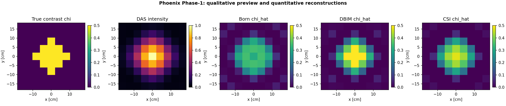
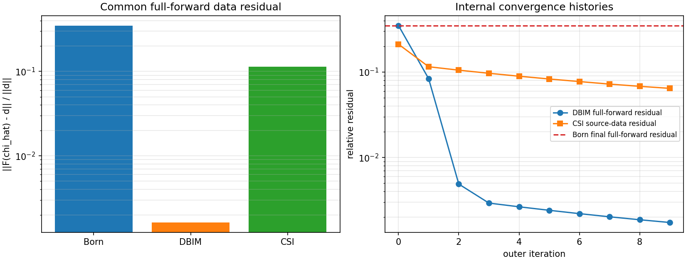

# P1 Milestone — Evaluation, benchmark/reporting, and DAS vertical slice

**Status:** ✅ complete

**Completion evidence:** `python -m pytest -q -p no:cacheprovider` returned **48 passed** in **28.77 s** on the development machine, with no test failures or warnings.

## 1. What P1 completed

P1 turns the validated forward and inverse algorithms into one reproducible platform path:

$$
\text{full-wave synthetic scene}
\rightarrow
\text{shared data}
\rightarrow
\{\text{DAS, Born, DBIM, CSI}\}
\rightarrow
\text{common metrics}
\rightarrow
\text{PNG/JSON/Markdown report}.
$$

### P1-A — unified evaluation

- Added RMSE and relative-permittivity RMSE.

- Added Gaussian-window SSIM without introducing a scikit-image dependency.

- Added thresholded support IoU, physical-coordinate centroid localization error, contrast recovery, and common relative data residual.

- Added ImageMetricsEvaluator behind the existing Evaluator interface and registry name `image_metrics`.

- Added four arithmetic/interface tests in tests/test_p1a_evaluation.py.

### P1-B — common benchmark and automatic reporting

- Added run_phase1_benchmark, which gives Born, DBIM, CSI, and DAS the same full-wave synthetic measurements.

- Added a documented Born warm start for DBIM/CSI and correct accounting of shared initialization versus nonlinear refinement runtime.

- Added a fair final data score by re-simulating every quantitative contrast map through the same full nonlinear forward map.

- Added BenchmarkReporter, which writes method maps, residual plots, a compact JSON scorecard, and a Markdown report.

- Added scripts/run_phase1_benchmark.py as the one-command driver.

- Added four integration/reporting tests in tests/test_p1b_benchmark.py.

- Vectorized CSI's fixed-$\chi$ multi-view source update into one multiple-right-hand-side least-squares solve, preserving the mathematics while reducing benchmark runtime.

### P1-C — DAS qualitative imaging

- Added coherent plane-wave frequency-domain Delay-and-Sum with optional Born-column sensitivity correction.

- Proved by unit test that its coherent map is the Born adjoint $A^Hd$ after restoring the common $(k_b^2dS)^*$ factor omitted before normalization.

- Added normalized intensity output, registry name `das`, optional display reshaping, dimensional validation, and physical localization/support tests.

- Added three tests in tests/test_p1c_das.py.

## 2. New and changed files

| File | Role |
| --- | --- |
| `mwisim/evaluation/image_metrics.py` | P1-A metric functions and evaluator |
| `mwisim/evaluation/benchmark.py` | P1-B common experiment orchestration |
| `mwisim/imaging/das.py` | P1-C coherent DAS/back-projection |
| `mwisim/reporting/report.py` | PNG/JSON/Markdown reporter |
| `scripts/run_phase1_benchmark.py` | one-command P1 driver |
| `tests/test_p1a_evaluation.py` | four evaluation tests |
| `tests/test_p1b_benchmark.py` | four integration/report tests |
| `tests/test_p1c_das.py` | three DAS tests |
| `docs/P1_Tutorial_Benchmark-Evaluation-DAS-and-Reporting.md` | from-0-to-100 derivation and code guide |
| `docs/phase1_benchmark_report.md` | automatically generated run report |
| `docs/phase1_benchmark_metrics.json` | automatically generated machine scorecard |
| `docs/fig_phase1_methods.png` | true/DAS/Born/DBIM/CSI comparison |
| `docs/fig_phase1_residuals.png` | common final residual and internal histories |

## 3. Verified reference benchmark

The automatic default run used one $1$ GHz, $9\times9$ grid, 8-view, 20-receiver, $\varepsilon_r=1.5$ full-wave synthetic cylinder problem.

| Method | $\chi$ relative $L_2$ | SSIM | Common full-forward data residual | Total runtime |
| --- | ---: | ---: | ---: | ---: |
| Born | 0.6146 | 0.7100 | $3.5004\times10^{-1}$ | 0.002 s |
| DBIM | 0.3792 | 0.8536 | $1.6231\times10^{-3}$ | 0.201 s |
| CSI | 0.4207 | 0.7788 | $1.1436\times10^{-1}$ | 0.064 s |

Runtime is machine-dependent; the accuracy values can vary slightly with floating-point libraries. The important automated conclusions all passed: DBIM and CSI both improved the common nonlinear data fit over Born, DAS localized inside the true object, and all arrays were finite.

## 4. Validation design

The new tests follow a testing pyramid. Hand-computable metric tests and operator-identity tests form the fast unit base. One small module-scoped benchmark supplies the integration layer. Existing I1/I2/I3 tests retain the stronger algorithm-specific checks, while F1/F2 continue to guard the electromagnetic forward physics against dense and Mie references.

The common residual is deliberately

$$
\frac{\|F(\hat\chi)-d\|_2}{\|d\|_2}
$$

for every quantitative method. CSI's internal $\|d-SW\|/\|d\|$ history remains in its information dictionary and residual figure, but it is labelled as a different diagnostic rather than used as the cross-method score.

## 5. What this milestone proves

- Phoenix has a complete 2-D synthetic vertical slice, not only independent algorithm scripts.

- One Imager and three Inverter implementations can consume one shared problem representation.

- Quantitative and qualitative outputs are scored according to their actual physical meaning.

- The benchmark is reproducible from one command and produces both human- and machine-readable evidence.

- The platform can add a future method without inventing a private test problem or private metric.

## 6. What this milestone does not prove

P1 uses an ideal centered homogeneous cylinder, one frequency, exact geometry, full circular reception, and noiseless synthetic data. It is software/algorithm validation, not clinical validation. It does not yet establish performance for realistic breast tissue, bone density, dispersive/lossy media, antenna coupling, skin artifacts, calibration uncertainty, sparse aperture, noise, or measured patients.

## 7. Next milestone

The next milestone should be **Phase-1 hardening and release readiness**, not a fourth inversion algorithm:

1. Off-centre, two-object, and heterogeneous phantoms.

2. Controlled noise and geometry/calibration perturbations with repeated random seeds and mean/standard-deviation reporting.

3. YAML scene schema plus a concrete Pipeline.

4. GitHub Actions CI and a compact notebook/example gallery.

5. Then Phase 2: dispersive tissue, preprocessing/calibration, and a public measured-data benchmark.

The full derivation, arithmetic examples, pseudocode, code map, and troubleshooting guide are in [P1_Tutorial_Benchmark-Evaluation-DAS-and-Reporting.md](P1_Tutorial_Benchmark-Evaluation-DAS-and-Reporting.md).
