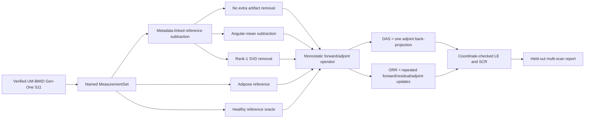

# P2-B Tutorial — measured DAS, ORR, and artifact removal from zero to 100

## 0. What P2-B adds, and what it does not claim

P2-A taught Phoenix how to receive real complex microwave measurements without losing axis names, coordinates, geometry, metadata, reference relationships, provenance, or security boundaries. P2-B takes the next step: turn a calibrated monostatic frequency-angle record into a spatial image, compare several artifact-removal choices, and measure localization on a held-out multi-scan cohort.

The complete P2-B path is:



P2-B reconstructs a **qualitative radar reflectivity map**. It does not reconstruct dielectric contrast $chi$, relative permittivity $epsilon_r$, conductivity, or a clinical diagnosis. The synthetic Born/DBIM/CSI solvers remain quantitative 2-D tomography algorithms under a different acquisition model; feeding UM-BMID data directly into them would still be scientifically unjustified.

## 1. School-mathematics foundation

### 1.1 Coordinates and distance

Every antenna and candidate image pixel has an $(x,y)$ coordinate measured in metres. If antenna $a$ is at $(x_a,y_a)$ and pixel $p$ is at $(x_p,y_p)$, their straight-line distance follows Pythagoras:

$$
R_{a,p}=sqrt{(x_a-x_p)^2+(y_a-y_p)^2}.
$$

Worked example: let an antenna be at $(0.20,0)$ m and a pixel be at $(0.03,-0.04)$ m. The horizontal and vertical differences are $0.17$ m and $0.04$ m, so

$$
R=sqrt{0.17^2+0.04^2}=sqrt{0.0305}approx0.1746 	ext{m}.
$$

`ImageGrid2D` stores increasing one-dimensional $x$ and $y$ coordinates. `np.meshgrid` combines them into every $(x,y)$ pair. A $36\times36$ grid therefore contains

$$
P=36\times36=1296
$$

candidate pixels. Array row means a $y$ coordinate, array column means an $x$ coordinate, and figures use `origin="lower"`, so positive $y$ points upward. This convention is tested rather than left to plotting intuition.

### 1.2 Speed, travel time, and the factor of two

Speed is distance divided by time, so one-way travel time from antenna to pixel is

$$
\tau_{a,p}^{\text{one-way}}=\frac{R_{a,p}}{v}.
$$

UM-BMID measures monostatic $S_{11}$: the same antenna position transmits and receives. The modeled wave travels from antenna to target and back, so the total path length and delay are

$$
L_{a,p}^{\text{round-trip}}=2R_{a,p},\qquad \tau_{a,p}^{\text{round-trip}}=\frac{2R_{a,p}}{v}.
$$

Using the previous $R=0.1746$ m and the P2-B effective speed $v=2.6\times10^8$ m/s gives

$$
\tau^{\text{round-trip}}=\frac{2(0.1746)}{2.6\times10^8}\approx1.343\times10^{-9} \text{s}=1.343 \text{ns}.
$$

The speed in this simple model is an **effective path-averaged fitting parameter**, not a direct tissue permittivity measurement. A substantial part of the path is outside the phantom, and the real path is heterogeneous and dispersive.

### 1.3 Complex numbers as rotating arrows

A VNA measurement is complex:

$$
d=d_{\mathrm{re}}+j d_{\mathrm{im}}=|d|e^{j\phi}.
$$

You can picture $d$ as an arrow in a plane. Its length is magnitude $|d|$ and its direction is phase $phi$. Two arrows pointing in the same direction add strongly; two equal arrows pointing in opposite directions cancel. DAS works by rotating the measured arrows so echoes from one candidate pixel point in the same direction, then adding them.

Under Phoenix's engineering time convention $e^{+j\omega t}$, delaying a sinusoid by $	au$ gives

$$
e^{j\omega(t-\tau)}=e^{j\omega t}e^{-j\omega\tau}.
$$

Therefore a round-trip delay contributes the frequency-domain phase

$$
e^{-j\omega(2R/v)}=e^{-j2\pi f(2R/v)}=e^{-j4\pi fR/v}.
$$

This is where the minus sign, $4\pi$, frequency $f$, distance $R$, and speed $v$ in the measured forward model come from. None is an arbitrary coding choice.

### 1.4 Vectors, matrices, and a matrix-free operator

Flatten the $36\times36$ image into a vector $oldsymbol\sigma\in\mathbb R^{1296}$. Flatten 51 frequencies and 72 antenna positions into a data vector $mathbf d\in\mathbb C^{3672}$ because

$$
M=N_fN_a=51\times72=3672.
$$

A linear forward model can be written

$$
\mathbf d_{\mathrm{pred}}=G\boldsymbol\sigma,
$$

where $G$ would have shape

$$
G\in\mathbb C^{3672\times1296}.
$$

One entry is

$$
G_{(f,a),p}=e^{-j4\pi fR_{a,p}/v}.
$$

Row $(f,a)$ asks what every pixel contributes to one frequency/antenna measurement. Column $p$ asks what phase pattern one pixel produces across all measurements. Phoenix exposes `matvec(model)` and `rmatvec(data)`, so the algorithm can use $G$ and $G^H$ without requiring callers to build or invert a normal matrix. For repeated ORR calls, a moderate matrix may be cached automatically; larger cases remain frequency-chunked and matrix-free.

## 2. From a `MeasurementSet` to one monostatic scan

### 2.1 Why named axes still matter at imaging time

The canonical measured tensor has dimensions

```text
(scan, frequency, angle)
```

An imaging algorithm needs one matrix ordered as

```text
(frequency, angle)
```

`extract_monostatic_scan` finds axes by name, selects one scan, reorders the remaining axes, extracts `geometry["antenna_position"]`, finds the `x` and `y` entries through the named `xyz` coordinate, and returns a validated `MonostaticScan`. It does not assume that frequency is always array axis 1 or that $x,y$ are always geometry columns 0 and 1.

### 2.2 The antenna coordinate proxy and phase-centre offset

P2-A constructs Gen-One ring positions from metadata antenna radius and acquisition angles:

$$
x_a=r_a\cos\theta_a,\qquad y_a=r_a\sin\theta_a.
$$

The metadata radius is a mechanical/reference proxy, not a measured electromagnetic phase centre. The public ORR Gen-Three code contains antenna-specific corrections, but transferring those constants to Gen-One without evidence would be wrong. P2-B therefore exposes an explicit radial offset

$$
\mathbf a_a^{\mathrm{corrected}}=\mathbf a_a+\Delta r\frac{\mathbf a_a}{\lVert\mathbf a_a\rVert},
$$

and freezes the benchmark at $Delta r=0$ mm. Future calibration can change one declared parameter rather than silently editing coordinates.

### 2.3 Frequency selection

The archive contains 1001 points from 1 to 8 GHz. The P2-B driver uses 2 to 8 GHz and deterministically selects 51 evenly distributed points. This follows the lower-band practice used by the public ORR workflow while keeping the CPU benchmark small enough to rerun routinely. It is a declared benchmark choice, not proof that all sub-2-GHz Gen-One data are unusable.

`select_frequency_band` uses `MeasurementSet.select`, so values and the frequency coordinate stay aligned and the selection is appended to provenance.

## 3. The measured monostatic forward operator from first principles

### 3.1 The simplest primary-scatter model

Let $sigma_p$ be the unknown reflectivity assigned to pixel $p$. The modeled contribution of that pixel to frequency $f$ and antenna $a$ is

$$
\sigma_p e^{-j4\pi fR_{a,p}/v}.
$$

Add the contribution from every pixel:

$$
d_{f,a}^{\mathrm{pred}}=\sum_{p=1}^{P}\sigma_p e^{-j4\pi fR_{a,p}/v}.
$$

In continuous notation the published ORR model uses an integral and therefore a differential area/volume. In a discrete grid this becomes a cell weight $Delta A$. Phoenix supports `cell_weight`, but the P2-B qualitative benchmark uses one because both data and final intensity are normalized. The reconstructed amplitude is therefore a scaled reflectivity proxy, not a physical material property.

### 3.2 What this model ignores

The model assumes a homogeneous propagation speed, straight paths, an isotropic point antenna, primary scattering, uniform gain, and no distance attenuation, interface transmission, frequency-dependent tissue loss, antenna beam pattern, or multiple scattering. These omissions are exactly why this module is named radar imaging rather than full-wave quantitative tomography.

The model is still useful because its phase law is simple, testable, and compatible with DAS and the original ORR concept. A baseline must be understandable before enhanced physics is added.

### 3.3 Forward pseudocode

```text
input: real or complex pixel model sigma[p]
input: frequencies f[k]
input: antenna coordinates a[m]
input: pixel coordinates r[p]
input: homogeneous speed v

for each frequency k:
    for each antenna m:
        predicted[k,m] = 0
        for each pixel p:
            R = distance(a[m], r[p])
            phase = exp(-j * 4*pi * f[k] * R / v)
            predicted[k,m] += phase * sigma[p]

return predicted
```

The NumPy implementation creates one frequency chunk of phase values and uses `einsum`/matrix multiplication for the final sum. Chunking changes memory use, not the equation.

## 4. DAS from zero: why the adjoint makes an image

### 4.1 Undo the phase expected from one candidate pixel

Suppose a true point at pixel $p_\star$ produces

$$
d_{f,a}=c_{f,a}e^{-j4\pi fR_{a,p_\star}/v}.
$$

To test candidate pixel $p$, multiply each measurement by the conjugate candidate phase:

$$
e^{+j4\pi fR_{a,p}/v}d_{f,a}.
$$

If $p=p_\star$, the two phases cancel:

$$
e^{+j4\pi fR_{a,p_\star}/v}e^{-j4\pi fR_{a,p_\star}/v}=1.
$$

All measurements then point approximately in the same complex direction and add coherently. For a wrong pixel, the candidate distances differ from the true distances, so residual phases vary with antenna and frequency and partially cancel.

### 4.2 The DAS equation

The coherent back-projection is

$$
b_p=\sum_f\sum_a e^{+j4\pi fR_{a,p}/v}d_{f,a}.
$$

Because the forward entries are $G_{(f,a),p}=e^{-j4\pi fR_{a,p}/v}$, their conjugates are $G_{(f,a),p}^{*}=e^{+j4\pi fR_{a,p}/v}$. Therefore

$$
\mathbf b=G^H\mathbf d.
$$

So measured frequency-domain DAS is exactly the Hermitian adjoint/back-projection of the declared primary-scatter forward model.

### 4.3 A two-arrow example

Imagine two measurements from the true pixel with phases $30^\circ$ and $-80^\circ$:

$$
d_1=e^{-j30^\circ},\qquad d_2=e^{+j80^\circ}.
$$

The matched back-projection multiplies them by $e^{+j30^\circ}$ and $e^{-j80^\circ}$:

$$
b=e^{+j30^\circ}d_1+e^{-j80^\circ}d_2=1+1=2.
$$

At a wrong pixel, suppose the compensating phases leave arrows at $0^\circ$ and $180^\circ$:

$$
b_{\mathrm{wrong}}=1+(-1)=0.
$$

Real data never cancel this perfectly because there are extended scatterers, noise, model errors, and clutter, but this school-level arrow addition is the core of focusing.

### 4.4 From complex back-projection to displayed intensity

The coherent image $mathbf b$ is complex. P2-B displays normalized intensity

$$
I_p=\frac{|b_p|^2}{\max_q|b_q|^2}.
$$

This makes $0\le I_p\le1$ and preserves peak location. It discards absolute amplitude, which is another reason the result cannot be interpreted as $epsilon_r$ or $chi$.

### 4.5 DAS pseudocode

```text
input: measured data d[f,a]
initialize complex image b[p] = 0

for each frequency f:
    for each antenna a:
        for each pixel p:
            R = distance(antenna[a], pixel[p])
            undo_phase = exp(+j * 4*pi * f * R / v)
            b[p] += undo_phase * d[f,a]

intensity[p] = abs(b[p])**2
intensity /= max(intensity)
return intensity
```

## 5. Why the adjoint test is the first non-negotiable test

For any model-space vector $mathbf x$ and data-space vector $mathbf u$, a correct forward/adjoint pair must satisfy

$$
\langle G\mathbf x,\mathbf u\rangle=\langle\mathbf x,G^H\mathbf u\rangle.
$$

For complex vectors, NumPy's inner product is

$$
\langle\mathbf a,\mathbf b\rangle=\mathbf a^H\mathbf b=\sum_i a_i^{*}b_i.
$$

The test uses random complex $mathbf x$ and $mathbf u$ because random values exercise many indices and phases simultaneously. Agreement near floating-point precision catches a wrong sign, missing conjugate, transposed angle/frequency order, wrong reshape, missing cell weight, or mismatched geometry. ORR repeatedly uses $G^H$ as a gradient direction, so a wrong adjoint may still produce an image but it will no longer be the derivative of the stated objective.

## 6. ORR from zero: least squares turned into repeated imaging

### 6.1 DAS is one back-projection; ORR asks the image to reproduce the data

DAS computes $G^H\mathbf d$ once. It does not ask whether forwarding that image through $G$ actually recreates all measured samples. ORR introduces an unknown reflectivity image $oldsymbol\sigma$ and minimizes the difference between predicted and measured data:

$$
\min_{\boldsymbol\sigma}\frac12\lVert G\boldsymbol\sigma-\mathbf d\rVert_2^2.
$$

Phoenix optionally adds Tikhonov damping:

$$
J(\boldsymbol\sigma)=\frac12\lVert G\boldsymbol\sigma-\mathbf d\rVert_2^2+\frac{\lambda}{2}\lVert\boldsymbol\sigma\rVert_2^2.
$$

This is still a least-squares objective. “ORR” is not a magical objective that replaces least squares; it is an imaging formulation and iterative optimization process built around a radar forward model. Different solvers can minimize the same objective.

### 6.2 Begin with a one-variable derivative

For one unknown $x$ and one observation $d$, suppose prediction is $gx$. The loss is

$$
J(x)=\frac12(gx-d)^2.
$$

Using the chain rule,

$$
\frac{dJ}{dx}=g(gx-d).
$$

The term $(gx-d)$ is the residual: predicted minus measured. The outer $g$ moves that residual's influence back to the unknown $x$.

For many complex measurements and a real image, the corresponding gradient is

$$
\nabla J(\boldsymbol\sigma)=\operatorname{Re}\left\{G^H(G\boldsymbol\sigma-\mathbf d)\right\}+\lambda\boldsymbol\sigma.
$$

The real part appears because this implementation updates a real reflectivity image. If the model itself were complex, complex-variable/Wirtinger calculus and a different model contract would be needed.

### 6.3 Why DAS is hidden inside ORR's first step

ORR starts from the zero image:

$$
\boldsymbol\sigma_0=\mathbf0.
$$

Its first residual and gradient, ignoring regularization, are

$$
\mathbf r_0=G\boldsymbol\sigma_0-\mathbf d=-\mathbf d,
$$

$$
\nabla J(\boldsymbol\sigma_0)=\operatorname{Re}\{G^H(-\mathbf d)\}=-\operatorname{Re}\{G^H\mathbf d\}.
$$

Gradient descent subtracts the gradient:

$$
\boldsymbol\sigma_1=\boldsymbol\sigma_0-\alpha\nabla J(\boldsymbol\sigma_0)=\alpha\operatorname{Re}\{G^H\mathbf d\}.
$$

Thus the first ORR update is a scaled real DAS back-projection. Later updates forward-project the current image, calculate what remains unexplained, and back-project only that residual.

### 6.4 One complete ORR iteration physically

At iteration $k$:

1. Current image $oldsymbol\sigma_k$ says where reflectivity may exist.
2. `G.matvec(sigma_k)` predicts what the VNA would measure under the simple radar model.
3. Predicted minus measured data gives residual $mathbf r_k$.
4. `G.rmatvec(r_k)` smears that residual back over candidate pixels.
5. Subtracting the gradient changes pixels in the direction that should reduce data mismatch.
6. Forward-project again to verify that the objective actually decreased.

This is the same forward → residual → adjoint → update pattern seen in Born/CGLS/DBIM, but the physical forward model and reconstructed quantity are different.

### 6.5 Numerical scaling used by Phoenix

Raw S-parameter magnitude and the number of measurements should not make the step size impossible to interpret. Phoenix defines

$$
B=\frac{G}{\sqrt M},\qquad \mathbf d'=\frac{\mathbf d}{\lVert\mathbf d\rVert_2},
$$

and minimizes

$$
J(\boldsymbol\sigma)=\frac12\lVert B\boldsymbol\sigma-\mathbf d'\rVert_2^2+\frac{\lambda}{2}\lVert\boldsymbol\sigma\rVert_2^2.
$$

This changes only the arbitrary scale of the qualitative reflectivity estimate; the displayed image is normalized afterward. The P2-B benchmark uses $lambda=10^{-4}$.

### 6.6 Step size, Lipschitz constant, and the school-level idea of “do not jump past the bottom”

Imagine walking downhill in a bowl. A tiny step is safe but slow. A very large step crosses the bottom and may climb the opposite side. For a quadratic least-squares bowl, the largest curvature is approximately

$$
L=\lambda_{\max}\left(\operatorname{Re}\{B^HB\}+\lambda I\right).
$$

A safe initial step is

$$
\alpha\approx\frac1L.
$$

Phoenix estimates $L$ by power iteration: repeatedly apply the normal action to a vector and normalize it. This finds the strongest-amplified direction without constructing $B^HB$.

### 6.7 Backtracking and bounded stopping

Even a numerical estimate of $L$ can be imperfect. Phoenix computes a candidate update and checks the actual objective. If the objective increased, it halves the step and retries. This is backtracking.

The public reference implementation stops when relative objective change is below $0.1\%$. Phoenix keeps that criterion but also requires a maximum iteration count, because a scientific driver must terminate even when assumptions are poor.

### 6.8 ORR pseudocode, line by line

```text
input: measured complex data d
input: forward operator G and exact adjoint G^H
input: regularization lambda, tolerance, max_iterations

d_scaled = d / ||d||
B(x)  = G(x) / sqrt(number_of_measurements)
BH(u) = G^H(u) / sqrt(number_of_measurements)

estimate largest curvature L by power iteration
step = 1 / L
sigma = zeros(number_of_pixels)
residual = B(sigma) - d_scaled
objective = 0.5*||residual||^2 + 0.5*lambda*||sigma||^2

for k = 1, 2, ..., max_iterations:
    gradient = real(BH(residual)) + lambda*sigma
    trial_step = step

    repeat:
        candidate = sigma - trial_step*gradient
        candidate_residual = B(candidate) - d_scaled
        candidate_objective = 0.5*||candidate_residual||^2
                              + 0.5*lambda*||candidate||^2

        if candidate_objective <= objective:
            accept candidate
            break
        else:
            trial_step = trial_step / 2

    relative_change = (objective - candidate_objective) / objective
    sigma = candidate
    residual = candidate_residual
    objective = candidate_objective

    if k is large enough and relative_change < tolerance:
        stop as converged

return sigma, objective history, residual norm, and stopping information
```

### 6.9 Why a decreasing objective does not guarantee better localization

ORR is guaranteed only to reduce the stated model-data mismatch when a decreasing step is accepted. If $G$ omits major experimental physics, fitting $G\boldsymbol\sigma$ to measured data can improve the objective without moving the strongest image peak closer to the true tumour. This distinction is visible in the P2-B result: ORR reduces every reported objective, but its mixed-cohort median localization is worse than healthy-reference DAS.

### 6.10 ORR versus Born, DBIM, and CSI

| Method | Input acquisition assumption | Reconstructed quantity | Main model |
|---|---|---|---|
| Measured DAS | monostatic frequency-angle radar | normalized focus intensity | homogeneous round-trip phase |
| ORR | monostatic frequency-angle radar | qualitative reflectivity proxy $sigma$ | primary-scatter round-trip phase + LS optimization |
| Born | 2-D transmit/receive scattering geometry | approximate contrast $chi$ | first-order Lippmann–Schwinger linearization |
| DBIM | 2-D transmit/receive scattering geometry | nonlinear contrast $chi$ | repeated full forward solve + Fréchet updates |
| CSI | 2-D transmit/receive scattering geometry | contrast and contrast sources | coupled data/domain equations |

ORR lives in `mwisim/imaging`, not `mwisim/inverse`, because its output is not calibrated dielectric contrast. This directory boundary encodes a scientific distinction, not merely a software preference.

## 7. Artifact removal from zero

### 7.1 Why empty-reference subtraction is not enough

An empty chamber reference can cancel stationary cable, antenna, and chamber responses, but it does not contain the phantom surface. After subtraction, strong air–phantom/interface responses, scan drift, antenna mismatch, and tissue clutter may remain. A tumour echo can be much smaller than these components.

P2-B compares every method on the same target IDs and does not silently switch cohorts when a result looks poor.

### 7.2 The three reference types

For target data $Y_t$ and reference $Y_r$, each reference method computes

$$
Y_{\mathrm{sub}}=Y_t-Y_r.
$$

The difference lies in what $Y_r$ contains:

| Reference | What it contains | What subtraction attempts to cancel | Practical boundary |
|---|---|---|---|
| Empty chamber | system without breast phantom | chamber/system baseline | realistic public baseline but leaves surface/tissue response |
| Adipose-only | matched outer adipose phantom | system + large outer/interface response | experimental aid, not generally available clinically |
| Healthy | matched same tissue geometry without tumour | almost everything except tumour response | strongest oracle and explicitly not clinically available |

The healthy reference is valuable for understanding algorithm behavior, but it must never be presented as a deployable tumour-detection pipeline.

### 7.3 Angular-mean subtraction

At one frequency, suppose the $N_a$ antenna samples are $y_1,\dots,y_{N_a}$. Their complex mean is

$$
\bar y=\frac1{N_a}\sum_{a=1}^{N_a}y_a.
$$

Subtract it from every angle:

$$
y_a^{\mathrm{filtered}}=y_a-\bar y.
$$

Worked real-number example: if three antenna values are $[10,13,7]$, the mean is $(10+13+7)/3=10$, and the filtered values are $[0,3,-3]$. Their new mean is zero.

Worked complex example: let values be $[1+j,3+j,2+4j]$. The mean is

$$
\bar y=\frac{(1+j)+(3+j)+(2+4j)}3=2+2j.
$$

The filtered values are

$$
[-1-j,\ 1-j,\ 0+2j],
$$

whose complex sum is zero. Real and imaginary parts are removed together; taking only magnitude first would destroy coherent phase.

Angular-mean subtraction removes exactly the component that is identical across all antenna positions at each frequency. It is simple, uses no tumour-free matched phantom, and improved the P2-B empty-reference baseline. It can also remove legitimate broad angular target content, so it is a baseline rather than a final skin-suppression theory.

### 7.4 Low-rank SVD clutter removal

For one scan, arrange data into a frequency-by-angle matrix

$$
Y\in\mathbb C^{N_f\times N_a}.
$$

The singular value decomposition writes

$$
Y=U\Sigma V^H=\sum_{k=1}^{r}\sigma_k\mathbf u_k\mathbf v_k^H.
$$

Each term is an outer product: one frequency pattern times one angular pattern. A response that repeats coherently over many frequencies and angles often concentrates in the first few singular components.

Tiny rank-one example:

$$
\mathbf u=\begin{bmatrix}1\\2\end{bmatrix},\qquad \mathbf v=\begin{bmatrix}1\\3\\-1\end{bmatrix},
$$

$$
Y=\mathbf u\mathbf v^T=\begin{bmatrix}1&3&-1\\2&6&-2\end{bmatrix}.
$$

Every row is a multiple of the other, so the matrix has rank one. Removing its first singular component leaves zero, apart from floating-point error.

The P2-B rank-one filter computes

$$
Y_{\mathrm{filtered}}=Y-\sigma_1\mathbf u_1\mathbf v_1^H.
$$

This is more flexible than angular-mean subtraction, but “largest coherent component” does not automatically mean “unwanted clutter.” A target response can also be low-rank. The measured benchmark confirms this danger: rank-one removal made median localization worse than angular-mean removal.

## 8. Coordinate-checked evaluation

### 8.1 Peak location and localization error

Within a declared circular region of interest, the image peak is

$$
(x_{\mathrm{peak}},y_{\mathrm{peak}})=\operatorname*{arg\,max}_{(x,y)\in\mathrm{ROI}}I(x,y).
$$

If metadata give the tumour centre $(x_t,y_t)$, localization error is ordinary Euclidean distance:

$$
\mathrm{LE}=\sqrt{(x_{\mathrm{peak}}-x_t)^2+(y_{\mathrm{peak}}-y_t)^2}.
$$

Example: a peak at $(1,2)$ cm and truth at $(4,6)$ cm give

$$
\mathrm{LE}=\sqrt{(1-4)^2+(2-6)^2}=5\ \text{cm}.
$$

The per-scan “localized” gate is

$$
\mathrm{LE}\le r_{\mathrm{tumour}}+1\ \text{cm},
$$

where the extra 1 cm is the declared Gen-One positioning/model tolerance used by this benchmark. Every raw LE remains in JSON; the boolean gate does not replace the continuous metric.

### 8.2 Signal-to-clutter ratio

Define a target mask as the documented tumour circle plus a 5 mm margin. Define clutter as all other pixels inside the phantom ROI. For intensity image $I=|b|^2$,

$$
\mathrm{SCR}_{\mathrm{dB}}=10\log_{10}\left(\frac{\max I_{\mathrm{target}}}{\max I_{\mathrm{clutter}}}\right).
$$

If amplitude $A=|b|$ were used instead, the equivalent expression would be

$$
20\log_{10}\left(\frac{\max A_{\mathrm{target}}}{\max A_{\mathrm{clutter}}}\right).
$$

These are equal because $I=A^2$. P2-B explicitly tells the metric whether its input is intensity, preventing a hidden factor-of-two error in dB.

### 8.3 ROI radius

The public ORR workflow uses approximate phantom sizes A1, A2, and A3. P2-B uses 5, 6, and 7 cm as the adipose-radius proxy and adds 1 cm for the evaluation ROI. This radius limits peak/SCR evaluation; it does not alter the $9$ cm image grid or pretend to segment the true phantom boundary.

## 9. A fair speed protocol instead of per-image tuning

Homogeneous speed strongly changes phase focusing. Choosing the best speed separately for every target after looking at truth would be label leakage: the benchmark would use the answer to tune the answer.

P2-B makes the compromise explicit:

1. Freeze calibration IDs `[1, 104, 135]`.
2. Freeze disjoint evaluation IDs `[13, 25, 36, 37, 117, 136, 147, 269]`.
3. Test global speeds $[1.8,2.0,2.2,2.4,2.6,2.8]\times10^8$ m/s on calibration scans only.
4. Use healthy-reference DAS and select the speed with smallest calibration median LE, breaking ties by mean LE and then lower speed.
5. Freeze the selected $2.6\times10^8$ m/s for every held-out scan and every method.
6. Report all speed candidates and calibration metrics in JSON.

This is supervised calibration because tumour coordinates are used on the calibration split. It is not a material-property estimate, and three calibration scans are too few for publication-grade generalization. It is nevertheless much more honest than silent per-scan tuning and sufficient for an engineering milestone.

## 10. The frozen public benchmark

### 10.1 Dataset and cohort

The driver verifies the official [UM-BMID Gen-One Zenodo archive](https://zenodo.org/records/5120981), whose pinned MD5 is `4ac179a5b9fb2ec072adc6d2a7ac8ad3`. The full record contains 323 scans, 1001 frequencies, and 72 monostatic angles. The held-out eight-scan cohort spans A1/A2/A3 phantom families and contains four 3 cm-radius and four 2 cm-radius tumour surrogates with complete empty, adipose, and healthy reference IDs.

The optimization model follows the primary-scatter concept in Reimer and Pistorius, [“An Optimization-Based Approach to Radar Image Reconstruction in Breast Microwave Sensing”](https://doi.org/10.3390/s21248172), and was independently implemented against the public [ORR-Algorithm repository](https://github.com/TysonReimer/ORR-Algorithm). The paper/code benchmark uses UM-BMID Gen-Three; Phoenix's P2-B result uses Gen-One and must not be described as a numerical reproduction of the paper's diagnostic results.

### 10.2 Fixed settings

| Parameter | Frozen value |
|---|---:|
| Frequencies | 2–8 GHz, 51 deterministic points |
| Antenna positions | 72 |
| Grid | $36\times36$ cell-centred pixels |
| Image half-width | 9 cm |
| Pixel spacing | 5 mm |
| Selected global speed | $2.6\times10^8$ m/s |
| Radial phase-centre offset | 0 mm |
| ORR regularization | $10^{-4}$ |
| ORR maximum iterations | 25 |
| Per-scan location tolerance | tumour radius + 1 cm |
| Milestone aggregate gate | median LE $\le3$ cm and localized fraction $\ge50\%$ |

### 10.3 Held-out results

| Method | n | Median LE (cm) | Mean LE (cm) | Localized fraction | Median SCR (dB) |
|---|---:|---:|---:|---:|---:|
| DAS: empty reference | 8 | 4.09 | 4.24 | 0.0% | -3.34 |
| DAS: empty + angular mean | 8 | 2.18 | 2.96 | 62.5% | 0.34 |
| DAS: empty + rank-1 SVD | 8 | 3.75 | 4.21 | 25.0% | -1.05 |
| DAS: adipose reference | 8 | 4.80 | 4.13 | 25.0% | -2.87 |
| DAS: healthy reference | 8 | 1.58 | 2.09 | 75.0% | 1.54 |
| ORR: healthy reference | 8 | 2.31 | 2.44 | 62.5% | 0.10 |

The predeclared milestone gate is evaluated on **empty-reference + angular-mean DAS**, because it does not use a matched tumour-free healthy phantom. It passes with median LE $2.18$ cm and localized fraction $62.5\%$.

### 10.4 What the result actually teaches

- Plain empty-reference subtraction leaves a strong central/interface-dominated artifact on this cohort; none of the eight image peaks falls inside the per-scan gate.
- Angular-mean subtraction materially improves the practical empty-reference baseline, but three scans still fail and median SCR remains only $0.34$ dB.
- Blind rank-one SVD removal is not automatically superior; it likely removes useful target structure along with clutter in several scans.
- Adipose-reference subtraction is not uniformly ideal in Gen-One. Reference mismatch, drift, geometry, and unmodeled tissue responses can dominate a theoretically attractive subtraction.
- Healthy-reference DAS is the best localization result, as expected when a matched tumour-free scan cancels almost all non-tumour structure. It is an oracle, not a clinical method.
- ORR reduces its own least-squares objective on every scan but does not outperform healthy-reference DAS in mixed-cohort median LE or localized fraction. Model fit and spatial truth are different validation axes.


## 11. Code walkthrough

### 11.1 `mwisim/imaging/measured.py`

`ImageGrid2D` validates regular increasing coordinates, returns image shape, flattened pixel positions, pixel area, and plotting extent. `square_image_grid` creates cell centres rather than ambiguously placing pixels on both outer boundaries.

`MonostaticScan` is the validated one-scan object: complex data `(frequency, angle)`, frequency coordinates, 2-D antenna positions, scan ID, and metadata.

`extract_monostatic_scan` performs named-axis extraction and optional radial phase-centre correction. `select_frequency_band` performs aligned frequency cropping/decimation through the schema.

`MonostaticImagingOperator.matvec` applies $G\boldsymbol\sigma$; `rmatvec` applies $G^H\mathbf u$. The operator stores only antenna-pixel distances and creates phase chunks unless the estimated matrix fits the cache budget.

`measured_das` performs one adjoint, squares magnitude, normalizes, and returns parameter/provenance information. `orr_reconstruct` performs bounded monotone gradient descent, returning the unnormalized real reflectivity model plus objective/residual/stopping evidence.

`MeasuredDAS` and `ORRImager` implement the platform `Imager` interface and register as `"measured_das"` and `"orr"`. The earlier synthetic plane-wave imager remains registered as `"das"`; the names do not hide their different acquisition assumptions.

### 11.2 `mwisim/preprocessing/artifacts.py`

`AngularMeanSubtract` removes the complex mean along the named angle axis independently for every scan and frequency.

`LowRankClutterFilter` moves named dimensions into `(scan, frequency, angle)` order, computes a complex SVD per scan, removes the requested leading rank, restores original dimension order, and records the removed energy fraction. Rank zero is an exact identity and invalid ranks are rejected.

### 11.3 `mwisim/evaluation/measured_imaging.py`

`peak_location_m` searches inside an optional circular ROI. `localization_error_m` uses metadata and coordinate arrays rather than array indices. `signal_to_clutter_ratio_db` explicitly distinguishes amplitude and intensity conventions. `aggregate_measured_metrics` reports count, mean, median, sample standard deviation, minimum, maximum, SCR, and localized fraction without deleting per-scan failures.

### 11.4 `mwisim/evaluation/measured_benchmark.py`

`select_scan_ids` maps IDs to rows and preserves requested order. `reference_subtracted_targets` selects target and reference rows by metadata ID, never by row adjacency. `artifact_ablation_records` builds all five preprocessing variants on the same target cohort.

`speed_sensitivity` uses only calibration IDs. `run_p2b_benchmark` freezes speed, reconstructs every held-out scan, runs ORR on the healthy-reference variant, computes aggregate results, applies the practical angular-mean DAS gate, and returns both machine-readable evidence and image arrays.

### 11.5 `scripts/run_p2b_measured_imaging.py`

The driver verifies the archive, loads the official record behind the explicit trusted-pickle gate, runs the benchmark, writes strict JSON, renders two figures, writes a Markdown report, prints a compact summary, and exits nonzero if the acceptance gate fails.

## 12. End-to-end driver pseudocode

```text
verify official Gen-One archive byte count and MD5
load S11 + metadata into MeasurementSet
select 2–8 GHz and 51 frequency samples

calibration stage:
    for each candidate homogeneous speed:
        healthy-reference subtract three calibration scans
        reconstruct calibration DAS images
        calculate localization errors
    choose one speed by median then mean calibration LE

held-out stage:
    select eight disjoint target scans and every linked reference by ID
    construct five preprocessing variants
    for each target scan:
        build one geometry-matched monostatic operator
        for each preprocessing variant:
            apply DAS = G^H d
            calculate image, LE, SCR, and per-scan gate
        run bounded ORR with the healthy-reference data
        store objective and image metrics

aggregate every method across all eight scans
apply milestone gate to empty-reference + angular-mean DAS
write benchmark.json, report.md, reconstructions.png, and ablation figure
```

## 13. Tests and what each one protects

| Test file | Main protections |
|---|---|
| `test_p2b_measured_imaging.py` | cell-centred coordinates, named extraction, hand-computed phase, complex adjoint identity, synthetic point DAS/ORR localization, monotone ORR objective, metric arithmetic, registry, frequency selection |
| `test_p2b_artifact_removal.py` | complex angular mean, exact rank-one SVD removal, rank-zero identity, invalid rank, provenance, registry |
| `test_p2b_benchmark_protocol.py` | scan/reference matching by ID, requested cohort order, common ablation cohort, reference arithmetic, A1/A3 ROI proxy |

The large public archive remains an opt-in system benchmark rather than a CI download. Fast synthetic tests prove equations and failure modes offline; the driver proves that the same implementation runs on checksum-pinned public measurements.

## 14. Run it yourself

From the repository root:

```powershell
cd C:\Projects\Project_Pheonix\mwi
python -m pip install -e ".[dev]"
python scripts\run_p2b_measured_imaging.py
```

If the archive is absent:

```powershell
python scripts\run_p2b_measured_imaging.py --download
```

Useful declared experiments:

```powershell
python scripts\run_p2b_measured_imaging.py --n-pixels 48 --max-frequency-points 81 --orr-iterations 50
python scripts\run_p2b_measured_imaging.py --radial-offset-mm 5
```

Changing these parameters creates a new experiment; it does not retroactively change the frozen milestone evidence. Use another output directory when exploring if you want to preserve the official artifacts.

Outputs:

- `docs/phase2b_um_bmid/benchmark.json` contains checksums, fingerprint, split, speed sweep, every per-scan metric, aggregates, ORR convergence information, and the gate.
- `docs/phase2b_um_bmid/report.md` is the generated human-readable result.
- `docs/phase2b_um_bmid/reconstructions.png` overlays the documented target and reconstructed peak.
- `docs/phase2b_um_bmid/sensitivity-and-ablation.png` displays calibration-only speed sensitivity and held-out method statistics.

Run every offline test:

```powershell
python -m pytest -q -p no:cacheprovider
```

## 15. Common misunderstandings

**“Is measured DAS the same as the Phase-1 DAS?”** No. Both are coherent adjoints, but Phase-1 uses a 2-D plane-wave transmit/Born Green-function operator, while P2-B uses a monostatic homogeneous round-trip radar phase model.

**“Is ORR a better least-squares method than LSQR?”** This mixes objective and solver. ORR defines a radar-image least-squares optimization and the current implementation solves it with safeguarded gradient descent. LSQR is a Krylov solver that could solve a compatible linear least-squares system, but constraints, real/complex conventions, regularization, and reporting would still need explicit design.

**“If ORR's objective decreases, is the image scientifically correct?”** No. It is more consistent with the assumed $G$, not necessarily with omitted physics or true tumour position. Validate both data fit and spatial truth.

**“Why not use the healthy reference for the milestone gate if it performs best?”** Because it is a matched tumour-free oracle unavailable in normal use. The gate uses empty-reference + angular-mean DAS; healthy-reference results remain an upper-bound experiment.

**“Why did rank-one SVD make results worse?”** SVD ranks energy/coherence, not biological meaning. The first singular component can contain target response as well as clutter.

**“Why did adipose reference perform worse than empty + angular mean?”** Subtraction is only ideal when scans are perfectly matched in geometry, system state, phantom placement, and non-target content. Gen-One drift/mismatch and the simple propagation model can defeat the theoretical advantage.

**“Does selected speed imply $\epsilon_r=(c/v)^2$ for breast tissue?”** No. It is a supervised effective phase-focusing parameter for a heterogeneous path that includes air and phantom material. Converting it directly to tissue permittivity would overinterpret the model.

**“Can the current Born/DBIM/CSI code now reconstruct UM-BMID $\chi$?”** No. P2-B validates a monostatic radar operator, not the synthetic 2-D tomographic acquisition/field model. Quantitative measured inversion needs calibrated antenna physics, backgrounds, units, dispersive materials, and a validated measured forward adapter.

## 16. Scientific boundary and next research questions

P2-B completes the Phase-2 exit criterion of one declared, coordinate-checked measured spatial benchmark. It establishes a reusable forward/adjoint boundary and reveals which simple preprocessing choices help or hurt on a mixed Gen-One cohort. It does not establish clinical sensitivity/specificity, generalization to patients, reliable small-lesion detection, quantitative dielectric recovery, or publication-grade uncertainty.

The strongest next measured-data questions are antenna phase-centre calibration, path-dependent/dispersive propagation speed, skin/interface suppression that does not require a matched healthy phantom, nested calibration/evaluation across many sessions, and an enhanced-physics ORR operator. The broader platform roadmap then proceeds to Phase 3 solver adapters and realistic 3-D/dispersive scenes while preserving this measured benchmark as a regression anchor.
