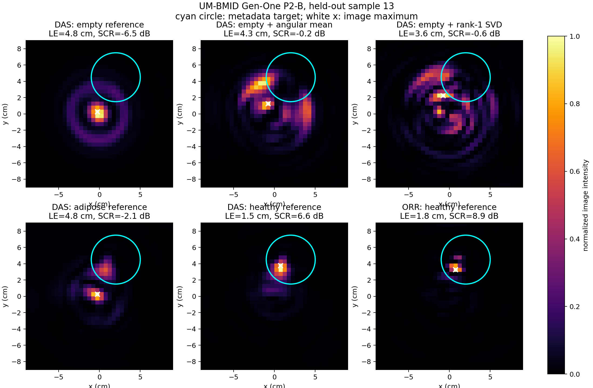
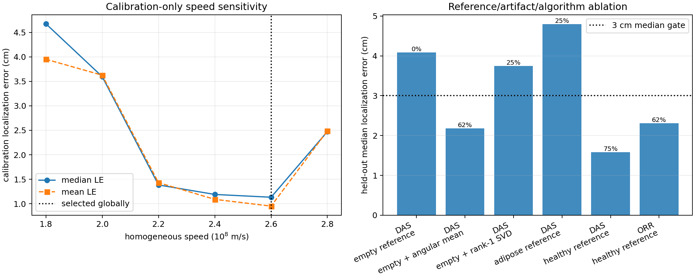

# P2-B milestone — measured DAS, ORR, artifact ablation, and localization

**Status:** complete for the defined P2-B scope

**Verified baseline:** `python -m pytest -q -p no:cacheprovider` returned **88 passed in 94.70 s**, including **10 new P2-B tests**. The opt-in public-data driver passed against the checksum-pinned UM-BMID Gen-One archive and generated JSON, Markdown, and two PNG evidence artifacts.

## 1. Delivered

- A coordinate-explicit `ImageGrid2D` and schema-safe `MonostaticScan` extraction path.
- A shared primary-scatter `MonostaticImagingOperator` with round-trip phase $e^{-j4\pi fR/v}$, chunked/cached forward action, and exact Hermitian adjoint.
- Measured frequency-domain DAS as $G^H\mathbf d$, exposed as `MeasuredDAS` and registry name `measured_das` without conflating it with the Phase-1 plane-wave DAS.
- Bounded ORR-style gradient descent with zero initialization, normalized least squares, power-iteration curvature estimate, monotone backtracking, optional Tikhonov damping, maximum iterations, and full objective/residual evidence.
- `AngularMeanSubtract` and complex per-scan `LowRankClutterFilter`, both behind `Preprocessor` and the registry.
- Coordinate-aware peak, localization error, circular ROI, intensity/amplitude-correct SCR, and multi-scan aggregate metrics.
- ID-safe cohort/reference construction, a disjoint calibration/evaluation split, one globally selected homogeneous speed, five DAS reference/artifact variants, and a healthy-reference ORR comparison.
- A one-command public driver, strict JSON, generated report, reconstruction overlays, sensitivity/ablation figure, attribution, 10 CI-safe tests, and a from-school-mathematics-to-pseudocode tutorial.

## 2. Public benchmark protocol

Dataset: University of Manitoba Breast Microwave Imaging Dataset, Gen-One S11, DOI [10.5281/zenodo.5120981](https://zenodo.org/records/5120981), CC-BY-4.0.

Archive gate: 350,526,155 bytes; MD5 `4ac179a5b9fb2ec072adc6d2a7ac8ad3`; both exact.

Loaded record: 323 scans × 1001 frequencies × 72 clockwise antenna positions, complex128.

Calibration IDs are `[1, 104, 135]`. Held-out IDs are `[13, 25, 36, 37, 117, 136, 147, 269]`, spanning A1/A2/A3 families and four 3 cm-radius plus four 2 cm-radius tumour surrogates. The sets are disjoint.

One global homogeneous speed was selected from $[1.8,2.0,2.2,2.4,2.6,2.8]\times10^8$ m/s by calibration-only healthy-reference DAS median localization. The frozen held-out speed is $2.6\times10^8$ m/s; no per-scan tuning is performed.

The held-out benchmark uses 51 deterministic frequency samples over 2–8 GHz, 72 angles, a $36\times36$ cell-centred grid over ±9 cm, 5 mm pixels, and zero radial phase-centre offset. ORR uses $\lambda=10^{-4}$ and at most 25 iterations.

## 3. Held-out evidence

| Method | n | Median LE (cm) | Mean LE (cm) | Localized fraction | Median SCR (dB) |
|---|---:|---:|---:|---:|---:|
| DAS: empty reference | 8 | 4.09 | 4.24 | 0.0% | -3.34 |
| DAS: empty + angular mean | 8 | 2.18 | 2.96 | 62.5% | 0.34 |
| DAS: empty + rank-1 SVD | 8 | 3.75 | 4.21 | 25.0% | -1.05 |
| DAS: adipose reference | 8 | 4.80 | 4.13 | 25.0% | -2.87 |
| DAS: healthy reference | 8 | 1.58 | 2.09 | 75.0% | 1.54 |
| ORR: healthy reference | 8 | 2.31 | 2.44 | 62.5% | 0.10 |

The predeclared milestone gate is evaluated on `das_empty_plus_angular_mean`, not the healthy-reference oracle: median LE ≤ 3 cm and localized fraction ≥ 50%. The result is 2.18 cm and 62.5%, so **P2-B passes**.

The result is deliberately not rewritten as “ORR beats DAS.” ORR reduced the normalized least-squares objective on every scan but did not outperform healthy-reference DAS in mixed-cohort localization. Rank-one SVD removal also underperformed the simpler angular-mean filter. Both findings remain visible in the versioned evidence.





## 4. Acceptance tests

| Group | Tests | What is guarded |
|---|---:|---|
| `test_p2b_measured_imaging.py` | 5 | cell-centred coordinates, named extraction, manual phase, complex adjoint, synthetic DAS/ORR localization, monotone objective, metrics, registry, frequency selection |
| `test_p2b_artifact_removal.py` | 3 | complex angular mean, exact rank-one removal, rank-zero identity, invalid rank, provenance, registry |
| `test_p2b_benchmark_protocol.py` | 2 | ID-safe selection/reference matching, common target order, reference arithmetic, ROI proxies |

The original 78 tests still pass. The 350 MB archive remains an opt-in system benchmark rather than a network dependency in normal CI.

## 5. Files

| File | Role |
|---|---|
| `mwisim/imaging/measured.py` | grid, scan extraction, monostatic forward/adjoint, measured DAS, ORR, imager adapters |
| `mwisim/preprocessing/artifacts.py` | angular-mean and low-rank clutter filters |
| `mwisim/evaluation/measured_imaging.py` | coordinate/SCR metrics and aggregation |
| `mwisim/evaluation/measured_benchmark.py` | split, reference ablations, speed calibration, held-out orchestration and gate |
| `scripts/run_p2b_measured_imaging.py` | archive verification, benchmark, figures, JSON and Markdown generation |
| `docs/P2B_Tutorial_Measured-DAS-ORR-and-artifact-removal-from-zero-to-100.md` | complete conceptual, mathematical, code, pseudocode, and result tutorial |
| `docs/phase2b_um_bmid/benchmark.json` | machine-readable checksum, split, parameters, per-scan and aggregate evidence |
| `docs/phase2b_um_bmid/report.md` | generated concise report |
| `docs/phase2b_um_bmid/*.png` | reconstruction and ablation evidence |

## 6. Reproduce

```powershell
cd C:\Projects\Project_Pheonix\mwi
python scripts\run_p2b_measured_imaging.py
python -m pytest -q -p no:cacheprovider
```

If the pinned archive is absent, add `--download` to the driver.

## 7. Honest boundary

P2-B validates a qualitative, coordinate-aware radar imaging workflow on controlled breast phantoms. The homogeneous speed is supervised on three calibration scans, the phase-centre offset is uncalibrated, the model omits dispersive heterogeneous propagation, antenna pattern/gain, attenuation, interface transmission, and multiple scattering, and the cohort is an engineering benchmark rather than a clinical study. Healthy-reference subtraction uses a matched tumour-free phantom and is an experimental oracle unavailable in ordinary clinical use.

The existing Born/DBIM/CSI code is not thereby validated for UM-BMID quantitative inversion. No result here is a sensitivity, specificity, dielectric-property, patient, or diagnosis claim.

## 8. Phase status

P2-A established trustworthy measured-data ingestion and preprocessing. P2-B adds the declared spatial forward/adjoint model, practical artifact ablation, held-out localization, and reproducible measured images. Together they satisfy the planned Phase-2 exit criterion: one public measured spatial reconstruction benchmark with explicit propagation assumptions and a quantitative localization gate.

The next planned platform phase is Phase 3: validated 3-D forward-solver adapters, dispersive phantoms, and VTK export. Enhanced measured calibration/physics remains a parallel research track and should retain P2-B as its regression anchor.
