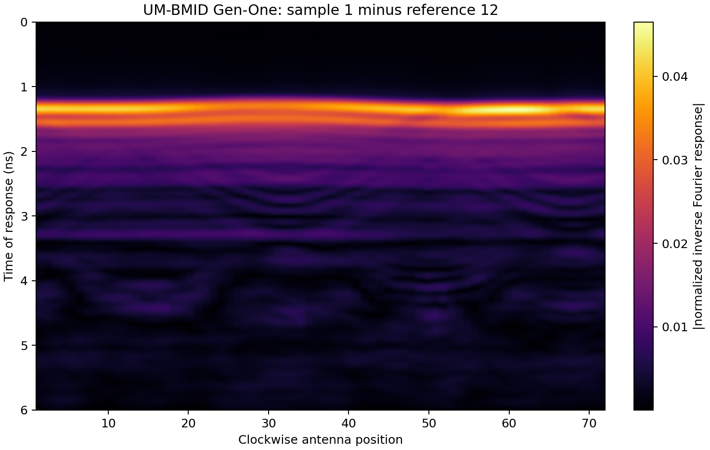

# P2-A milestone — measured-data foundation and public UM-BMID workflow

**Status:** complete for the defined P2-A scope

**Verified baseline:** `python -m pytest -q -p no:cacheprovider` returned **78 passed in 94.34 s**, including **16 Phase-2 tests**. The opt-in public-data driver passed against the checksum-pinned UM-BMID Gen-One archive.

## 1. Delivered

- Axis-aware `MeasurementSet` with named dimensions, coordinates, auxiliary geometry, per-scan metadata, dataset attributes, provenance history, selection, deterministic fingerprinting, and pickle-free NPZ round-trip.
- `UMBMIDDataSource` for consolidated MAT or explicitly trusted pickle data, plus official raw real/imaginary text parsing.
- Pinned UM-BMID Gen-One download metadata, archive size/MD5 verification, and ZIP traversal/symlink protection.
- Metadata normalization that preserves source fields, creates stable reference IDs, and adds SI-unit aliases.
- `ComplexGainCalibrator` with named-axis broadcasting and zero/non-finite gain guards.
- `ReferenceSubtract` with ID-based matching, duplicate detection, explicit missing-reference policies, and provenance.
- Ordered `PreprocessingPipeline` behind the Phase-0 `Preprocessor` interface and registry.
- Direct inverse Fourier/ICZT implementation plus an independent UM-BMID phase-compensated reference formulation.
- One-command measured-data driver, JSON evidence, and a public-data sinogram.
- From-zero tutorial, schema reference, attribution, and 16 CI-safe tests.

## 2. Public benchmark evidence

Dataset: University of Manitoba Breast Microwave Imaging Dataset, Gen-One S11, DOI [10.5281/zenodo.5120981](https://zenodo.org/records/5120981), CC-BY-4.0.

Archive gate: 350,526,155 bytes; MD5 `4ac179a5b9fb2ec072adc6d2a7ac8ad3`; both exact.

Loaded record: 323 scans × 1001 frequencies × 72 clockwise antenna positions, complex128.

Reproduced case: sample ID 1 minus metadata-linked empty-reference ID 12, then 0–6 ns ICZT at 1024 points.

| Check | Result | Gate |
| --- | ---: | ---: |
| Reference subtraction relative $L_2$ | 0 | $\le10^{-14}$ |
| Reference subtraction maximum absolute error | 0 | $\le10^{-14}$ |
| ICZT reference relative $L_2$ | $1.625341893873883\times10^{-15}$ | $\le10^{-11}$ |
| ICZT reference maximum absolute error | $8.489739172644748\times10^{-17}$ | $\le10^{-11}$ |

The resulting time-domain peak is 0.0465254 at 1.36070 ns. This number describes the selected measured sinogram and is not a tumor-detection score.

## 3. Acceptance tests

| Group | Tests | What is guarded |
| --- | ---: | --- |
| `test_p2_schema.py` | 4 | named-axis validation, read-only arrays, aligned selection, NPZ round-trip, geometry constraints |
| `test_p2_preprocessing.py` | 5 | complex gain, estimator, ID matching, missing policies, registry/pipeline order |
| `test_p2_um_bmid.py` | 5 | UM-BMID normalization/SI geometry, pickle trust gate, MAT ingest, raw text, safe ZIP |
| `test_p2_measured_benchmark.py` | 2 | scalar inverse-Fourier oracle and complete public-workflow contract |

The large public archive is an opt-in system test rather than a normal CI dependency. The normal suite remains offline, deterministic, and fast at the unit/integration layers.

## 4. Files

| File | Role |
| --- | --- |
| `mwisim/data/schema.py` | canonical schema and native storage |
| `mwisim/data/um_bmid.py` | UM-BMID ingest, verification, normalization, safety boundary |
| `mwisim/preprocessing/calibration.py` | gain calibration and matched reference subtraction |
| `mwisim/preprocessing/pipeline.py` | stage composition |
| `mwisim/evaluation/measured.py` | ICZT and reproducibility checks |
| `scripts/run_p2_um_bmid.py` | public benchmark driver |
| `docs/phase2_um_bmid/benchmark.json` | machine-readable measured result |
| `docs/phase2_um_bmid/sinogram.png` | public benchmark figure |
| `docs/P2_Tutorial_Measured-Data-from-zero-to-100.md` | conceptual and code tutorial |
| `docs/P2_Measurement_Schema_Reference.md` | exact schema contract |

## 5. Honest boundary

P2-A proves ingestion, alignment, provenance, complex-gain mechanics, metadata-linked reference subtraction, and time-transform reproduction on real measurements. It does not prove that the existing synthetic plane-wave Born/DBIM/CSI operators are valid for this monostatic 3-D experimental geometry. It also does not correct antenna phase centers, dispersive immersion/background media, skin response, scan drift, or reference mismatch.

## 6. Next milestone

P2-B should implement a measured monostatic qualitative baseline compatible with UM-BMID—DAS and preferably the public ORR baseline—then evaluate localization against documented phantom/tumor metadata. The first artifact-removal method should be compared against plain empty-reference subtraction with ablation and multi-scan statistics. Measured quantitative inversion should follow only after the propagation and calibration assumptions have their own validation gates.
