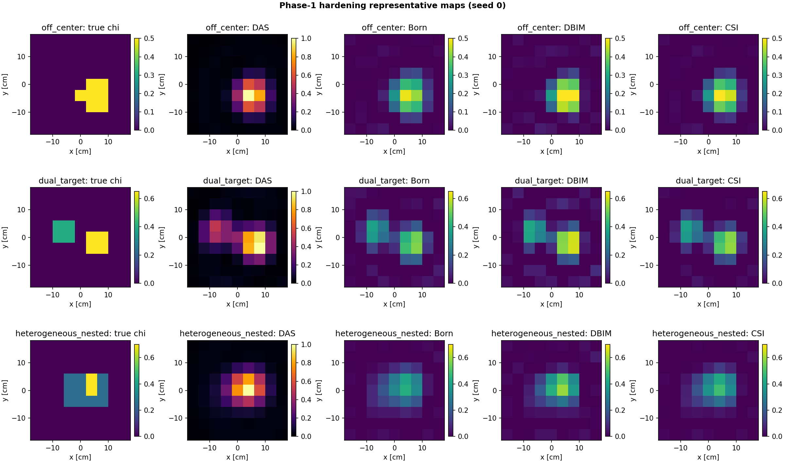
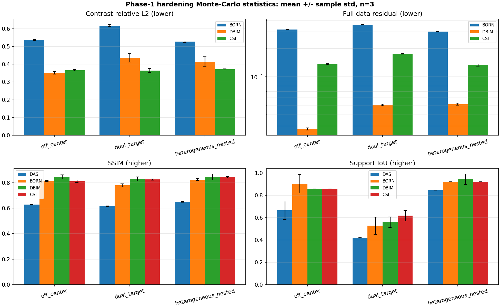

# Phoenix Phase-1 hardening report

> Generated automatically at 2026-07-19T19:57:42-07:00 from seeds [0, 1, 2].

This report evaluates off-centre, dual-target, and nested heterogeneous scenes under controlled complex noise and receiver-position model error. Every seed is a complete scene → data → DAS/Born/DBIM/CSI → common-score Pipeline run.

## Mean and sample standard deviation

### off_center

Requested corruption: SNR 30.0 dB and per-coordinate receiver-position standard deviation 0.500 mm.

| Method | chi rel-L2 | SSIM | Support IoU | Components error | Full data residual | Runtime [s] |
| --- | ---: | ---: | ---: | ---: | ---: | ---: |
| DAS | — | 0.6289 ± 0.0014 | 0.6667 ± 0.0825 | 0.00 ± 0.00 | — | 0.001 ± 0.000 |
| BORN | 0.5362 ± 0.0032 | 0.8136 ± 0.0045 | 0.9048 ± 0.0825 | 0.00 ± 0.00 | 0.3189 ± 0.0014 | 0.003 ± 0.000 |
| DBIM | 0.3515 ± 0.0074 | 0.8456 ± 0.0156 | 0.8571 ± 0.0000 | 0.00 ± 0.00 | 0.0280 ± 0.0008 | 0.168 ± 0.000 |
| CSI | 0.3662 ± 0.0036 | 0.8118 ± 0.0102 | 0.8571 ± 0.0000 | 0.00 ± 0.00 | 0.1367 ± 0.0016 | 0.056 ± 0.003 |

### dual_target

Requested corruption: SNR 25.0 dB and per-coordinate receiver-position standard deviation 1.000 mm.

| Method | chi rel-L2 | SSIM | Support IoU | Components error | Full data residual | Runtime [s] |
| --- | ---: | ---: | ---: | ---: | ---: | ---: |
| DAS | — | 0.6153 ± 0.0033 | 0.4211 ± 0.0000 | 1.00 ± 0.00 | — | 0.001 ± 0.000 |
| BORN | 0.6175 ± 0.0054 | 0.7789 ± 0.0117 | 0.5287 ± 0.0765 | 1.00 ± 0.00 | 0.3583 ± 0.0029 | 0.003 ± 0.000 |
| DBIM | 0.4358 ± 0.0236 | 0.8290 ± 0.0161 | 0.5607 ± 0.0474 | 1.00 ± 0.00 | 0.0503 ± 0.0009 | 0.167 ± 0.000 |
| CSI | 0.3645 ± 0.0109 | 0.8252 ± 0.0051 | 0.6178 ± 0.0477 | 1.00 ± 0.00 | 0.1753 ± 0.0015 | 0.054 ± 0.000 |

### heterogeneous_nested

Requested corruption: SNR 25.0 dB and per-coordinate receiver-position standard deviation 1.000 mm.

| Method | chi rel-L2 | SSIM | Support IoU | Components error | Full data residual | Runtime [s] |
| --- | ---: | ---: | ---: | ---: | ---: | ---: |
| DAS | — | 0.6492 ± 0.0036 | 0.8462 ± 0.0000 | 0.00 ± 0.00 | — | 0.001 ± 0.000 |
| BORN | 0.5267 ± 0.0041 | 0.8243 ± 0.0065 | 0.9231 ± 0.0000 | 0.00 ± 0.00 | 0.3023 ± 0.0021 | 0.003 ± 0.000 |
| DBIM | 0.4138 ± 0.0277 | 0.8453 ± 0.0231 | 0.9444 ± 0.0481 | 0.00 ± 0.00 | 0.0511 ± 0.0012 | 0.166 ± 0.000 |
| CSI | 0.3711 ± 0.0036 | 0.8433 ± 0.0050 | 0.9231 ± 0.0000 | 0.00 ± 0.00 | 0.1336 ± 0.0038 | 0.054 ± 0.000 |

## Suite acceptance

- [x] all_runs_complete
- [x] all_numeric_metrics_finite
- [x] corrupted_seeds_produce_variation

## Interpretation boundary

Mean describes typical performance across the selected random seeds; sample standard deviation describes seed sensitivity. Three seeds are an engineering smoke test, not a publication-grade uncertainty estimate. A paper should normally use more seeds and confidence intervals chosen before examining results.

These are still idealized 2-D synthetic experiments. Noise and receiver-coordinate mismatch make them harder and more honest than the original centered cylinder, but they do not replace antenna calibration, dispersive tissue, skin/clutter artifacts, sparse clinical arrays, or measured-data validation.
