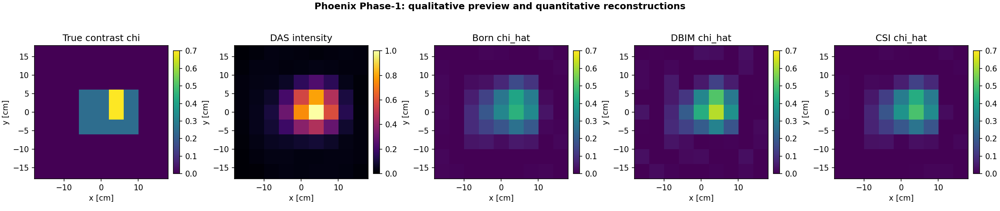
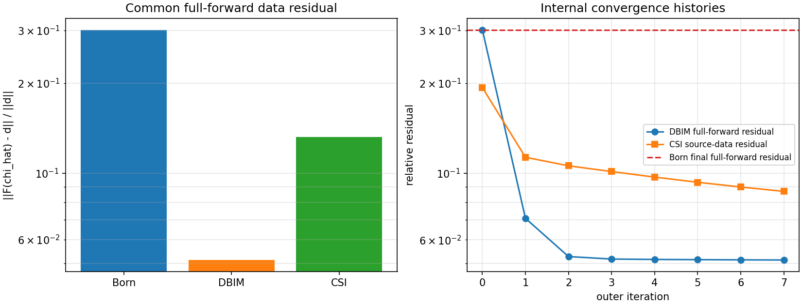

# Phoenix Phase-1 benchmark report

> Generated automatically at `2026-07-19T19:51:09-07:00` by `python scripts/run_phase1_benchmark.py`.

## Problem

All methods used the same full-wave synthetic data: frequency `1 GHz`, grid `9 x 9` (`81` cells), `8` plane-wave views, `20` receivers, and maximum true relative permittivity `1.7` for the Phase-1 vacuum background.

DBIM and CSI use the already-computed Born map as a warm start. Their total runtime includes that shared Born time; `refine time` shows only the nonlinear refinement.

## Quantitative results

| Method | chi rel-L2 | eps_r RMSE | SSIM | Localization [mm] | Support IoU | Contrast recovery | Full data residual | Total time [s] | Refine time [s] |
| --- | ---: | ---: | ---: | ---: | ---: | ---: | ---: | ---: | ---: |
| Born | 0.5269 | 0.0742 | 0.8315 | 8.391 | 0.8571 | 81.7% | 3.0124e-01 | 0.004 | 0.004 |
| DBIM | 0.4007 | 0.0564 | 0.8600 | 6.627 | 0.8462 | 94.0% | 5.1318e-02 | 0.169 | 0.165 |
| CSI | 0.3725 | 0.0524 | 0.8567 | 5.524 | 0.9231 | 84.6% | 1.3191e-01 | 0.058 | 0.054 |

DAS is a normalized qualitative energy image, not an estimate of chi, so RMSE and contrast recovery are intentionally not reported for it.

| Imager | SSIM | Localization [mm] | Support IoU | Runtime [s] |
| --- | ---: | ---: | ---: | ---: |
| DAS | 0.6451 | 7.760 | 0.8462 | 0.0008 |

## Acceptance gates

- [x] DBIM full-forward data fit is better than Born
- [x] CSI full-forward data fit is better than Born
- [x] DAS centroid lands inside the true object
- [x] All reconstructed arrays are finite

## How to read the residual figure

The left panel is the fair comparison: every method is re-simulated through the same nonlinear forward map and scored as `||F(chi_hat)-d||/||d||`. The right panel exposes each algorithm's own convergence history. DBIM's history is already a full-forward residual, while CSI's history is `||d-SW||/||d||`; those two curves diagnose their own algorithms but must not be compared point-for-point.

## Scope

This is a reproducible 2-D, single-frequency, synthetic-data platform benchmark. It validates software wiring and controlled inverse behavior; it is not evidence of clinical diagnostic performance. Phase 2 must add realistic dispersive tissue, calibration, noise/artifacts, and a public measured-data benchmark.
